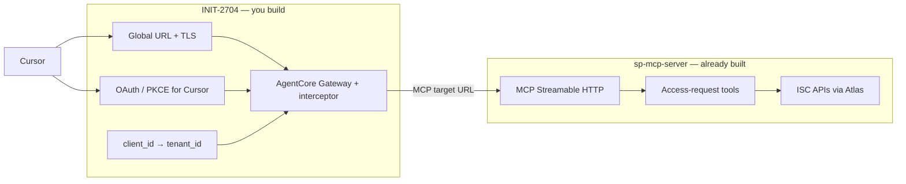
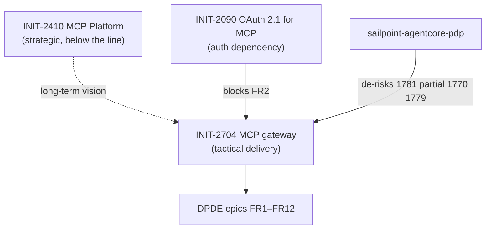
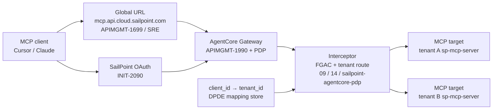

# What is MCP Gateway

As AI agents are adopted at scale, developer teams can create dozens to hundreds of specialized Model Context Protocol (MCP) servers, tailored for specific agent use case and domain, organization functions or teams. Organizations also need to integrate their own existing MCP servers or open source MCP servers for their AI workflows. There is a need for a way to efficiently combine these existing MCP servers–whether custom-built, publicly available, or open source–into a unified interface that AI agents can readily consume and teams can seamlessly share across the organization.


1) 

2) 

3) 

4) 
   

# MCP Gateway — Execution Plan

This is an EM-level execution plan for delivering a SailPoint MCP gateway built on **AWS Bedrock AgentCore Gateway** as the managed service foundation, satisfying the FRs and NFRs in:

- [\[MCP Q1-2 PRD\] SailPoint MCP Server Single URL and OAuth Support](https://sailpoint.atlassian.net/wiki/spaces/~7120200fd8a6740fdb4ca9bd0f88f478f134a5/pages/4634738812/MCP+Q1-2+PRD+SailPoint+MCP+Server+Single+URL+and+Oauth+Support)
- [\[MCP PRD\] Tenant-Agnostic MCP Server Endpoint & OAuth Integration](https://sailpoint.atlassian.net/wiki/spaces/~7120200fd8a6740fdb4ca9bd0f88f478f134a5/pages/4342448180/MCP+PRD+Tenant-Agnostic+MCP+Server+Endpoint+Oauth+Integration)

For background concepts, see `docs/mcp-gateway.md`.

**MVP specification (canonical scope):** [`mcp-gateway-mvp-spec.md`](mcp-gateway-mvp-spec.md) — FR/NFR acceptance criteria, PRD decision table, architecture, exit criteria.

**Related documents:** [`mcp-gateway.md`](mcp-gateway.md) · [`mcp-gateway-mvp-spec.md`](mcp-gateway-mvp-spec.md) · [`mcp-gateway-delivery-kit.md`](mcp-gateway-delivery-kit.md) (week-1, Jira, RACI, risks, cost) · **PRD 1:** [\[MCP Q1-2 PRD\] Single URL and OAuth Support](https://sailpoint.atlassian.net/wiki/spaces/~7120200fd8a6740fdb4ca9bd0f88f478f134a5/pages/4634738812/MCP+Q1-2+PRD+SailPoint+MCP+Server+Single+URL+and+Oauth+Support) · **PRD 2:** [\[MCP PRD\] Tenant-Agnostic Endpoint & OAuth Integration](https://sailpoint.atlassian.net/wiki/spaces/~7120200fd8a6740fdb4ca9bd0f88f478f134a5/pages/4342448180/MCP+PRD+Tenant-Agnostic+MCP+Server+Endpoint+Oauth+Integration)

Jira: **16 epics** under **[INIT-2704](https://sailpoint.atlassian.net/browse/INIT-2704)** in project **DPDE** (component **DP-SAF**, labels `INIT-2704`, `mcp-gateway`). Canonical index: [`mcp-gateway-mvp-spec.md` §4.1](mcp-gateway-mvp-spec.md#41-jira-epic-index). **FR1:** [DPDE-1768](https://sailpoint.atlassian.net/browse/DPDE-1768) · **Kickoff:** [DPDE-1767](https://sailpoint.atlassian.net/browse/DPDE-1767) · **PoC:** [DPDE-1781](https://sailpoint.atlassian.net/browse/DPDE-1781) · **NFRs:** [DPDE-1780](https://sailpoint.atlassian.net/browse/DPDE-1780) · **Docs/GA:** [DPDE-1782](https://sailpoint.atlassian.net/browse/DPDE-1782). Closed duplicate: [AI-1415](https://sailpoint.atlassian.net/browse/AI-1415).

## TL;DR For Leadership

- **What we're building.** A single, tenant-agnostic MCP endpoint for SailPoint, fronted by AWS Bedrock AgentCore Gateway, that routes authenticated MCP traffic to the correct tenant's ISC backend and provides centralized auth, tool discovery, telemetry, and policy.
- **Why now.** Per-tenant URLs block AWS Marketplace listing, "one-click install" in Cursor / Claude / VS Code, and competitive parity with Saviynt and Wiz, who already shipped marketplace MCP listings in mid-2025. Two PRDs already exist and the team is ready to start.
- **Approach.** Buy the gateway plane (AgentCore Gateway, AgentCore Identity), build the SailPoint-specific glue (tenant routing, client mapping, admin UI integration, telemetry pipeline). Avoid building a JSON-RPC / SSE proxy from scratch.
- **Target plan (this team).** **4-week MVP** with **2–3 engineers** using **Cursor + AI models** for IaC, tests, docs, and integration glue. Role split and week-by-week plan: [§ Accelerated MVP — 4 weeks](#accelerated-mvp--4-weeks-23-engineers-cursor-assisted). Delivers **internal-pilot-ready** gateway (E2E universal URL + OAuth + routing + thin observability); **not** full GA, marketplace, or every P0 NFR at production scale in four weeks.
- **Baseline plan (leadership / GA).** **Two funding gates:** **Gate 1** (4 weeks, 2–3 eng) = internal pilot; **Gate 2** (weeks 5–12, 5–6 eng) = GA — approved only after week-4 demo. Full kit: [`mcp-gateway-delivery-kit.md` §1](mcp-gateway-delivery-kit.md#1-two-funding-gates--pilot--ga).
- **Risks to flag now.** Two PRDs disagree on URL and OAuth model; AgentCore is AWS-coupled (data residency, FedRAMP); bedrock-agentcore-control APIs are new and still evolving. Accelerated timeline **requires** Week-1 PM/OAuth decisions and descoping FR7 UI + Snowflake CDC.

---

## Accelerated MVP — 4 weeks, 2–3 engineers (Cursor-assisted)

**Intent:** Ship a **working, demonstrable MCP gateway** in one sprint month: universal URL, OAuth/JWT, tenant routing, `tools/list` / `tools/call` from Cursor, minimal ops visibility. Align with existing platform work ([APIMGMT-1990](https://sailpoint.atlassian.net/browse/APIMGMT-1990), [SAASSRE-6461](https://sailpoint.atlassian.net/browse/SAASSRE-6461), [SAASSIGMA-6213](https://sailpoint.atlassian.net/browse/SAASSIGMA-6213)) instead of re-building DNS/gateway plumbing in parallel.

**Starter code (gateway plane):** Extend [sailpoint-agentcore-pdp](https://github.com/sailpoint-core/sailpoint-agentcore-pdp) (AgentCore Gateway + PDP interceptor Terraform) per [`mcp-gateway.md` § Related Repositories](mcp-gateway.md#related-repositories).

**Downstream backend (MCP tools):** [sp-mcp-server](https://github.com/sailpoint-core/sp-mcp-server) — **do not reimplement** access-request tools in the gateway; route to this service per [§ Backend contract — sp-mcp-server](#backend-contract--sp-mcp-server). That contract is what makes a **4-week** gateway credible: you build the **front door**, Masala/ADI already built the **MCP product**.

### Quick takeaway — [sailpoint-agentcore-pdp](https://github.com/sailpoint-core/sailpoint-agentcore-pdp) de-risk map

| DPDE epic | sailpoint-agentcore-pdp |
| --- | --- |
| [DPDE-1781](https://sailpoint.atlassian.net/browse/DPDE-1781) Foundation / PoC | **Largely de-risked** — AgentCore Gateway + Terraform + interceptor exist |
| [DPDE-1770](https://sailpoint.atlassian.net/browse/DPDE-1770) FR3 | **Partial** — MCP `tools/list` / `tools/call` with external targets; **net-new** for ISC tenant backends |
| [DPDE-1779](https://sailpoint.atlassian.net/browse/DPDE-1779) FR12 | **Partial** — CloudWatch audit logging; **net-new** for Snowflake + SailPoint schema |
| [DPDE-1769](https://sailpoint.atlassian.net/browse/DPDE-1769) FR2 | **Pattern only** (`CUSTOM_JWT` / `AWS_IAM`); **net-new** for SailPoint OAuth + PKCE |
| [DPDE-1771](https://sailpoint.atlassian.net/browse/DPDE-1771) FR4, [DPDE-1776](https://sailpoint.atlassian.net/browse/DPDE-1776) FR8, [DPDE-1775](https://sailpoint.atlassian.net/browse/DPDE-1775) FR7, [DPDE-1768](https://sailpoint.atlassian.net/browse/DPDE-1768) FR1, [DPDE-1773](https://sailpoint.atlassian.net/browse/DPDE-1773) FR6, [DPDE-1774](https://sailpoint.atlassian.net/browse/DPDE-1774) FR9, [DPDE-1777](https://sailpoint.atlassian.net/browse/DPDE-1777) FR10, [DPDE-1778](https://sailpoint.atlassian.net/browse/DPDE-1778) FR11, [DPDE-1780](https://sailpoint.atlassian.net/browse/DPDE-1780) NFRs, [DPDE-1782](https://sailpoint.atlassian.net/browse/DPDE-1782) Docs | **Net-new** |

**In one line:** the PDP repo is a **spike accelerator** for gateway plane + audit hooks — **not** the SailPoint product (tenant routing, OAuth productization, admin, Snowflake, production NFRs). **Eng 1** should extend it; **Eng 2** still depends on [INIT-2090](https://sailpoint.atlassian.net/browse/INIT-2090) / OAuth platform delivery.

### Backend contract — [sp-mcp-server](https://github.com/sailpoint-core/sp-mcp-server)

**Role in the 4-week goal.** The SailPoint MCP gateway is a **reverse proxy and control plane** in front of existing MCP backends. For MVP, that backend is **`sp-mcp-server`** (Masala / Harbor Pilot / ADI — Jira **ADI**, releases via `team-eng-harbor-pilot-releases`). The gateway team owns **URL, OAuth for external clients, tenant routing, mapping store, and edge policy**; this repo owns **`tools/list`, `tools/call`, and ISC API integration**.



#### Quick takeaway — sp-mcp-server de-risk map

| DPDE epic / FR | sp-mcp-server | Gateway still builds |
| --- | --- | --- |
| [DPDE-1770](https://sailpoint.atlassian.net/browse/DPDE-1770) **FR3** `tools/list` / `tools/call` | **Largely de-risked** — real MCP server (`mark3labs/mcp-go`, Streamable HTTP) | AgentCore target registration; proxy path; E2E from universal URL |
| [DPDE-1771](https://sailpoint.atlassian.net/browse/DPDE-1771) **FR4** tenant routing | **N/A** — tenant today is **hostname** or Atlas token context | `client_id → tenant_id` → pick correct **upstream MCP URL** |
| [DPDE-1769](https://sailpoint.atlassian.net/browse/DPDE-1769) **FR2** OAuth | **Partial** — RFC 9728 protected-resource metadata + global env vars | External client OAuth at gateway; **forward user bearer** to backend |
| [DPDE-1768](https://sailpoint.atlassian.net/browse/DPDE-1768) **FR1** URL | **Partial** — paths and global metadata hooks | DNS / sp-gateway / `mcp.api.cloud.sailpoint.com` |
| [DPDE-1773](https://sailpoint.atlassian.net/browse/DPDE-1773) **FR6** compat | **De-risked** — legacy URLs keep working | Gateway smoke + `test_mcp_tools.py` against old and new URL |
| [DPDE-1775](https://sailpoint.atlassian.net/browse/DPDE-1775) **FR7**, [DPDE-1776](https://sailpoint.atlassian.net/browse/DPDE-1776) **FR8** | **N/A** | Mapping store + admin CLI/API |
| [DPDE-1779](https://sailpoint.atlassian.net/browse/DPDE-1779) **FR12** | **Partial** — per-tool metrics, traces, Kafka telemetry | Edge audit logs; correlate via `request_id` / headers |
| Workflow / transform MCP | **Exists** (`/workflow/mcp`, `/transform/mcp`) | **Descoped** for 4-week MVP — access-requests only |

**In one line:** **`sp-mcp-server` is FR3 for access requests**; the gateway is everything that lets Cursor use **one URL** and land on the **right tenant’s** `sp-mcp-server` with a **valid user token**.

#### Wire contract (gateway ↔ backend)

| Item | Contract |
| --- | --- |
| **Protocol** | MCP over **Streamable HTTP** ([`internal/infra/mcp.go`](https://github.com/sailpoint-core/sp-mcp-server/blob/main/internal/infra/mcp.go) — `NewStreamableHTTPServer`) |
| **MVP path** | `POST` (and MCP session traffic) to `/{apiVersion}/access-requests/mcp` — e.g. `latest` or `v2025` |
| **Tenant URL (today)** | `https://{tenant}.api.cloud.sailpoint.com/{version}/access-requests/mcp` |
| **Global URL (in flight)** | `https://mcp.api.cloud.sailpoint.com/{version}/access-requests/mcp` (Lori / [APIMGMT-1699](https://sailpoint.atlassian.net/browse/APIMGMT-1699)); backend env: `SP_MCP_GLOBAL_MCP_PUBLIC_URL`, `SP_MCP_GLOBAL_AUTHORIZATION_SERVER_ISSUER` |
| **OAuth discovery** | `GET /.well-known/oauth-protected-resource/{version}/access-requests/mcp` — gateway and backend must agree on **host** and **issuer** ([`internal/infra/oauth.go`](https://github.com/sailpoint-core/sp-mcp-server/blob/main/internal/infra/oauth.go)) |
| **Authorization** | `Authorization: Bearer <SailPoint **user** access token>` — Atlas requires **`IdentityID`** in request context ([`web_handlers.go`](https://github.com/sailpoint-core/sp-mcp-server/blob/main/internal/infra/web_handlers.go)) |
| **Optional headers** | `X-Sailpoint-Route-Version` — API version when gateway strips path prefix; `X-Forwarded-Host` — effective host for global metadata |
| **MVP tools** (access-requests) | `list-requestable`, `create-access-request`, `view-access-requests`, `cancel-access-request`, `list-request-identities` |
| **AgentCore target** | Register upstream as **MCP server target** → tenant base + `/access-requests/mcp` ([AWS tutorial 05](https://github.com/awslabs/agentcore-samples/tree/main/01-tutorials/02-AgentCore-gateway/05-mcp-server-as-a-target)); dev: `listingMode=DYNAMIC` |
| **Do not** | Reimplement tools in gateway; strip or rewrite MCP JSON-RPC bodies; send machine-only tokens unless backend contract changes |

**Week-1 confirmation with Antoine Troadec / Dave Owens:** On global host, is tenant resolved **only from JWT** (single fleet) or must gateway still route to **per-tenant hostname**? That answer picks target URL shape for AgentCore.

#### Local dev and golden tests (Eng 3 / week 1)

```bash
# Backend only (baseline)
cd sp-mcp-server && make run          # http://localhost:7100
export BEARER=<user_token>
python3 test_mcp_tools.py             # base_url = http://localhost:7100

# Tenant-direct (FR6 compat)
# base_url = https://{tenant}.api.cloud.sailpoint.com/v2025

# After gateway
# base_url = https://mcp.api.cloud.sailpoint.com/latest   # or mcp.sailpoint.com
```

Confluence runbook: [MCP Access Review Requests — local](https://sailpoint.atlassian.net/wiki/spaces/ISC/pages/3710582785/MCP+Access+Review+Requests#Locally).

#### Public baseline — [developer.sailpoint.com MCP Getting Started](https://developer.sailpoint.com/docs/extensibility/mcp-getting-started/)

This is the **current customer-facing contract** (last updated Nov 2025). INIT-2704 must **preserve** it for FR6 and **supersede** only the connection URL/auth UX for Cursor-class clients.

| Topic | What is published today | Gateway MVP changes |
| --- | --- | --- |
| **Endpoint** | `https://[tenant].api.identitynow.com/v2025/access-requests/mcp` — tenant in hostname | Universal URL (`mcp.sailpoint.com` / `mcp.api.cloud.sailpoint.com`) + routing; **tenant URLs stay valid** |
| **Transport** | **Streamable HTTP** | Same — AgentCore and `sp-mcp-server` already use this |
| **Auth (public guide)** | Static **API access token** in `Authorization: Bearer …` ([Authentication](https://developer.sailpoint.com/docs/api/v2025/authentication)) | **Additional path:** OAuth PKCE for Cursor/Claude (FR2) — document both in quickstart |
| **Test harness** | `npx @modelcontextprotocol/inspector` + Streamable HTTP | Reuse for **FR6** smoke (tenant URL) and week-4 gateway URL regression |
| **Tools** | Four access-request tools ([Available Tools](https://developer.sailpoint.com/docs/extensibility/mcp-available-tools/)): `list-requestable`, `create-access-request`, `view-access-requests`, `cancel-access-request` | Same four are the **public** surface; `sp-mcp-server` may expose **`list-request-identities`** internally — do not break the four for compat |
| **Hostname families** | Docs use **`api.identitynow.com`** | Internal stacks also use **`api.cloud.sailpoint.com`** (Lori’s tests). Gateway routing table must support **both** tenant hostname patterns per environment |

**4-week implications**

1. **Week 1 baseline test** — Run MCP Inspector against tenant URL exactly as [Getting Started](https://developer.sailpoint.com/docs/extensibility/mcp-getting-started/) before any gateway work (proves public contract).
2. **Week 4 deliverable** — Draft updated quickstart: same tools and Streamable HTTP; replace “put your tenant in the URL” with “use `mcp.sailpoint.com` + `client_id` + OAuth” (coordinate **DPDE-1782** with developer portal owners).
3. **FR6 acceptance** — Automated suite hits **published** URL shape (`*.api.identitynow.com/...`) **and** internal `*.api.cloud.sailpoint.com/...` if both remain in production.
4. **Do not** ship gateway MVP without a plan to refresh public docs — customers will otherwise see only the old tenant-URL flow ([competitive gap](docs/mcp-gateway.md) vs marketplace listings).

**Gap to close with PM/docs:** Public guide teaches **PAT bearer**; PRD emphasizes **OAuth for MCP clients**. MVP quickstart should state: *Inspector/PAT = tenant-direct debugging; Cursor/Claude = gateway URL + OAuth.*

#### How sp-mcp-server accelerates each week (4-week delivery)

| Week | Gateway deliverable | sp-mcp-server role |
| --- | --- | --- |
| **1** | AgentCore + **one** MCP target; hardcoded tenant upstream | Prove backend with `test_mcp_tools.py` **before** gateway; copy tool names for target sync |
| **2** | Mapping store + PKCE E2E in Cursor | Same tools via universal URL; compare direct tenant URL vs gateway latency/errors |
| **3** | Second tenant; routing fuzz; admin CLI | Two upstream targets (or two hostnames); no backend code change if routing is correct |
| **4** | Demo video + MVP §14 checklist | Quickstart shows **same tools** users already get on tenant URL — gateway only changes **where they connect** |

**Schedule risk if ignored:** Rebuilding MCP tools or protocol in the gateway repo adds **4–8+ weeks**. Treat any “implement list-requestable in gateway” story as **out of scope**.

**Partner ask (week 1):** [ISCANT-12559](https://sailpoint.atlassian.net/browse/ISCANT-12559) / Masala — global dev URLs and env vars set on shared `mcp.api.cloud.sailpoint.com` fleet.

#### Two authentication layers (from Dave Owens doc §8)

[`sp-mcp-server`](https://github.com/sailpoint-core/sp-mcp-server) requires a **user** bearer with `IdentityID` (see [backend contract](#backend-contract--sp-mcp-server)). The [AWS Agent Core Gateway Integration](https://sailpoint.atlassian.net/wiki/spaces/~978782161/pages/4347527504/AWS+Agent+Core+Gateway+Integration) Confluence page formalizes this as:

| Layer | Purpose | 4-week MVP (Cursor / internal pilot) | Post-MVP (AWS Marketplace) |
| --- | --- | --- | --- |
| **Layer 1** | Which **tenant** / customer agent is calling | Gateway validates JWT; `client_id → tenant_id` or custom claims (`tenant_id`, `aws_account_id`) | Marketplace-issued OAuth client credentials after ResolveCustomer |
| **Layer 2** | Which **human user** the tools run as | **Same bearer** from Cursor PKCE → ISC user token forwarded to `sp-mcp-server` | Option A: `X-ISC-User-Token` nested header; Option B: on-demand ISC OAuth in MCP session |

**4-week implication:** INIT-2704 demo is **Layer 1 + Layer 2 collapsed** into one user OAuth flow (Cursor) — not the Marketplace registration edge. Do not block the sprint on ResolveCustomer or tenant-name registration form.

---

### Dave Owens — Marketplace & AgentCore integration (Confluence)

**Source:** [AWS Agent Core Gateway Integration](https://sailpoint.atlassian.net/wiki/spaces/~978782161/pages/4347527504/AWS+Agent+Core+Gateway+Integration) (Dave Owens personal space, page `4347527504`).

**What it is.** Research on listing SailPoint **MCP/A2A on AWS Marketplace** while using **AgentCore Gateway** as a unified entry point with **interceptor-based routing** to existing tenant-specific MCP URLs on EKS — **API-based SaaS delivery**, not container repackaging.

**How it strengthens the 4-week INIT-2704 plan**

| Confluence finding | Already in our plan? | Enhancement |
| --- | --- | --- |
| **Interceptors route by customer identity** to tenant MCP URLs | Yes — Kartik/APIMGMT-1991, tutorial 09, PDP | **Validates** week 1–3 interceptor + mapping approach; cite page in DPDE-1781 |
| **MCP servers as native gateway targets**; no backend rewrite | Yes — tutorial 05 + [sp-mcp-server backend contract](#backend-contract--sp-mcp-server) | Confirms **do not** containerize `sp-mcp-server` for MVP |
| **OAuth claims** (`sub`, custom `tenant_id`, `aws_account_id`) for routing | Partial — D3 static map | Add **D11** in week 1: claim shape for mapping store vs DB-only lookup |
| **Two auth layers** (service + end-user) | Implicit in FR2 + sp-mcp-server contract | Make explicit in MVP spec journey; gateway must **forward user token** |
| **Option A:** `Authorization` + `X-ISC-User-Token` | Not in 4-week scope | Future Marketplace agents; document as Phase II pattern |
| **API-based Marketplace** fits EKS-hosted MCP | N/A for 4-week | **Descoped** — internal pilot first; Marketplace is [AI-881](https://sailpoint.atlassian.net/browse/AI-881) / post-pilot |
| Example endpoint `https://api.sailpoint.com/marketplace/gateway` | PRD uses `mcp.sailpoint.com` | **Separate products:** INIT-2704 universal URL ≠ Marketplace gateway hostname — align with Dave/Ye in week 1 |
| **Registration edge** (tenant name form + ISC admin OAuth) | Overlaps INIT-2090 themes | Marketplace-only; **not** required for Cursor 4-week demo |
| **ResolveCustomer** + `CustomerAWSAccountId` mapping | FR8 mapping store | Reuse **same mapping table design** for `aws_account_id → tenant_id` later |

**What to descope for 4 weeks (explicitly called out in Confluence but not MVP)**

- AWS Marketplace redirect fulfillment and ResolveCustomer webhook
- Edge registration form for tenant name at subscribe time
- Quick Launch / CloudFormation Deployment API
- Marketplace-specific hostname (`api.sailpoint.com/marketplace/gateway`)
- A2A listing (doc covers MCP + A2A; MVP is access-requests MCP only)

**Week-1 actions with Dave Owens (Masala EM)**

1. Confirm **4-week INIT-2704** = Cursor universal URL + PKCE + `sp-mcp-server` — **not** Marketplace listing.
2. Agree **JWT / mapping contract** for interceptors (custom claims vs lookup-only).
3. Confirm global URL work ([ISCANT-12559](https://sailpoint.atlassian.net/browse/ISCANT-12559), `SP_MCP_GLOBAL_*` env vars) is the same fleet the gateway targets.
4. Capture whether **Option A** (`X-ISC-User-Token`) is needed before Marketplace or only for service credentials.

**Coordination:** Dave Owens (author), Ye Zhu (platform), Kartik (interceptor POC), Evan Anandappa (ISC OAuth Layer 2).

---

## Initiative landscape — how INIT-2704 fits

Three Global Initiatives overlap MCP work. **Delivery focus for this plan:** [INIT-2704](https://sailpoint.atlassian.net/browse/INIT-2704) (gateway execution). Treat the others as **context, dependencies, and scope guardrails**.



### [INIT-2704](https://sailpoint.atlassian.net/browse/INIT-2704) — MCP gateway for SailPoint (this plan)

| | |
| --- | --- |
| **What** | Tactical delivery of universal MCP URL + OAuth + tenant routing + observability (PRD Q1–2 scope). |
| **Where tracked** | **DPDE** epics [DPDE-1767](https://sailpoint.atlassian.net/browse/DPDE-1767)–[DPDE-1782](https://sailpoint.atlassian.net/browse/DPDE-1782) under component **DP-SAF**. |
| **Docs** | [`mcp-gateway-mvp-spec.md`](mcp-gateway-mvp-spec.md), this execution plan. |
| **4-week target** | Internal-pilot gateway using accelerated plan below. |

### [INIT-2410](https://sailpoint.atlassian.net/browse/INIT-2410) — MCP Platform (strategic)

| | |
| --- | --- |
| **What** | **SailPoint MCP Platform** — make MCP the standard integration fabric for agents across SailPoint: internal teams → customers → marketplace for verified MCP tools. Phased: (1) prove case + lock infrastructure, (2) build/pilot platform, (3) scale. Confluence: [platform strategy](https://sailpoint.atlassian.net/wiki/x/PoEHEwE). |
| **Status** | In Progress in Jira, but **below the line** for stakeholder comms (May 2026): leadership directed **100% focus on SAF milestones**; initiative lead deprioritized for exec tracking. Reporter: Ye Zhu · Assignee: Maryam Agahi. |
| **Implication for INIT-2704** | INIT-2704 is a **concrete slice** of Phase 1/2 platform thinking (gateway + auth + routing), not the full platform (tool generation at scale, marketplace, org-wide governance automation). **Do not** expand INIT-2704 scope to “build the entire MCP Platform” while INIT-2410 is below the line. |
| **Coordination** | Align with Ye Zhu / Maryam Agahi on naming: gateway MVP **feeds** platform narrative later; avoid duplicate “platform” epics outside DPDE until INIT-2410 is re-baselined. |

### [INIT-2090](https://sailpoint.atlassian.net/browse/INIT-2090) — MCP: OAuth 2.1 support for MCP (auth)

| | |
| --- | --- |
| **What** | Update SailPoint authentication so **external MCP clients** (Cursor, Claude Desktop, etc.) can authenticate per **current MCP / OAuth 2.1 expectations**. |
| **Problem statement** | Today’s auth does not meet MCP spec; blocks agent configuration. |
| **Status** | In Progress · Priority Medium · Assignee: Evan Anandappa · Labels: `activity-data-insights`, `hp-core`, `q2'26-sos-track`. |
| **Critical blocker** | [ISCINTAKE-248](https://sailpoint.atlassian.net/browse/ISCINTAKE-248) (**Open**) — OAuth 2.1 for MCP: **dynamic client registration (DCR)** + login/consent so customers can use a **tenant-specific URL** in the MCP client and complete auth. **Blocks** INIT-2090. |
| **Child / related delivery** | [APIMGMT-1699](https://sailpoint.atlassian.net/browse/APIMGMT-1699) — *sp-gateway MCP and global url support* (In Progress, Lori Van Gulick) — implements [Global OAuth and MCP URLs for AI client integration](https://sailpoint.atlassian.net/wiki/spaces/ISC/pages/4146135316/Global+OAuth+and+MCP+URLs+for+AI+client+integration). **Overlaps INIT-2704 FR1** (universal URL). |
| **Also related** | [IPSPLAN-605](https://sailpoint.atlassian.net/browse/IPSPLAN-605) (Planned idea) · [SAASSIGMA-6087](https://sailpoint.atlassian.net/browse/SAASSIGMA-6087) / [SAASSIGMA-6088](https://sailpoint.atlassian.net/browse/SAASSIGMA-6088) (IPS — single URL; dedupe question in comments). |

**INIT-2090 vs INIT-2704 — important tension**

| Topic | INIT-2090 / ISCINTAKE-248 direction | INIT-2704 MVP spec (accelerated) |
| --- | --- | --- |
| Client registration | **DCR** + consent at connect time | **Static** `client_id` + admin/CLI registration (DCR → Phase II) |
| URL model | **Tenant-specific URL** in MCP client | **Universal** `mcp.sailpoint.com` + JWT routing |
| Owner | OAuth / ISC platform (Dave Owens intake) | DPDE / gateway team |

**Week-1 action:** Joint working session with **Evan Anandappa**, **Rahul Mishra** (OAuth), and **APIMGMT-1699** owner — agree minimum OAuth deliverable for 4-week gateway demo (e.g. static client + PKCE on universal URL) vs waiting for full ISCINTAKE-248. **DPDE-1769 (FR2) cannot close** without this alignment.

### Cross-initiative dependency matrix (execution plan)

| Work item | Initiative | DPDE epic | Owner to confirm |
| --- | --- | --- | --- |
| Universal URL / DNS / sp-gateway | INIT-2090 → APIMGMT-1699 | DPDE-1768 FR1 | Lori Van Gulick / SRE |
| OAuth 2.1 + PKCE + JWT authorizer | INIT-2090 ← ISCINTAKE-248 | DPDE-1769 FR2 | Evan Anandappa / Rahul Mishra |
| AgentCore gateway + PDP | INIT-2704 | DPDE-1781, partial 1779 | DPDE Eng 1 + sailpoint-agentcore-pdp |
| **MCP tools backend (access requests)** | Masala / ADI | [DPDE-1770](https://sailpoint.atlassian.net/browse/DPDE-1770) FR3 | **Antoine Troadec** — [sp-mcp-server](https://github.com/sailpoint-core/sp-mcp-server); gateway **routes only** |
| Tenant routing / single URL IPS | INIT-2704 | DPDE-1771 FR4 | SAASSIGMA-6087 |
| Strategic platform / marketplace | INIT-2410 | *(none — deferred)* | Ye Zhu / Maryam Agahi |

---

## Landscape — other teams, repos, and leadership (search snapshot)

Searched **Jira**, **GitHub (`sailpoint-core`)**, **Slack**, and known **Confluence** links (May 2026). Confluence pages require login; titles/URLs below are from Jira/Slack references.

### Leadership and PM ownership

| Who | Role in MCP / gateway space | Evidence |
| --- | --- | --- |
| **Ye Zhu** | PM for **MCP Platform** (strategic) | Slack [#help-cursor](https://sailpoint.slack.com/archives/C09G6AT7XL1) — Nick Amaya; drives AWS AgentCore Gateway narrative to Tony/AWS |
| **Nick Amaya** | AI team — MCP platform tooling evaluation; epic [AI-881](https://sailpoint.atlassian.net/browse/AI-881) | AI-881 On Hold; linked to INIT-2410 platform strategy |
| **Alex Reichle** | Assignee on [AI-881](https://sailpoint.atlassian.net/browse/AI-881) External MCP Gateway | Customer-facing gateway epic (on hold) |
| **Maryam Agahi** | Assignee [INIT-2410](https://sailpoint.atlassian.net/browse/INIT-2410) MCP Platform | Initiative below the line for stakeholder comms (SAF focus) |
| **Rahul Mishra** | OAuth / platform — **Global OAuth and MCP URLs** arch review requester | [#eng-architecture](https://sailpoint.slack.com/archives/C063FQJ8J48) Jan 2026 |
| **Jasper Chan / Kelly Grizzle** | AWS strategic partnership — **#ai-data-aws-explorations** | Ye’s MCP Gateway ask to AWS (Mar 2026); separate deep dive scheduled |
| **Dave Owens** | Masala / **sp-mcp-server** ownership area | Slack: owns current [sp-mcp-server](https://github.com/sailpoint-core/sp-mcp-server) |
| **Dattu Marneni** | [INIT-2704](https://sailpoint.atlassian.net/browse/INIT-2704), DPDE epics | Tactical gateway delivery (this plan) |

### Track A — Global URL + sp-gateway (largest body of **shipped** work)

Not AgentCore multiplexing, but **directly enables FR1** (`mcp.sailpoint.com`, `mcp.api.cloud.sailpoint.com`).

| Team / lead | Key Jira | Status | What they built |
| --- | --- | --- | --- |
| **API Management (Priyanka Shukla area)** | [APIMGMT-1685](https://sailpoint.atlassian.net/browse/APIMGMT-1685) | Done | Support global MCP URLs in **sp-gateway** |
| | [APIMGMT-1776](https://sailpoint.atlassian.net/browse/APIMGMT-1776) | Done | Route MCP endpoint to global MCP URL |
| | [APIMGMT-1775](https://sailpoint.atlassian.net/browse/APIMGMT-1775) | Done | Route oauth-authorization-server to global token URL |
| | [APIMGMT-1699](https://sailpoint.atlassian.net/browse/APIMGMT-1699) | In Progress | Epic: sp-gateway MCP + global URL ([Confluence HLD](https://sailpoint.atlassian.net/wiki/spaces/ISC/pages/4146135316/Global+OAuth+and+MCP+URLs+for+AI+client+integration)) — **Lori Van Gulick** |
| | [APIMGMT-1863](https://sailpoint.atlassian.net/browse/APIMGMT-1863) | Backlog | Epic: MCP Gateway and Real Time AuthZ |
| | [APIMGMT-1864](https://sailpoint.atlassian.net/browse/APIMGMT-1864) | Backlog | Spike: vendor compare + AgentCore routing scenario |
| **Sigma / IPS** | [SAASSIGMA-5948](https://sailpoint.atlassian.net/browse/SAASSIGMA-5948), [SAASSIGMA-6170](https://sailpoint.atlassian.net/browse/SAASSIGMA-6170), [SAASSIGMA-6088](https://sailpoint.atlassian.net/browse/SAASSIGMA-6088) | Done | Deploy/test **mcp.api.cloud.sailpoint.com**, CloudFront global URL, OAuth global URL |
| | [SAASSIGMA-6232](https://sailpoint.atlassian.net/browse/SAASSIGMA-6232) | Backlog | Configure **mcp.sailpoint.com** in prod |
| | [SAASSIGMA-6087](https://sailpoint.atlassian.net/browse/SAASSIGMA-6087) | In Progress | IPS: single URL for all tenants |
| **SRE** | [SAASSRE-6461](https://sailpoint.atlassian.net/browse/SAASSRE-6461) | In Progress | DNS for **mcp.sailpoint.com**, **login.sailpoint.com**, **api.identitynow.com**; CloudFront — **David Peterson** |
| **Activity Data (Masala)** | [ISCANT-12559](https://sailpoint.atlassian.net/browse/ISCANT-12559) | Backlog | sp-mcp-server global dev URLs — **Antoine Troadec** |

**Slack signal:** [Lori Van Gulick in #help-cursor](https://sailpoint.slack.com/archives/C09G6AT7XL1/p1778883059399099) testing `https://mcp.api.cloud.sailpoint.com/latest/access-requests/mcp` with Cursor (May 2026).

**Architecture review (Jan 2026):** [Global OAuth and MCP URLs](https://sailpoint.atlassian.net/wiki/spaces/ISC/pages/4146135316/Global+OAuth+and+MCP+URLs+for+AI+client+integration) — Jeff Upton feedback: CloudFront + SSE/long-running MCP POC, FedRAMP gap, finalize global URLs.

### Track B — AWS Bedrock AgentCore Gateway (POC / platform)

| Team / engineer | Key Jira / repo | Status | What they built |
| --- | --- | --- | --- |
| **API Management** | [APIMGMT-1990](https://sailpoint.atlassian.net/browse/APIMGMT-1990) | **Done** | Set up AgentCore MCP Gateway in us-east-1 — **Kartik Khamborkar** |
| | [APIMGMT-1991](https://sailpoint.atlassian.net/browse/APIMGMT-1991) | **Done** | Go-based interceptor on AgentCore GW |
| | [APIMGMT-1993](https://sailpoint.atlassian.net/browse/APIMGMT-1993) | In Progress | Outbound OAuth + target MCP server in AgentCore |
| **Sigma** | [SAASSIGMA-6213](https://sailpoint.atlassian.net/browse/SAASSIGMA-6213) | In Progress | Lambda interceptor test — **Itay Gurvich** (unstable; AWS support engaged) |
| **Eng AI Ops** | [ENGAIOPS-109](https://sailpoint.atlassian.net/browse/ENGAIOPS-109) | In Progress | AgentCore bootstrap infra + onboarding — **Jakob Vendegna** |
| | [ENGAIOPS-110](https://sailpoint.atlassian.net/browse/ENGAIOPS-110) | Backlog | AgentCore platform design doc (DACI concerns) — **Chris Lejeune** |
| **Platform infra** | [sp-agentcore-infra](https://github.com/sailpoint-core/sp-agentcore-infra) | WIP module | `modules/runtime` ready; **`modules/gateway` WIP** — shared Terraform building blocks |
| **PDP reference** | [sailpoint-agentcore-pdp](https://github.com/sailpoint-core/sailpoint-agentcore-pdp) | Mar 2026 | Python PDP interceptor + Terraform (GitHub/Atlassian demo targets) |
| **CAM / connector** | `connector-bundle-aws` bedrockagentcore | — | AgentCore connector for governance inventory (not MCP gateway product) |

### Track C — Tenant MCP server (backend, not gateway)

| Team | Repo / Jira | Notes |
| --- | --- | --- |
| **Masala / ADI** | [sp-mcp-server](https://github.com/sailpoint-core/sp-mcp-server) — **Antoine Troadec** | Per-tenant MCP tools; quarterly releases (ADI-9640+); gateway **routes to** this |
| **ISC RR** | [ISCRR-1543](https://sailpoint.atlassian.net/browse/ISCRR-1543), [ISCRR-1519](https://sailpoint.atlassian.net/browse/ISCRR-1519) | Done — SIEM/SOAR + intelligence package MCP analysis |

### Track D — AI / SAF adjacent (not gateway, but leadership attention)

| Item | Notes |
| --- | --- |
| [AI-881](https://sailpoint.atlassian.net/browse/AI-881) | External customer-facing MCP Gateway — **On Hold**; strategy + Q2 MCP PRD links |
| [ENGAIOPS-109/110](https://sailpoint.atlassian.net/browse/ENGAIOPS-109) | Internal AgentCore **agent runtime** platform, not customer MCP URL |
| [saas-sp-gateway](https://github.com/sailpoint-core/saas-sp-gateway) | New repo (May 2026); relationship to sp-gateway unclear — confirm with API Mgmt |
| SAF comms | INIT-2410 below the line; Ye Zhu on ABM/SAF per [#proj-saf-dataai-leads](https://sailpoint.slack.com/archives/C0ARY4Y1RNE) |

### Slack themes (beyond your DPDE epic creation)

| Channel | Finding |
| --- | --- |
| [#ai-data-aws-explorations](https://sailpoint.slack.com/archives/C0AHC4U2PCN) | **Ye Zhu** MCP Gateway pitch to AWS (AgentCore Gateway, tool discovery, observability); AWS to schedule **separate technical deep dive**; briefing doc planned (Nick/Ye owner TBD) |
| [#eng-architecture](https://sailpoint.slack.com/archives/C063FQJ8J48) | Approved design-review thread for **Global OAuth and MCP URLs** (Rahul Mishra) |
| [#help-cursor](https://sailpoint.slack.com/archives/C09G6AT7XL1) | Engineers testing **global MCP URL** in Cursor; PM pointer to Ye Zhu for MCP platform |
| [#team-eng-dp-jira](https://sailpoint.slack.com/archives/C0ABAE8LJ3D) | Bot noise from your **DPDE-1767–1782** epic creation (May 14) |
| DMs | You asked Sachit/Mark about MCP Gateway (May 16) — org still ramping on SailPoint-specific context |

### Confluence (referenced; not fully searchable without auth)

| Page | Relevance |
| --- | --- |
| [Global OAuth and MCP URLs for AI client integration](https://sailpoint.atlassian.net/wiki/spaces/ISC/pages/4146135316/Global+OAuth+and+MCP+URLs+for+AI+client+integration) | **Primary HLD** for sp-gateway global URL path (INIT-2090 / APIMGMT-1699) |
| [MCP Q1-2 PRD](https://sailpoint.atlassian.net/wiki/spaces/~7120200fd8a6740fdb4ca9bd0f88f478f134a5/pages/4634738812/MCP+Q1-2+PRD+SailPoint+MCP+Server+Single+URL+and+Oauth+Support) ([tiny](https://sailpoint.atlassian.net/wiki/x/fIBAFAE)) | INIT-2704 requirements source (**PRD 1**) |
| [MCP PRD — Tenant-agnostic endpoint](https://sailpoint.atlassian.net/wiki/spaces/~7120200fd8a6740fdb4ca9bd0f88f478f134a5/pages/4342448180/MCP+PRD+Tenant-Agnostic+MCP+Server+Endpoint+Oauth+Integration) ([tiny](https://sailpoint.atlassian.net/wiki/x/NIDUAgE)) | INIT-2704 requirements source (**PRD 2**) |
| [Draft SailPoint MCP Platform Strategy](https://sailpoint.atlassian.net/wiki/spaces/~7120200fd8a6740fdb4ca9bd0f88f478f134a5/pages/4614226238/) | INIT-2410 / AI-881 |
| [Q2 MCP PRD Platform Phase 1](https://sailpoint.atlassian.net/wiki/spaces/~7120200fd8a6740fdb4ca9bd0f88f478f134a5/pages/4853826767/) | AI-881 reference |
| [AWS Agent Core Gateway Integration](https://sailpoint.atlassian.net/wiki/spaces/~978782161/pages/4347527504/AWS+Agent+Core+Gateway+Integration) | **Dave Owens** — Marketplace + AgentCore routing research (see [§ Dave Owens — Marketplace & AgentCore doc](#dave-owens--marketplace--agentcore-integration-confluence)) |
| [Approved MCP Servers](https://sailpoint.atlassian.net/wiki/spaces/SDLC/pages/4951474326/) | Lori’s Cursor test question |

### Quick takeaway — who already did what vs INIT-2704

| INIT-2704 needs | Already done elsewhere | Gap / owner to sync |
| --- | --- | --- |
| **FR1** universal URL + TLS | APIMGMT/Sigma/SRE global URL work; `mcp.api.cloud.sailpoint.com` in dev | **mcp.sailpoint.com** prod ([SAASSIGMA-6232](https://sailpoint.atlassian.net/browse/SAASSIGMA-6232)); align with Lori / David Peterson |
| **FR2** OAuth/JWT | INIT-2090, ISCINTAKE-248, global OAuth routes | DCR vs static client — **Evan Anandappa / Rahul Mishra** |
| **FR3–FR4** MCP + tenant route | sp-mcp-server per tenant; IPS single URL in flight | AgentCore **or** sp-gateway routing model — **Kartik / Itay / API Mgmt** |
| **FR11–FR12** errors + logs | APIMGMT-1991 Go interceptor; SAASSIGMA-6213 Lambda; sailpoint-agentcore-pdp audit | SailPoint envelope + Snowflake — **DPDE** |
| **Gateway product** | APIMGMT-1863/1864 spikes; AI-881 on hold; Ye/AWS AgentCore narrative | **INIT-2704 / DPDE** is the active execution track |

**Coordination meeting short list:** Kartik Khamborkar (AgentCore POC done), Lori Van Gulick (APIMGMT-1699), David Peterson (SAASSRE-6461), Itay Gurvich (interceptor), Evan Anandappa (INIT-2090), Ye Zhu (platform/OAuth product), Antoine Troadec (sp-mcp-server backends).

---

**What “MVP in 4 weeks” means**

| In scope (week 4 exit) | Deferred (weeks 5–12 or baseline plan) |
| --- | --- |
| PRD decisions D1–D7 locked in **week 1** (not a 3-week Phase 0) | FedRAMP / UAE1 regions |
| AgentCore Gateway + IaC in dev/stage; reuse platform DNS/TLS where possible | Full **ISC Admin UI** for MCP clients (FR7) |
| SailPoint OAuth + PKCE; JWT authorizer; token-expired UX (FR2, FR5) | **Snowflake** mapping CDC + analytics (FR9) — CloudWatch first |
| `client_id → tenant_id` store + routing to **sp-mcp-server** (FR4, FR8); FR3 via backend + gateway proxy | **1M req/month** load proof (NFR-005) — smoke at 50–100 concurrent |
| Multiplex `/workflow/mcp`, `/transform/mcp` | Workflow/transform MCP paths in sp-mcp-server (post-MVP) |
| Universal URL + client docs for **Cursor + Claude Desktop** (FR1) | Closed beta **5–10 tenants** (Phase 3) |
| Structured errors + `/health` (FR11); JSON request logs, no tokens in logs (FR12) | Full Grafana suite + Snowflake dashboards (FR10) |
| Backward-compat **smoke** on 1–2 legacy tenant URLs (FR6) | AWS Marketplace listing + [Dave Owens Marketplace doc](https://sailpoint.atlassian.net/wiki/spaces/~978782161/pages/4347527504/AWS+Agent+Core+Gateway+Integration) fulfillment |
| Admin: **CLI or internal API** to register clients (FR7 minimum) | DCR, developer portal (Phase II) |
| Threat model + routing fuzz tests (security gate before “done”) | Full SRE ORR + on-call (baseline MVP exit) |

Canonical acceptance criteria remain in [`mcp-gateway-mvp-spec.md`](mcp-gateway-mvp-spec.md); the table above is **scope negotiation** for the compressed schedule.

### Who does what (2–3 engineers + EM)

Assume **~0.5 EM** (you) for decisions, dependencies, and demos; **2 FTE builders** minimum; **+1 FTE** strongly recommended for tests/docs/telemetry so platform and identity engineers are not the only testers.

| Role | Person (fill in) | Primary ownership | Jira epics | How Cursor / models help |
| --- | --- | --- | --- | --- |
| **EM / coordinator** | _TBD_ | Week-1 decision workshop; OAuth/UI/SRE dependency dates; weekly demo; acceptance sign-off against MVP spec §14 | [DPDE-1767](https://sailpoint.atlassian.net/browse/DPDE-1767) kickoff | PRD diff summaries, epic/story breakdown, status reports, Confluence-ready decision log |
| **Eng 1 — Platform / AgentCore** | _TBD_ | IaC, AgentCore gateway + **sp-mcp-server MCP targets**, tenant routing, mapping store, error/health; wire contract URLs per [§ Backend contract](#backend-contract--sp-mcp-server) | [DPDE-1781](https://sailpoint.atlassian.net/browse/DPDE-1781), [DPDE-1770](https://sailpoint.atlassian.net/browse/DPDE-1770), [DPDE-1771](https://sailpoint.atlassian.net/browse/DPDE-1771), [DPDE-1776](https://sailpoint.atlassian.net/browse/DPDE-1776), [DPDE-1778](https://sailpoint.atlassian.net/browse/DPDE-1778), [DPDE-1780](https://sailpoint.atlassian.net/browse/DPDE-1780) (smoke only) | AgentCore target JSON from backend paths; routing tests; no tool reimplementation |
| **Eng 2 — Identity / integration** | _TBD_ | OAuth/JWT for Cursor; ensure **user bearer** reaches sp-mcp-server; PKCE, token-expired UX, E2E `mcp.json` | [DPDE-1769](https://sailpoint.atlassian.net/browse/DPDE-1769), [DPDE-1772](https://sailpoint.atlassian.net/browse/DPDE-1772), [DPDE-1768](https://sailpoint.atlassian.net/browse/DPDE-1768) | Align with backend RFC 9728 metadata + global issuer env vars |
| **Eng 3 — Quality / DX** _(optional but recommended)_ | _TBD_ | **`test_mcp_tools.py` harness** (direct vs gateway URL), compat smoke, admin CLI/API, quickstart | [DPDE-1779](https://sailpoint.atlassian.net/browse/DPDE-1779), [DPDE-1773](https://sailpoint.atlassian.net/browse/DPDE-1773), [DPDE-1782](https://sailpoint.atlassian.net/browse/DPDE-1782), [DPDE-1775](https://sailpoint.atlassian.net/browse/DPDE-1775) (CLI not UI), [DPDE-1777](https://sailpoint.atlassian.net/browse/DPDE-1777) (basic alarms) | Extend repo `test_mcp_tools.py` for gateway base_url; k6 on `tools/list` |

**Shared / not on the 2–3 FTE hook** (must be calendar-bound in week 1):

| Partner | Delivers | Blocks |
| --- | --- | --- |
| **Rahul Mishra / OAuth** | Issuer, JWKS, static client registration, scopes | Eng 2 — entire hot path |
| **Ben Coble / UI** | FR7 **only** if leadership insists on Admin UI in 4 weeks; otherwise API contract for CLI | Eng 3 — admin flows |
| **SRE / APIMGMT / SAASSRE** | Global URL, DNS, CloudFront, sp-gateway alignment | Eng 1 — FR1 TLS hostname |
| **Antoine Troadec / Masala** | Dev/stage **sp-mcp-server** URL, test tenant, user token, global env vars on shared host | E2E demo; FR3 tool behavior |
| **Security** | 2–4 hr threat-model review + sign-off on routing tests | Week 4 “done” |
| **Data Platform** | Snowflake path | Post–week 4 (FR9) |

### Four-week calendar

```
Week:     1                    2                    3                    4
          |--------------------|--------------------|--------------------|--------------------|
Eng 1     | IaC + AgentCore    | sp-mcp-server      | Mapping + errors   | Perf smoke + fixes |
          | + 1 MCP target     | target + routing   | + log shipping     | + handoff runbook  |
          | (tenant URL)       | v0                 | (CW)               |                    |
Eng 2     | OAuth/JWT spike    | PKCE E2E Cursor    | Multi-tenant +     | Token UX + sec     |
          | + D1–D7 decisions  | tools/list,call    | revoke + 401/403   | test fixes         |
Eng 3     | test_mcp_tools.py  | Admin CLI/API      | Docs draft         | NFR-011 timed test |
(or EM)   | baseline vs GW     | + FR6 smoke        | Cursor+Claude      | + demo recording   |
All       | Demo: skeleton     | Demo: 1 tenant E2E | Demo: 2 tenants    | Demo: MVP checklist|
```

**Week 1 — Lock & spike (no multi-week Phase 0)** — detailed calendar, workshop agenda, and spikes: [`mcp-gateway-delivery-kit.md` §2–3](mcp-gateway-delivery-kit.md#2-week-1-execution).

- **Days 1–2:** Decision meeting (D1–D12 in [`mcp-gateway-mvp-spec.md` §4](mcp-gateway-mvp-spec.md#4-prd-reconciliation--decisions-required)); assign Eng 1/2/3; confirm reuse of in-flight APIMGMT/SRE AgentCore + DNS work.
- **Days 3–5:** Parallel spikes — run **`sp-mcp-server` + `test_mcp_tools.py`** direct (Eng 3 baseline); AgentCore MCP target = tenant `.../access-requests/mcp` (Eng 1); OAuth authorizer + JWKS (Eng 2).
- **Exit:** One `tools/list` through gateway in dev with **hardcoded** tenant upstream URL (acceptable for spike only).

**Week 2 — One tenant end-to-end**

- Eng 1: Mapping store (DynamoDB preferred for speed) + AgentCore target per [backend contract](#backend-contract--sp-mcp-server).
- Eng 2: PKCE flow in Cursor; `tools/call` (`list-requestable` or `create-access-request`) on one real tenant via gateway.
- Eng 3: CloudWatch structured logs; quickstart with same tools as tenant-direct URL.
- **Exit:** Demo from Cursor using universal URL + `client_id` (record for stakeholders).

**Week 3 — Harden path & admin without UI**

- Eng 1: Routing cache, error envelope, `/health`; negative routing tests.
- Eng 2: Revoked client, expired token, scope gaps.
- Eng 3: Admin **CLI/API** for client + mapping CRUD; **FR6** — `test_mcp_tools.py` against legacy `{tenant}.api.cloud...` and gateway URL.
- **Exit:** Second tenant upstream; zero cross-tenant failures on fuzz suite (`tools/call` must not hit wrong tenant’s sp-mcp-server).

**Week 4 — Pilot-ready package**

- Thin dashboards/alarms (CloudWatch; defer Snowflake/Grafana depth).
- Docs: Cursor + Claude Desktop only (VS Code best-effort).
- Security review + MVP spec §14 checklist (honest exceptions documented).
- **Exit:** “Internal pilot ready” — **not** GA. Schedule beta (baseline Phase 3) if leadership agrees.

### Cursor / AI working agreements (make the 4-week plan credible)

- **Single repo** (or mono-folder) with `AGENTS.md` / rules: stack (CDK/Terraform, Python/TS), AgentCore patterns, “no tenant id in URL” invariant.
- **AI generates; humans review:** IaC, tests, and docs — **not** routing/security logic without review.
- **Daily:** Each engineer lands one vertical slice (test included); use Cursor Agent for boilerplate, Composer for cross-file refactors.
- **Pre-baked prompts:** “Add contract test for 401 envelope,” “Generate k6 smoke for tools/list,” “Draft Cursor mcp.json for gateway URL.”
- **Do not AI-scope creep:** No multiplexing, no semantic search, no FedRAMP — explicit in rules file.

### Reference architectures — AWS AgentCore tutorials + API Mgmt HLD

Two external references define **how** to build; INIT-2704 / DPDE defines **what** to ship in four weeks.

| Reference | Link | Owner / status |
| --- | --- | --- |
| **AWS AgentCore Gateway tutorials** | [awslabs/agentcore-samples — 02-AgentCore-gateway](https://github.com/awslabs/agentcore-samples/tree/main/01-tutorials/02-AgentCore-gateway) | Public; Ye Zhu / AWS deep dive (Mar 2026) |
| **MCP Gateway and Real-Time Authorization — High Level Plan** | [Confluence (Kartik Khamborkar space)](https://sailpoint.atlassian.net/wiki/spaces/~712020303f3c3361704efaa8f88f28b4536d5d/pages/5028315398/MCP+Gateway+and+Real-Time+Authorization+High+Level+Plan) | API Management; mirrors [APIMGMT-1863](https://sailpoint.atlassian.net/browse/APIMGMT-1863) (Backlog) |
| **AWS Agent Core Gateway Integration** | [Dave Owens](https://sailpoint.atlassian.net/wiki/spaces/~978782161/pages/4347527504/AWS+Agent+Core+Gateway+Integration) | Marketplace + interceptor routing + two auth layers — [§ below](#dave-owens--marketplace--agentcore-integration-confluence) |

#### What the AWS tutorial suite proves (buy vs build)

AgentCore Gateway is a **managed MCP endpoint** (Streamable HTTP only) with **targets** (Lambda, OpenAPI/Smithy, **MCP servers**) and **dual auth**:

| AWS concept | Tutorial(s) | Maps to DPDE / FR |
| --- | --- | --- |
| Create gateway + invoke MCP | [README](https://github.com/awslabs/agentcore-samples/tree/main/01-tutorials/02-AgentCore-gateway), `04-integration` | [DPDE-1781](https://sailpoint.atlassian.net/browse/DPDE-1781) — **done in spirit** by [APIMGMT-1990](https://sailpoint.atlassian.net/browse/APIMGMT-1990) |
| **MCP server as target** (multiplex many backends) | [`05-mcp-server-as-a-target`](https://github.com/awslabs/agentcore-samples/tree/main/01-tutorials/02-AgentCore-gateway/05-mcp-server-as-a-target) | [DPDE-1770](https://sailpoint.atlassian.net/browse/DPDE-1770) FR3, [DPDE-1771](https://sailpoint.atlassian.net/browse/DPDE-1771) FR4 — register each **ISC tenant `sp-mcp-server`** as a target; use `listingMode='DYNAMIC'` in dev to skip catalog sync |
| Inbound OAuth (MCP auth spec) | `17-inbound-auth-code-flow-okta` | [DPDE-1769](https://sailpoint.atlassian.net/browse/DPDE-1769) FR2 — wire **SailPoint OAuth** as IdP (not Okta in prod) |
| Outbound OAuth to backend | `13-outbound-auth-code-grant`, [APIMGMT-1993](https://sailpoint.atlassian.net/browse/APIMGMT-1993) | Token to tenant MCP backend — coordinate with Kartik |
| **Request/response interceptors** (FGAC, audit) | [`09-fine-grained-access-control`](https://github.com/awslabs/agentcore-samples/tree/main/01-tutorials/02-AgentCore-gateway/09-fine-grained-access-control) | Real-time authz on `tools/call` + filter `tools/list` by JWT scopes — [DPDE-1779](https://sailpoint.atlassian.net/browse/DPDE-1779) FR12 partial |
| **Token exchange** at interceptor | [`14-token-exchange-at-request-interceptor`](https://github.com/awslabs/agentcore-samples/tree/main/01-tutorials/02-AgentCore-gateway/14-token-exchange-at-request-interceptor) | Inbound SailPoint JWT → outbound credential for tenant MCP (if backends require different client) |
| Tenant / correlation headers (no Lambda) | [`08-custom-header-propagation`](https://github.com/awslabs/agentcore-samples/tree/main/01-tutorials/02-AgentCore-gateway/08-custom-header-propagation) | `metadataConfiguration.allowedRequestHeaders` e.g. `x-tenant-id` after mapping lookup — faster than custom routing Lambda for v0 |
| Semantic tool search | `03-search-tools` | **Descoped** for 4-week MVP (INIT-2410 / Ye narrative; not P0) |
| Transform APIs/Lambda to tools | `01-`, `02-` | **Not MVP** — backends are already MCP ([sp-mcp-server](https://github.com/sailpoint-core/sp-mcp-server)) |

**4-week technical bet:** Use **tutorial 05** (MCP-as-target) + **09** (interceptor FGAC) + **08** (headers) on top of Kartik’s gateway ([APIMGMT-1990](https://sailpoint.atlassian.net/browse/APIMGMT-1990)) and Lori’s **global URL** ([APIMGMT-1699](https://sailpoint.atlassian.net/browse/APIMGMT-1699)), instead of building a JSON-RPC proxy or second gateway.

#### Inferred fit — Kartik’s Confluence HLD ↔ INIT-2704

The Confluence title matches epic **[APIMGMT-1863](https://sailpoint.atlassian.net/browse/APIMGMT-1863)** (*MCP Gateway and Real Time AuthZ*, assignee **Kartik Khamborkar**). Completed sibling work:

| APIMGMT | Status | Likely HLD section already implemented |
| --- | --- | --- |
| [APIMGMT-1990](https://sailpoint.atlassian.net/browse/APIMGMT-1990) | **Done** | AgentCore MCP Gateway in us-east-1 |
| [APIMGMT-1991](https://sailpoint.atlassian.net/browse/APIMGMT-1991) | **Done** | Go request interceptor on gateway |
| [APIMGMT-1993](https://sailpoint.atlassian.net/browse/APIMGMT-1993) | In Progress | Outbound OAuth + MCP target in AgentCore |
| [APIMGMT-1864](https://sailpoint.atlassian.net/browse/APIMGMT-1864) | Backlog spike | “Setup AgentCore as MCP gw and try a **routing scenario**” — same as AWS tutorial 05 + your FR4 spike |

**Alignment with DPDE (INIT-2704):**

| HLD theme (inferred) | DPDE epic | Who should build in 4 weeks |
| --- | --- | --- |
| AgentCore gateway plane | [DPDE-1781](https://sailpoint.atlassian.net/browse/DPDE-1781) | **Merge** with Kartik — extend [sailpoint-agentcore-pdp](https://github.com/sailpoint-core/sailpoint-agentcore-pdp) + APIMGMT PoC; do not stand up a second gateway account |
| Real-time authorization (interceptor / PDP) | [DPDE-1779](https://sailpoint.atlassian.net/browse/DPDE-1779), partial [DPDE-1780](https://sailpoint.atlassian.net/browse/DPDE-1780) | Kartik (Go) **or** DPDE Eng 1 (Python PDP hooks) — **pick one interceptor** for MVP |
| Universal URL + TLS | [DPDE-1768](https://sailpoint.atlassian.net/browse/DPDE-1768) FR1 | **Lori / SRE** — not DPDE greenfield |
| SailPoint OAuth + JWT | [DPDE-1769](https://sailpoint.atlassian.net/browse/DPDE-1769) FR2 | **Evan / Rahul** ([INIT-2090](https://sailpoint.atlassian.net/browse/INIT-2090)) |
| `client_id → tenant_id` + route to tenant MCP | [DPDE-1771](https://sailpoint.atlassian.net/browse/DPDE-1771), [DPDE-1776](https://sailpoint.atlassian.net/browse/DPDE-1776) | **DPDE Eng 1** — mapping store + target selection (tutorial 05 pattern) |
| Product docs + pilot | [DPDE-1782](https://sailpoint.atlassian.net/browse/DPDE-1782) | **DPDE Eng 3 / EM** |

**Adjacent (do not conflate):** [INIT-2591](https://sailpoint.atlassian.net/browse/INIT-2591) *SAF \| Agentic Real Time Authorization* is a separate SAF authorization product track (agentic access PRD). Kartik’s “Real-Time AuthZ” in the MCP HLD is **request-path MCP policy**, not a duplicate of INIT-2591 — but coordinate with **Kishore Darisipudi** so PDP rules do not fork.

#### Architecture choice for fastest 4-week E2E



**Alternative (slower for multiplexing):** sp-gateway alone routes to one tenant MCP URL (Lori’s current Cursor test) — satisfies FR1 partial but **not** FR4 multi-tenant on one client config. INIT-2704 MVP needs **AgentCore + MCP targets** (tutorial 05) or equivalent multiplexing.

### EM playbook — how Dattu accelerates the 4-week plan

You are **INIT-2704** owner and integration EM. The lever is not more code — it is **forcing one architecture, one repo, and calendar-bound dependencies** while Kartik/Lori/Evan ship platform pieces.

#### Week 0 (before sprint clock) — 2 days

| Action | Outcome |
| --- | --- |
| **Read** [AWS 02-AgentCore-gateway README](https://github.com/awslabs/agentcore-samples/tree/main/01-tutorials/02-AgentCore-gateway) + skim `05`, `09`, `14` | Shared vocabulary for Eng 1 / Kartik |
| **30-min with Kartik** — walk [Confluence HLD](https://sailpoint.atlassian.net/wiki/spaces/~712020303f3c3361704efaa8f88f28b4536d5d/pages/5028315398/MCP+Gateway+and+Real-Time+Authorization+High+Level+Plan) + [APIMGMT-1990](https://sailpoint.atlassian.net/browse/APIMGMT-1990)/[1991](https://sailpoint.atlassian.net/browse/APIMGMT-1991) | Agree: DPDE **extends** his PoC; link APIMGMT-1863 ↔ DPDE-1781 in Jira |
| **30-min with Antoine Troadec** — [sp-mcp-server](https://github.com/sailpoint-core/sp-mcp-server) global host + test tenant | Confirm [backend contract](#backend-contract--sp-mcp-server) (JWT-only vs per-tenant upstream) |
| **Post decision memo** (D1–D7 + **D11** two auth layers from MVP spec) — 1 page | Unblocks Eng 2; records universal URL vs Marketplace hostname |
| **30-min with Dave Owens** — [Marketplace & AgentCore Confluence](https://sailpoint.atlassian.net/wiki/spaces/~978782161/pages/4347527504/AWS+Agent+Core+Gateway+Integration) | Confirm 4-week = Cursor path, not Marketplace; JWT claim shape |
| **Book OAuth war room** (Evan, Rahul, Lori) — 90 min | Minimum OAuth for demo: static client + PKCE on global URL |
| **Assign Eng 1/2/3 names** in role table above | Stops “TBD” drift |

#### Week 1 — integration, not greenfield

| Your move | Why it saves weeks |
| --- | --- |
| **Single “gateway program” thread** with Kartik + Priyanka (APIMGMT EM) | Avoids duplicate AgentCore accounts and competing interceptors |
| **Mandate one interceptor** for MVP: Python PDP **or** Go (1991) — not both | Two interceptors = debug hell |
| **Point Eng 1 at tutorial `05-mcp-server-as-a-target`** with `listingMode=DYNAMIC` | No `SynchronizeGatewayTargets` churn in week 1 |
| **File Jira links:** DPDE-1781 blocks on / is satisfied by APIMGMT-1990 | Makes reuse auditable for leadership |
| **Get Lori’s dev URL** for Cursor smoke (`mcp.api.cloud.sailpoint.com/...`) | FR1 demo without waiting for `mcp.sailpoint.com` prod ([SAASSIGMA-6232](https://sailpoint.atlassian.net/browse/SAASSIGMA-6232)) |
| **Daily 15-min demo** — even “tools/list fails with 401” | Surfaces OAuth blocker early |

#### Week 2 — E2E ownership

| Your move | Why |
| --- | --- |
| **Own the demo script** (Cursor config + test tenant + client_id) | Removes ambiguity in “done” |
| **Pair Eng 2 with Evan’s team** on JWT claims (`tenant_id`, scopes) | FR2 + FR4 hinge on claim shape |
| **Escalate if APIMGMT-1993 slips** — outbound OAuth to tenant MCP | Kartik’s in-flight item; on critical path for `tools/call` |
| **Publish internal quickstart draft** in VibeEM / Confluence | SC-1 prep; Cursor can generate from working config |

#### Week 3 — scope guard

| Your move | Why |
| --- | --- |
| **Say no** to semantic search, DCR, INIT-2410 platform scope | Keeps 4-week credible |
| **Security 2-hr review** — routing fuzz + JWT scope tests (tutorial 09 pattern) | SC-2 gate |
| **Admin CLI only** — defer FR7 UI unless Ben commits date | FR7 is #1 schedule killer |

#### Week 4 — pilot package

| Your move | Why |
| --- | --- |
| **Run MVP spec §14 checklist** — document honest exceptions | Leadership trust |
| **Record demo video** (Cursor → universal URL → tools/list → tools/call) | Gaurav / SAF stakeholder proof |
| **Propose week 5–8** for Snowflake, prod hostname, beta tenants | Sets expectations: 4 weeks = **internal pilot**, not GA |
| **Schedule AWS deep dive** with Ye/Jasper — bring tutorial questions list | Closes gaps on interceptor limits, FedRAMP, cost |

#### What you should **not** do in 4 weeks

- Own Terraform for AgentCore if Kartik already has it — **coordinate**, don’t rewrite.
- Wait for full [ISCINTAKE-248](https://sailpoint.atlassian.net/browse/ISCINTAKE-248) DCR — negotiate static-client path.
- Merge INIT-2704 with INIT-2410 marketplace / tool-generation scope.
- Build sp-gateway routing **and** AgentCore multiplexing without an explicit architecture decision.

#### Updated four-week engineering focus (tutorial-aligned)

| Week | Eng 1 (Platform) | Eng 2 (Identity) | Eng 3 / EM |
| --- | --- | --- | --- |
| **1** | Fork **sailpoint-agentcore-pdp**; AgentCore target = tenant **`/access-requests/mcp`** (tutorial **05**) | OAuth spike; user bearer contract with Masala | **`test_mcp_tools.py`** baseline; **EM:** Kartik + Antoine sync |
| **2** | Mapping store → upstream URL per `client_id`; optional **08** headers | PKCE E2E on Lori’s global URL → sp-mcp-server tools | Quickstart (same tools, new URL) |
| **3** | Interceptor **09** + tenant routing deny; error envelope | Token tests; wrong-tenant fuzz | Admin CLI; FR6 dual-URL smoke |
| **4** | CloudWatch + `/health`; 2-tenant E2E | Token UX | Demo video; §14 checklist; **EM:** pilot sign-off |

### Accelerated vs baseline timeline

| Milestone | Accelerated only (2–3 eng + Cursor) | Full program (Option B, 12 weeks) |
| --- | --- | --- |
| PRD decisions + HLD | Week 1 | Week 1 |
| Technical MVP (internal pilot) | **Week 4** | **Week 4** ([§ Accelerated MVP](#accelerated-mvp--4-weeks-23-engineers-cursor-assisted)) |
| Full P0 FR/NFR + ORR | Follow-on (needs more headcount) | **Week 8** |
| Closed beta (5–10 tenants) | — | **Week 10** |
| GA (+ marketplace submit if in scope) | — | **Week 12** |

---

## Key Caveat: The Two PRDs Disagree

The requirements below come from two Confluence PRDs that are not fully aligned:

| | Document |
| --- | --- |
| **PRD 1** | [\[MCP Q1-2 PRD\] SailPoint MCP Server Single URL and OAuth Support](https://sailpoint.atlassian.net/wiki/spaces/~7120200fd8a6740fdb4ca9bd0f88f478f134a5/pages/4634738812/MCP+Q1-2+PRD+SailPoint+MCP+Server+Single+URL+and+Oauth+Support) — [tiny link](https://sailpoint.atlassian.net/wiki/x/fIBAFAE) |
| **PRD 2** | [\[MCP PRD\] Tenant-Agnostic MCP Server Endpoint & OAuth Integration](https://sailpoint.atlassian.net/wiki/spaces/~7120200fd8a6740fdb4ca9bd0f88f478f134a5/pages/4342448180/MCP+PRD+Tenant-Agnostic+MCP+Server+Endpoint+Oauth+Integration) — [tiny link](https://sailpoint.atlassian.net/wiki/x/NIDUAgE) |

Before we write a line of code, the team needs PM alignment on three points where the PRDs conflict:

| Topic | [PRD 1](https://sailpoint.atlassian.net/wiki/spaces/~7120200fd8a6740fdb4ca9bd0f88f478f134a5/pages/4634738812/MCP+Q1-2+PRD+SailPoint+MCP+Server+Single+URL+and+Oauth+Support) | [PRD 2](https://sailpoint.atlassian.net/wiki/spaces/~7120200fd8a6740fdb4ca9bd0f88f478f134a5/pages/4342448180/MCP+PRD+Tenant-Agnostic+MCP+Server+Endpoint+Oauth+Integration) | What we need to decide |
| --- | --- | --- | --- |
| Public URL | `https://mcp.sailpoint.com/` | `https://mcp.identitynow.com/` | One canonical hostname (and FedRAMP / UAE1 variants). |
| Tenant resolution | `client_id → tenant_id` static mapping table | Email-based discovery via `login.sailpoint.com/oauth/authorize` | Static map for MVP, email discovery for GA, or both? |
| OAuth model | Authorization Code, static client registration | OAuth 2.1 + PKCE + Dynamic Client Registration (RFC 7591) | Pick the v1 protocol; defer DCR to Phase II if needed. |
| Backward compatibility | Existing tenant URLs continue indefinitely | Deprecate when traffic < 5 tenants | Set a deprecation policy now. |
| Audit / telemetry sink | Snowflake | Snowflake + alerts on anomalies | Confirm pipeline owner. |

**Recommended call:** EM (Dattu) + PMs (Ye, Rahul) + OAuth lead (Rahul Mishra) + UI lead (Ben Coble) + Masala EM (Dave Owens) before Phase 0 sign-off.

## How AgentCore Gateway Maps To The FRs / NFRs

This is the build-vs-buy table, which directly informs the workstream breakdown.

| Requirement | AgentCore Gives Us | We Have To Build / Configure |
| --- | --- | --- |
| FR1 — single endpoint URL | Gateway endpoint (`*.bedrock-agentcore.<region>.amazonaws.com`) | Custom domain (`mcp.sailpoint.com`) via Route 53 + ACM, CloudFront if needed. |
| FR2 — OAuth/JWT auth | `customJWTAuthorizer` with discovery URL + allowed clients | Wire SailPoint OAuth as the IdP (or Cognito as a bridge). |
| FR3 — `tools/list` / `tools/call` | Native MCP protocol; cache-first `ListTools`; live `tools/call` | Per-tenant target registration; tool namespacing strategy. |
| FR4 — tenant routing | Targets per backend; gateway routes by tool name | Mapping `client_id` (or email-derived `tenant_id`) → target ARN; routing Lambda interceptor if claim-based routing is needed. |
| FR5 — token expiration handling | Standard 401 from authorizer | Custom error response shape (`{error, message, request_id}`). |
| FR6 — backward compatibility | N/A — purely additive | Keep existing tenant-specific URLs unchanged. |
| FR7 — admin portal for client registration | N/A | UI changes in ISC Admin Portal (collab with Ben Coble's team). |
| FR8 — `client_id → tenant_id` mapping | N/A | Backing store (DynamoDB or RDS), CRUD APIs, auth on those APIs. |
| FR9 — Snowflake mapping query | N/A | CDC pipeline from mapping store to Snowflake. |
| FR10 — usage dashboards | CloudWatch metrics, gateway logs | Grafana / Snowflake dashboards, alarm definitions. |
| FR11 — structured error responses | Default error envelope | Custom error transformer (Lambda) for 4xx/5xx normalization. |
| FR12 — structured request logs | CloudWatch Logs JSON | Log shipping to OpenSearch + Snowflake; PII redaction. |
| NFR-001..003 — latency p50 / p95 / p99 | AgentCore latency baseline | Performance test suite; tune Lambda/cache; warm pools. |
| NFR-004..006 — scale | Managed scaling | Load tests at 100 concurrent / 1M req/month / 1k clients. |
| NFR-007..008 — uptime, error rate | AWS SLA | Multi-AZ; canary alarms; runbook. |
| NFR-009..010 — TLS, JWT validation | Native | Configure TLS policy, allowed clients, token verification. |
| NFR-011..013 — usability | N/A | Setup docs, error messages with hints, time-to-config tests. |
| NFR-014..015 — cost | AWS billing | Cost tagging, monthly cost reports, budget alerts. |
| Security NFRs (PRD 2) — zero cross-tenant leakage | Per-target credential isolation | Conformance tests, fuzz testing, security review. |

The honest read: AgentCore covers the heavy lifting on the gateway plane (protocol, auth scaffolding, scale, observability primitives). The SailPoint-specific work concentrates on **identity integration, client/tenant mapping, admin UX, telemetry pipeline, and FedRAMP / UAE1 strategy**.

## Phased Execution Plan (baseline — ~3 months / 12 weeks)

> **Funding:** Treat as **Gate 1** (weeks 1–4, pilot) + **Gate 2** (weeks 5–12, GA) — see [`mcp-gateway-delivery-kit.md` §1](mcp-gateway-delivery-kit.md#1-two-funding-gates--pilot--ga).  
> **Active target for a 2–3 engineer squad:** deliver [Accelerated MVP — 4 weeks](#accelerated-mvp--4-weeks-23-engineers-cursor-assisted) first (unchanged). Gate 2 requires week-4 approval and Option B staffing.

### Timeline at a glance

```
Week:     1      2      3      4      5      6      7      8      9     10     11     12
Phase:    |-- P0 + accelerated MVP (4 wk) --|-- P2 harden (4 wk) --|P3 β|P4 GA|
Output:   decisions + 1-tenant E2E demo     P0 FR/NFR + ORR       beta  GA
```

| Phase | Weeks | Duration | Goal | Exit |
| --- | --- | --- | --- | --- |
| **0** — Decisions | 1 | 1 wk | Lock D1–D12, HLD, AgentCore spike, cost model | Signed HLD; PRD reconciliation done |
| **1** — Internal pilot | 1–4 | 4 wk | Same as [Accelerated MVP](#accelerated-mvp--4-weeks-23-engineers-cursor-assisted) | Universal URL + OAuth + routing + `tools/list`/`tools/call` for 1–2 tenants |
| **2** — P0 hardening | 5–8 | 4 wk | All P0 FR/NFRs, admin UX, telemetry, security | ORR passed; [`mcp-gateway-mvp-spec.md` §14](mcp-gateway-mvp-spec.md#14-mvp-exit-criteria-closed-beta-ready) |
| **3** — Closed beta | 9–10 | 2 wk | 5–10 tenants on real traffic | Go/no-go at end of week 10 |
| **4** — GA | 11–12 | 2 wk | Launch, docs, enablement; marketplace **submit** if in scope | GA on canonical URL; 30-day metrics baseline |

**Compression levers (vs a 6-month plan):** PoC merged into the 4-week pilot; Phase 2 workstreams run in **4 parallel tracks** (not 10 serial weeks); beta and GA are **2 weeks each** with pre-staged runbooks and listing copy started in week 8.

### Phase 0 — Reconciliation & design (week 1)

Run in parallel with the first engineering spikes — not a separate 3-week gate.

- Reconcile [PRD 1 / PRD 2](mcp-gateway-execution-plan.md#key-caveat-the-two-prds-disagree) with Ye, Rahul, Dave Owens, Ben Coble (sponsor in week 1).
- AgentCore + SailPoint OAuth architecture review; `customJWTAuthorizer` vs Cognito bridge decision.
- Backend contract with Masala (`sp-mcp-server`); mapping store choice (DynamoDB vs RDS).
- 3-day sandbox spike: one AgentCore target + stub MCP + JWT.
- Output: signed HLD-lite + week-4 demo criteria.

### Phase 1 — Internal pilot (weeks 1–4)

**Do not duplicate planning here** — follow [Accelerated MVP — 4 weeks](#accelerated-mvp--4-weeks-23-engineers-cursor-assisted) (calendar, roles, `sailpoint-agentcore-pdp` fork, `test_mcp_tools.py` baseline).

Option B adds **parallel capacity** in weeks 3–4 so Phase 2 does not restart from zero: mapping-store schema, admin API contract (even if UI slips), telemetry pipeline spike, FR6 compat harness skeleton.

### Phase 2 — P0 hardening (weeks 5–8)

**Goal:** All P0 FRs and NFRs in one commercial region; ready for closed beta.

Four parallel tracks (each owned by one engineer; tech lead unblocks cross-track):

| Track | Workstreams | Weeks 5–6 | Weeks 7–8 |
| --- | --- | --- | --- |
| **Platform** | WS-A routing (FR3, FR4, FR8), WS-E errors/health (FR11) | Mapping store + interceptor; target automation | Fuzz tests; error envelope; `/health` |
| **Identity** | WS-B auth (FR2, FR5) | JWKS, PKCE, scopes with Rahul Mishra | Token-expiry UX; VS Code path |
| **Experience** | WS-C admin (FR7), WS-H docs (NFR-011) | Admin API + **CLI fallback** if UI slips | ISC Admin UI minimum **or** CLI-only launch |
| **Ops** | WS-D telemetry (FR9–12), WS-F compat (FR6), WS-G perf (NFRs) | Logs, dashboards, Snowflake CDC | Load test + ORR; compat suite in CI |

```
Week:           5        6        7        8
Platform        |-- routing + errors --------|
Identity        |-- OAuth + PKCE -----------|
Experience      | admin API / CLI | docs ---|
Ops             | telemetry | perf + ORR --|
```

**Phase 2 exit criteria:** P0 FR1–FR12 met per [`mcp-gateway-mvp-spec.md` §7–8](mcp-gateway-mvp-spec.md#7-functional-requirements); ORR with SRE; runbook + on-call; ≥ 1 internal team on gateway ≥ 1 week without P1.

**If behind:** slip WS-C UI → CLI-only (week 6 decision); slip Snowflake CDC → CloudWatch-only for beta (week 7 decision).

### Phase 3 — Closed beta (weeks 9–10)

**Goal:** 5–10 tenants on production-like traffic; prove ops at scale.

- **Week 9:** Onboard pilots (internal dev team + 2–3 preview customers); daily error/latency review; tune alarms from Phase 2 baselines.
- **Week 10:** Go/no-go — require ≥ 5 tenants active 7+ days, 0 P1 on cross-tenant/auth/data, P0 NFRs green 14 days, top friction fixes shipped.
- ORR items: rollback (DNS to tenant URLs), tabletop (IdP outage, backend outage, leak alert), security sign-off on routing/auth.

### Phase 4 — General availability (weeks 11–12)

**Goal:** Public GA on canonical URL; marketplace submission started if in scope.

- **Week 11:** DNS cutover rehearsal; release notes; DevRel quickstart on developer.sailpoint.com; support/SE enablement; **marketplace listing draft submitted** (review often 2–4 weeks — start early).
- **Week 12:** GA announcement (blog, newsletter, community); 24×7 on-call handoff to SRE; track 30-day metrics (customers, volume, p95, error rate).

| Metric | 30 days post-GA |
| --- | --- |
| Customers on gateway | 5+ |
| Monthly requests | 100k+ |
| p95 gateway overhead | < 300ms |
| Error rate | < 0.5% |

### Phase II — Post-GA (Q3+ planning)

These items are **explicitly deferred** in PRD 1 and PRD 2; they get their own planning cycle once GA is stable. Listed in roughly the order I'd recommend tackling them.

#### II-1: Dynamic Client Registration (RFC 7591) — High Priority

- Lets MCP clients self-register without an admin step, satisfying PRD 2 OAuth 2.1 + DCR direction.
- Removes the biggest friction point in the developer onboarding flow.
- Effort: 1 senior identity engineer + 1 backend, 6–8 weeks.
- Pre-req: lock down rate limiting (II-4) so DCR doesn't open an abuse vector.

#### II-2: Developer Self-Service Portal — High Priority

- A `developer.sailpoint.com/mcp` portal where developers manage their own clients, see usage, rotate credentials, view docs.
- Replaces the admin-only registration from MVP for the customer-facing case.
- Effort: 1 frontend + 1 backend + design support, 8–10 weeks.

#### II-3: Tool Namespacing & Discovery UI — Medium Priority

- Prefix tools by domain (`access_requests.*`, `workflows.*`, `identity.*`) and expose discovery in the gateway response.
- Pairs naturally with AgentCore's semantic search tool.
- Effort: 1 backend, 4–6 weeks; coordinated with each tool-owning team.

#### II-4: Per-Tenant Rate Limiting — Medium Priority

- Required before opening DCR; protects backends from a single noisy tenant.
- Token-bucket on `tenant_id` claim; configurable per-tenant overrides.
- Effort: 1 backend, 3–4 weeks.

#### II-5: FedRAMP / UAE1 Region Rollout — High Priority If Customer-Driven

- Mirror MVP architecture into FedRAMP-eligible AWS region (`us-gov-east-1` or equivalent).
- Confirm AgentCore Gateway availability in FedRAMP regions before committing.
- Includes data-residency review and possibly a separate URL (`mcp-gov.identitynow.com`).
- Effort: 2 backend + SRE + compliance partner, 8–12 weeks.

#### II-6: Federation Across Gateways — Lower Priority

- AgentCore supports gateway-of-gateways. Useful if internal SailPoint AI use cases want their own MCP plane that nests under the customer-facing one.
- Defer until at least one concrete internal use case requires it.

#### II-7: Tool Catalog Consolidation Across SailPoint — Lower Priority

- Onboard non-ISC backends (NERM, AIS, SaaS Identity) as additional AgentCore targets.
- Each new backend type is its own mini-project; pace by customer demand.

## Workstream → Skills Map

| Workstream | Primary skills | Secondary skills |
| --- | --- | --- |
| WS-A Routing & Targets | AWS (Lambda, DynamoDB, IaC), Python or Go, MCP/JSON-RPC understanding | Performance engineering |
| WS-B Auth | OAuth 2.0 / 2.1, PKCE, JWT, IdP integration (Cognito, Okta-style) | Security review experience |
| WS-C Admin Portal | React / TypeScript (matches existing ISC UI stack), API integration | UX collaboration with Ben Coble's team |
| WS-D Telemetry | Snowflake, OpenSearch, Grafana, data engineering | Observability tooling, dashboarding |
| WS-E Error & Health | API design, structured logging | Compliance / PII awareness |
| WS-F Backward Compat | Test engineering, contract testing | Existing ISC API knowledge |
| WS-G Performance | k6 / Locust, AWS Lambda tuning, profiling | Capacity planning |
| WS-H Documentation | Tech writing, DevRel | Cursor / Claude / VS Code MCP client experience |
| Cross-cutting | AWS IaC (Terraform / CDK), CI/CD, threat modeling, cost engineering | Incident response, on-call |

## Team Shape — Staffing Options

Starting points for leadership. All options assume shared support from OAuth (Rahul Mishra), UI (Ben Coble), and DevRel. **The 4-week accelerated MVP plan is unchanged** — it is the first milestone in every path below.

### Option D — Accelerated MVP only (2–3 engineers + EM, Cursor-assisted) **← current squad target**

| Role | Count | Notes |
| --- | --- | --- |
| EM (part-time) | 0.5 | Decisions, dependencies, demos — not a third builder |
| Platform / AgentCore engineer | 1 | Must-own IaC + routing |
| Identity / OAuth engineer | 1 | Must-own authorizer + client E2E |
| Quality / DX engineer | 0–1 | Strongly recommended; else EM + Eng 1 absorb tests/docs |

- **Timeline:** **4 weeks** → internal-pilot MVP ([§ Accelerated MVP](#accelerated-mvp--4-weeks-23-engineers-cursor-assisted)).
- **Not included:** closed beta, GA, full P0 NFRs at scale, ISC Admin UI, Snowflake CDC — requires Option B (or D → B handoff in week 5).
- **Cursor / models:** **~1.3–1.5×** throughput on IaC, tests, docs — **not** on OAuth policy, security sign-off, or partner calendars.
- **Risk:** Two engineers without Eng 3 → docs and compat slip; FR7 UI in 4 weeks is **not realistic** without Ben Coble’s team.

### Option A — Lean full program (4 engineers + EM)

- 1 EM · 1 staff/tech lead · 2 backend (platform + telemetry) · 0.5 SDET · 0.25 SRE (shared)

- **Timeline:** **~4 months** to GA (4-week pilot + ~12 weeks hardening/beta/GA with heavy serial work).
- **Risk:** Single points of failure per workstream; hard to run four parallel Phase 2 tracks.

### Option B — Recommended full program (5–6 engineers + EM)

| Role | Count | Phase 1 (wk 1–4) | Phase 2+ (wk 5–12) |
| --- | --- | --- | --- |
| EM | 1 | Decisions, dependencies, weekly demo | ORR, beta go/no-go, launch |
| Staff / tech lead | 1 | AgentCore fork, routing spike | Unblock four tracks; threat model |
| Platform engineer | 1 | Gateway IaC, targets, interceptor | WS-A, WS-E, perf |
| Identity engineer | 1 | OAuth spike, PKCE E2E | WS-B, client flows |
| Backend (telemetry) | 1 | Mapping store schema, logs | WS-D, WS-F, Snowflake |
| Frontend or borrowed UI | 0.5–1 | Admin API contract | WS-C (or CLI fallback) |
| SDET + SRE | 0.5 each | Compat harness, CI | Load test, ORR, on-call |

- **Timeline:** **12 weeks** to GA — weeks 1–4 = accelerated MVP; weeks 5–12 = [§ Phased Execution Plan (~3 months)](#phased-execution-plan-baseline--3-months--12-weeks).
- **Effort:** ~20–22 person-months (vs ~39 in a 6-month plan) because PoC is merged into the 4-week pilot and phases are parallelized.
- **Best fit:** Leadership wants **one funding tranche** for pilot **and** production-ready gateway without a second staffing ask.

### Option C — Aggressive (7–8 engineers + EM)

Adds dedicated SRE, full-time SDET, second platform engineer. **~10 weeks** to GA if scope holds (same 4-week pilot, 6-week hardening, 2-week beta+GA overlap).

Use when leadership needs marketplace parity this quarter or FedRAMP discovery in parallel (FedRAMP build still Phase II).

## Timeline Snapshot

**Option D — accelerated only (2–3 eng + Cursor):**

```
Week:     1      2      3      4
Phase:    | decisions + 1-tenant E2E pilot (unchanged) |
Output:   HLD-lite → demo → 2 tenants → pilot sign-off
```

**Option B — complete solution (~3 months / 12 weeks):**

```
Week:     1      2      3      4      5      6      7      8      9     10     11     12
Phase:    |---- accelerated MVP (same as Option D) ----| harden | beta |  GA  |
Output:   decisions → E2E demo → P0 FR/NFR + ORR → 5-10 tenants → launch
```

## Risks

| Risk | Likelihood | Impact | Mitigation |
| --- | --- | --- | --- |
| PRDs not reconciled in time | Medium | High | Phase 0 as a hard gate; weekly PM sync. |
| AgentCore API changes (still GA-fresh) | Medium | Medium | Pin SDK versions; abstract behind internal interface. |
| AWS lock-in / FedRAMP gap | Medium | High | Keep gateway plane swappable; don't hardcode AgentCore semantics into business code. |
| Latency NFR-001 (p95 < 300ms overhead) hard to hit cold | Medium | Medium | Provisioned Lambda concurrency, mapping cache, regional warm pools. |
| Cross-tenant leakage in routing logic | Low | Critical | Threat model in Phase 0; routing tests + fuzzers in Phase 2; independent security review before Beta. |
| OAuth team bandwidth (Rahul) | Medium | High | Lock dependency dates in Phase 0; escalate via leadership if slipping. |
| Cost (NFR-015 < $100/month) likely unrealistic at real load | High | Low | Reframe NFR-015 with PM during Phase 0; set realistic budget. |

## Dependencies

- **OAuth / Platform team (Rahul Mishra).** Token issuance, JWKS endpoint, login-to-tenant mapping (PRD 2).
- **ISC Admin UI team (Ben Coble).** MCP client registration page, scope picker.
- **ISC API Gateway / Tenant team.** Accept gateway-injected identity headers; ensure tenant MCP backends are stable.
- **Data Platform / Snowflake team.** Sink for client mappings (FR9) and request logs (FR12).
- **Security.** Threat model sign-off, JWT validation review, cross-tenant test plan.
- **DevRel / Docs.** Setup guides for Cursor / Claude / VS Code, marketplace listing copy.

## Leadership Pitch

This section is structured as a 7-slide deck you can lift directly. Each slide has speaker notes (what to actually say) and the data points behind the claims. Length is intentional — keep it short on the slide, long in the speaker notes.

### Slide 1 — Problem In One Sentence

**On the slide:**
> Today, every MCP integration with SailPoint requires a tenant-specific URL. That single fact blocks AWS Marketplace, blocks one-click install in Cursor / Claude / VS Code, and leaves us behind Saviynt and Wiz who already shipped MCP marketplace listings in mid-2025.

**Speaker notes.**
- Customers cannot copy-paste a single URL into Cursor or Claude Desktop the way they can for GitHub, Linear, or Atlassian's MCP servers.
- AWS Marketplace listings require one stable endpoint URL. We can't list today.
- Two competitors are already on AWS Marketplace with MCP offerings — Saviynt (`saviynt-ispm-mcp.saviyntcloud.com/sse`) and Wiz (per-customer container in AWS AgentCore). Both shipped in July 2025.
- This is documented in PRD 2, §"Competitive Benchmark".

**Anticipated questions.**
- *"How many customers are actually asking for this?"* PRD 2 cites 28% of Fortune 500 implementing MCP servers in 2025, up from 12% in 2024. MCP preview customers have requested this directly.
- *"Could we just keep the per-tenant URL?"* Yes for existing customers — backward compatibility is part of the plan. But for new customer acquisition through marketplaces and one-click installs, no.

### Slide 2 — What We'll Build

**On the slide:** one diagram.
```
   MCP Clients (Cursor, Claude, VS Code, Custom)
                       │
                       ▼
        ┌──────────────────────────────┐
        │  mcp.sailpoint.com           │
        │  (AWS Bedrock AgentCore      │
        │   Gateway, managed)          │
        │                              │
        │  - SailPoint OAuth (JWT)     │
        │  - Tenant routing            │
        │  - Tool discovery + cache    │
        │  - Telemetry → Snowflake     │
        └──────────────────────────────┘
                       │
       ┌───────────────┼───────────────┐
       ▼               ▼               ▼
   ISC Tenant A    ISC Tenant B    ISC Tenant C
   (existing)      (existing)      (existing)
```

**Speaker notes.**
- One URL for every customer. One OAuth flow. One audit trail.
- Existing tenant URLs continue to work unchanged — this is additive.
- The gateway plane (the box in the middle) is AWS-managed. We own everything that touches SailPoint identity, customer data, and admin UX.
- This is a deliberate choice not to rebuild a JSON-RPC proxy — see slide 3.

**Anticipated questions.**
- *"Why one URL and not subdomains per tenant?"* Subdomains require the client to know the tenant. The whole point of marketplace and one-click install is that they don't.
- *"What about FedRAMP customers?"* Out of MVP scope. Phase II includes a separate FedRAMP region rollout (`mcp-gov.identitynow.com`).

### Slide 3 — Buy vs. Build

**On the slide:** a 3-column table.

| Concern | AgentCore Gives Us | We Build |
| --- | --- | --- |
| MCP protocol (`tools/list`, `tools/call`, sessions, SSE) | ✓ Native | – |
| OAuth / JWT validation | ✓ `customJWTAuthorizer` | Wire SailPoint OAuth |
| Tool discovery + semantic search | ✓ Native | Tool catalog metadata |
| Multi-target routing | ✓ Targets model | Tenant→target mapping |
| Scale, multi-AZ, managed ops | ✓ Native | SLOs, runbooks |
| Tenant routing logic, admin UX, telemetry to Snowflake, FedRAMP | – | All of it |

**Speaker notes.**
- AgentCore Gateway is purpose-built for MCP. It handles JSON-RPC, SSE streams, session state, multi-target fan-out, and tool catalog caching out of the box.
- An API gateway (Apigee, Kong, etc.) would not — there's an industry-recognized gap (cite Christian Posta's Oct 2025 New Stack article *"MCP vs. API Gateways: They're Not Interchangeable"*).
- The alternative is to either (a) retrofit an API gateway with custom JS/Lua plugins, which becomes brittle as the MCP spec evolves, or (b) build our own from scratch on top of `agentgateway` (Rust, CNCF), which is feasible but adds 3–6 months.
- Buying the gateway plane lets the team focus on SailPoint-specific glue — identity, tenant isolation, admin UX, telemetry — which is where the real value lives.

**Anticipated questions.**
- *"Aren't we locking into AWS?"* Yes, deliberately. Mitigation: keep the routing/auth/admin code free of AgentCore-specific business logic so we could re-front in 6 months if needed.
- *"What if AWS changes the API?"* AgentCore Gateway hit GA in 2025. We'll pin SDK versions and isolate the AgentCore surface behind an internal interface.
- *"Could we use Cognito or API Gateway alone?"* Cognito is auth only; API Gateway is HTTP only. Neither speaks MCP. We'd be writing the MCP protocol layer ourselves.

### Slide 4 — Phased Plan

**On the slide:**
```
Two tracks:

  A) Pilot (unchanged)     Weeks 1–4   2–3 eng + Cursor → internal demo

  B) Complete solution     Weeks 1–12  5–6 eng + EM → GA
     Wk 1     decisions + spike
     Wk 1–4   same 4-week pilot as (A)
     Wk 5–8   P0 hardening (4 parallel tracks)
     Wk 9–10  closed beta (5–10 tenants)
     Wk 11–12 GA + marketplace submit
```

**Speaker notes.**
- **Week 1.** PRD reconciliation (sponsored meeting) runs **in parallel** with AgentCore spike — not a 3-week paper phase.
- **Weeks 1–4.** Identical to the accelerated MVP the squad is executing now: universal URL, OAuth, routing, `tools/list` / `tools/call` for 1–2 tenants.
- **Weeks 5–8.** Four parallel tracks (platform, identity, experience, ops) deliver all P0 FR/NFRs; ORR at week 8. Admin UI can slip to CLI if Ben’s team is constrained.
- **Weeks 9–10.** Closed beta; hard go/no-go at end of week 10.
- **Weeks 11–12.** GA, developer.sailpoint.com quickstart, enablement; AWS Marketplace **submission** in week 11 (review continues post-GA).
- **Phase II (post-GA).** DCR, dev portal, FedRAMP, federation — separate planning.

**Anticipated questions.**
- *"Can we skip PRD reconciliation?"* No — [PRD 1 and PRD 2](mcp-gateway-execution-plan.md#key-caveat-the-two-prds-disagree) disagree on URL and OAuth; week-1 decisions are the gate.
- *"Can we do only the 4-week pilot?"* Yes — Option D. GA requires Option B (or add headcount in week 5).
- *"Why 3 months instead of 6?"* PoC is merged into the 4-week pilot; hardening uses parallel tracks; beta/GA are 2 weeks each with pre-staged runbooks. Tradeoff: less schedule buffer — Option C adds buffer with +2 engineers.
- *"What slips first?"* Admin UI → CLI; Snowflake CDC → CloudWatch-only for beta; docs → Cursor + Claude Desktop only at launch.

### Slide 5 — Headcount And Timeline Ask

**On the slide:**

| Option | Team | Week 4 (pilot) | GA target | Risk profile |
| --- | --- | --- | --- | --- |
| **D — Pilot only** | **2–3 eng + 0.5 EM + Cursor** | **Demo-ready** | Not in scope | Partner calendars; no UI in 4 wk |
| **B — Complete solution** | **5–6 eng + EM** | Same 4-wk pilot | **Week 12 (~3 mo)** | **Recommended for GA** |
| A — Lean | 4 eng + EM | 4 wk (stretched) | ~16 weeks (~4 mo) | Serial workstreams |
| C — Aggressive | 7–8 eng + EM | 4 wk | ~10 weeks | Scope churn costly |

**Recommend:**

1. **Now:** Option **D** — execute the **4-week accelerated MVP** (unchanged).
2. **Week 4 decision:** Approve Option **B** staffing for weeks 5–12 if leadership wants **closed beta + GA in one program** (~20–22 person-months total vs a prior 6-month estimate).

Option B: 1 EM, 1 tech lead, 2 platform/identity seniors, 1 telemetry backend, 0.5–1 UI (borrowed), 0.5 SDET, 0.5 SRE — plus OAuth and UI partner calendars.

**Speaker notes.**
- The 4-week pilot is **not throwaway** — it is weeks 1–4 of the 12-week program.
- Option B compresses by merging PoC into the pilot and running **four parallel tracks** in weeks 5–8; less calendar slack than a 6-month plan — mitigate with Option C or explicit descopes (CLI admin, Snowflake deferral).
- Option A works if leadership accepts ~4 months to GA with higher attrition risk.

**Anticipated questions.**
- *"Can Masala build this?"* They own `sp-mcp-server` (backend); gateway is a separate charter — coordinate, don’t duplicate tools.
- *"Cost of Option B?"* ~5.5 FTE × 3 months ≈ **16–17 core person-months** (+ partners), plus AWS infra in single-digit $K/month at MVP load.
- *"What if we fund only the pilot?"* We prove value in 4 weeks; GA and marketplace remain blocked until a week-5 staffing decision.

### Slide 6 — Top Risks

**On the slide:** the top 3 only.

| Risk | Mitigation |
| --- | --- |
| AWS lock-in / FedRAMP gap | Abstract AgentCore behind an internal interface; confirm FedRAMP region availability in Phase 0; keep FedRAMP rollout as a Phase II workstream. |
| PRDs not reconciled in time | Phase 0 as a hard gate; weekly PM sync; escalate decisions to leadership if blocked > 5 business days. |
| Cross-tenant security leak | Threat model in Phase 0; routing fuzzers and contract tests in WS-A; independent security review before Beta; redaction validated by external reviewer. |

**Speaker notes.**
- Honesty about AWS lock-in earns credibility. We're choosing managed for speed and we accept the tradeoff with explicit mitigations.
- The PRD reconciliation risk is the most likely to slip the timeline; ask leadership to sponsor that meeting in week 1.
- Cross-tenant security is the only "career-ending if it goes wrong" risk on the list — call it out by name even though likelihood is low.

**Other risks (in the doc, not on the slide).** AgentCore API churn, latency p95 budget, OAuth team bandwidth, cost NFR-015 unrealistic at real load.

**Anticipated questions.**
- *"What's our exit strategy if AgentCore regresses or AWS changes terms?"* Re-front on agentgateway (CNCF, Rust). The SailPoint-specific code (routing, mapping, admin UX, telemetry) is the same; only the gateway plane changes. Estimated 3–4 months to re-host.
- *"Have we threat-modeled this yet?"* No, that's Phase 0 work. We won't merge any routing code until we have a STRIDE pass with security sign-off.

### Slide 7 — The Three Decisions We're Asking For

**On the slide:**

1. **Approve the 4-week accelerated MVP** (Option D) — already in flight; delivers internal pilot by **week 4**.
2. **Pre-approve Option B staffing for weeks 5–12** (5–6 engineers + EM) contingent on a successful week-4 demo — **GA at week 12 (~3 months)** from program start.
3. **Sponsor the PRD reconciliation meeting in week 1** and **approve AgentCore Gateway** as the managed foundation (AWS coupling accepted for speed).

Attendees for (3): Ye Zhu ([PRD 1](https://sailpoint.atlassian.net/wiki/spaces/~7120200fd8a6740fdb4ca9bd0f88f478f134a5/pages/4634738812/MCP+Q1-2+PRD+SailPoint+MCP+Server+Single+URL+and+Oauth+Support)), Rahul Mishra ([PRD 2](https://sailpoint.atlassian.net/wiki/spaces/~7120200fd8a6740fdb4ca9bd0f88f478f134a5/pages/4342448180/MCP+PRD+Tenant-Agnostic+MCP+Server+Endpoint+Oauth+Integration)), Dave Owens, Ben Coble, engineering leadership.

**Speaker notes.**
- Decision (1) is low risk — bounded scope, uses existing `sailpoint-agentcore-pdp` and `sp-mcp-server`.
- Decision (2) avoids a **second funding conversation** after the demo; week-4 go/no-go is the real gate for GA spend.
- Decision (3) unblocks URL, OAuth model, and hostname for both the pilot and the 12-week program.

**Anticipated questions.**
- *"Why pre-approve week 5–12?"* Partner calendars (OAuth, UI, SRE) need lead time; without it, GA slips 6–8 weeks even after a good demo.
- *"Who owns delivery?"* EM (Dattu) + named tech lead by week 2; PM: Ye + Rahul until reconciliation, then one PM.

### Optional Backup Slides

Keep these in the appendix and pull them out only if asked:

- **B1.** AgentCore Gateway architecture in detail (targets, identity, semantic search, sync model). Lift from `docs/mcp-gateway.md` §"Reference Architecture".
- **B2.** Full FR/NFR-to-AgentCore mapping table. Lift from this doc §"How AgentCore Gateway Maps To The FRs / NFRs".
- **B3.** Phase 2 parallel tracks (weeks 5–8). Lift from this doc §"Phase 2 — P0 hardening".
- **B4.** Competitive benchmark — Saviynt, Wiz, GitHub MCP, Atlassian Remote MCP, Linear MCP. Lift from PRD 2 §"Competitive Benchmark" and `docs/mcp-gateway.md` §"Examples In The Wild".
- **B5.** Cost model placeholder — fill in after Phase 0.

## What I'd Want To Validate Before Locking This Plan

See also [`mcp-gateway-delivery-kit.md`](mcp-gateway-delivery-kit.md) (risks §6, cost §8, competitive §7).

- AgentCore Gateway pricing at expected SailPoint load — cost skeleton §8; firm TBD after week-1 sandbox load.
- Whether SailPoint OAuth works as `customJWTAuthorizer` — Spike B week 1.
- FedRAMP and UAE1 region availability of AgentCore.
- Masala partnership model and **edge owner** (AgentCore vs sp-gateway) — decision workshop §2.2.

## Jira Epic Index (created)

Epics exist in **DPDE**; full table in [`mcp-gateway-mvp-spec.md` §4.1](mcp-gateway-mvp-spec.md#41-jira-epic-index). Workstream → epic mapping:

| Workstream / phase | Jira epic |
| --- | --- |
| Program kickoff | [DPDE-1767](https://sailpoint.atlassian.net/browse/DPDE-1767) |
| FR1 — Universal URL & client config | [DPDE-1768](https://sailpoint.atlassian.net/browse/DPDE-1768) |
| FR2 — OAuth / JWT | [DPDE-1769](https://sailpoint.atlassian.net/browse/DPDE-1769) |
| FR3 — tools/list & tools/call | [DPDE-1770](https://sailpoint.atlassian.net/browse/DPDE-1770) |
| FR4 — Tenant routing | [DPDE-1771](https://sailpoint.atlassian.net/browse/DPDE-1771) |
| FR5 — Token expiry UX | [DPDE-1772](https://sailpoint.atlassian.net/browse/DPDE-1772) |
| FR6 — Backward compatibility | [DPDE-1773](https://sailpoint.atlassian.net/browse/DPDE-1773) |
| FR7 — Admin Portal | [DPDE-1775](https://sailpoint.atlassian.net/browse/DPDE-1775) |
| FR8 — Mapping store | [DPDE-1776](https://sailpoint.atlassian.net/browse/DPDE-1776) |
| FR9 — Snowflake mapping | [DPDE-1774](https://sailpoint.atlassian.net/browse/DPDE-1774) |
| FR10 — Dashboards & alarms | [DPDE-1777](https://sailpoint.atlassian.net/browse/DPDE-1777) |
| FR11 — Errors & health | [DPDE-1778](https://sailpoint.atlassian.net/browse/DPDE-1778) |
| FR12 — Request logging | [DPDE-1779](https://sailpoint.atlassian.net/browse/DPDE-1779) |
| NFR validation | [DPDE-1780](https://sailpoint.atlassian.net/browse/DPDE-1780) |
| Phase 0–1 foundation / PoC | [DPDE-1781](https://sailpoint.atlassian.net/browse/DPDE-1781) |
| Documentation & GA | [DPDE-1782](https://sailpoint.atlassian.net/browse/DPDE-1782) |

Break down each epic into stories using acceptance criteria from [`mcp-gateway-mvp-spec.md` §7–8](mcp-gateway-mvp-spec.md#7-functional-requirements). **Starter stories (week 1 + Gate 2 themes):** [`mcp-gateway-delivery-kit.md` §4](mcp-gateway-delivery-kit.md#4-jira--story-breakdown).

## References

### Related documents

| Document | Link |
| --- | --- |
| **PRD 1** — Q1-2 Single URL and OAuth | [Confluence](https://sailpoint.atlassian.net/wiki/spaces/~7120200fd8a6740fdb4ca9bd0f88f478f134a5/pages/4634738812/MCP+Q1-2+PRD+SailPoint+MCP+Server+Single+URL+and+Oauth+Support) · [tiny](https://sailpoint.atlassian.net/wiki/x/fIBAFAE) |
| **PRD 2** — Tenant-agnostic endpoint | [Confluence](https://sailpoint.atlassian.net/wiki/spaces/~7120200fd8a6740fdb4ca9bd0f88f478f134a5/pages/4342448180/MCP+PRD+Tenant-Agnostic+MCP+Server+Endpoint+Oauth+Integration) · [tiny](https://sailpoint.atlassian.net/wiki/x/NIDUAgE) |
| Concept primer | [`mcp-gateway.md`](mcp-gateway.md) |
| MVP specification | [`mcp-gateway-mvp-spec.md`](mcp-gateway-mvp-spec.md) |

### Other

- [\[MCP Q1-2 PRD\] SailPoint MCP Server Single URL and OAuth Support](https://sailpoint.atlassian.net/wiki/spaces/~7120200fd8a6740fdb4ca9bd0f88f478f134a5/pages/4634738812/MCP+Q1-2+PRD+SailPoint+MCP+Server+Single+URL+and+Oauth+Support) (PRD 1) ([tiny](https://sailpoint.atlassian.net/wiki/x/fIBAFAE))
- [\[MCP PRD\] Tenant-Agnostic MCP Server Endpoint & OAuth Integration](https://sailpoint.atlassian.net/wiki/spaces/~7120200fd8a6740fdb4ca9bd0f88f478f134a5/pages/4342448180/MCP+PRD+Tenant-Agnostic+MCP+Server+Endpoint+Oauth+Integration) (PRD 2) ([tiny](https://sailpoint.atlassian.net/wiki/x/NIDUAgE))
- [AWS — Bedrock AgentCore Gateway](https://aws.amazon.com/bedrock/agentcore/)
- [AWS — Transform your MCP architecture: Unite MCP servers through AgentCore Gateway](https://aws.amazon.com/blogs/machine-learning/transform-your-mcp-architecture-unite-mcp-servers-through-agentcore-gateway/)
