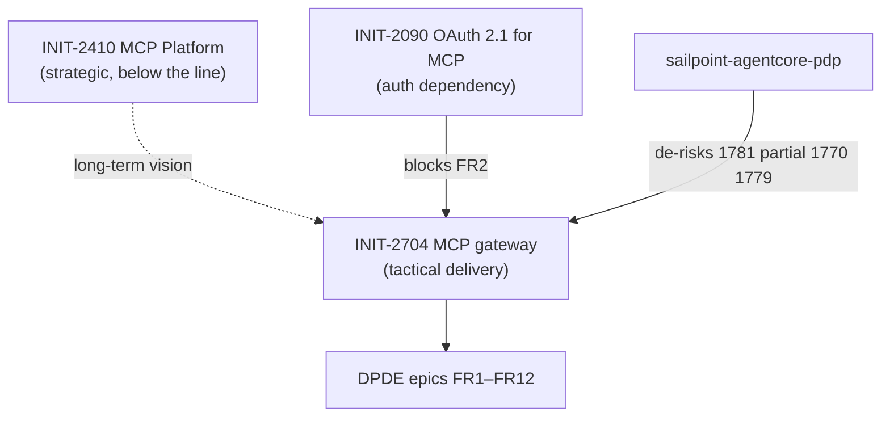

# What is MCP Gateway

As AI agents are adopted at scale, developer teams can create dozens to hundreds of specialized Model Context Protocol (MCP) servers, tailored for specific agent use case and domain, organization functions or teams. Organizations also need to integrate their own existing MCP servers or open source MCP servers for their AI workflows. There is a need for a way to efficiently combine these existing MCP servers–whether custom-built, publicly available, or open source–into a unified interface that AI agents can readily consume and teams can seamlessly share across the organization.


1) 

2) 

3) 

4) 
   

# MCP Gateway — Execution Plan

This is an EM-level execution plan for delivering a SailPoint MCP gateway built on **AWS Bedrock AgentCore Gateway** as the managed service foundation, satisfying the FRs and NFRs in:

- `[MCP Q1-2 PRD] SailPoint MCP Server Single URL and OAuth Support`
- `[MCP PRD] Tenant-Agnostic MCP Server Endpoint & OAuth Integration`

For background concepts, see `docs/mcp-gateway.md`.

**MVP specification (canonical scope):** [`mcp-gateway-mvp-spec.md`](mcp-gateway-mvp-spec.md) — FR/NFR acceptance criteria, PRD decision table, architecture, exit criteria.

Jira: **16 epics** under **[INIT-2704](https://sailpoint.atlassian.net/browse/INIT-2704)** in project **DPDE** (component **DP-SAF**, labels `INIT-2704`, `mcp-gateway`). Canonical index: [`mcp-gateway-mvp-spec.md` §4.1](mcp-gateway-mvp-spec.md#41-jira-epic-index). **FR1:** [DPDE-1768](https://sailpoint.atlassian.net/browse/DPDE-1768) · **Kickoff:** [DPDE-1767](https://sailpoint.atlassian.net/browse/DPDE-1767) · **PoC:** [DPDE-1781](https://sailpoint.atlassian.net/browse/DPDE-1781) · **NFRs:** [DPDE-1780](https://sailpoint.atlassian.net/browse/DPDE-1780) · **Docs/GA:** [DPDE-1782](https://sailpoint.atlassian.net/browse/DPDE-1782). Closed duplicate: [AI-1415](https://sailpoint.atlassian.net/browse/AI-1415).

## TL;DR For Leadership

- **What we're building.** A single, tenant-agnostic MCP endpoint for SailPoint, fronted by AWS Bedrock AgentCore Gateway, that routes authenticated MCP traffic to the correct tenant's ISC backend and provides centralized auth, tool discovery, telemetry, and policy.
- **Why now.** Per-tenant URLs block AWS Marketplace listing, "one-click install" in Cursor / Claude / VS Code, and competitive parity with Saviynt and Wiz, who already shipped marketplace MCP listings in mid-2025. Two PRDs already exist and the team is ready to start.
- **Approach.** Buy the gateway plane (AgentCore Gateway, AgentCore Identity), build the SailPoint-specific glue (tenant routing, client mapping, admin UI integration, telemetry pipeline). Avoid building a JSON-RPC / SSE proxy from scratch.
- **Target plan (this team).** **4-week MVP** with **2–3 engineers** using **Cursor + AI models** for IaC, tests, docs, and integration glue. Role split and week-by-week plan: [§ Accelerated MVP — 4 weeks](#accelerated-mvp--4-weeks-23-engineers-cursor-assisted). Delivers **internal-pilot-ready** gateway (E2E universal URL + OAuth + routing + thin observability); **not** full GA, marketplace, or every P0 NFR at production scale in four weeks.
- **Baseline plan (leadership / GA).** **~6 months** with **6 engineers + EM** (Option B below): Phase 0 (3 wk) → PoC (6 wk) → MVP (8–10 wk) → closed beta → GA. Use when the ask is production GA, FedRAMP path, full ISC Admin UI, and full NFR sign-off.
- **Risks to flag now.** Two PRDs disagree on URL and OAuth model; AgentCore is AWS-coupled (data residency, FedRAMP); bedrock-agentcore-control APIs are new and still evolving. Accelerated timeline **requires** Week-1 PM/OAuth decisions and descoping FR7 UI + Snowflake CDC.

---

## Accelerated MVP — 4 weeks, 2–3 engineers (Cursor-assisted)

**Intent:** Ship a **working, demonstrable MCP gateway** in one sprint month: universal URL, OAuth/JWT, tenant routing, `tools/list` / `tools/call` from Cursor, minimal ops visibility. Align with existing platform work ([APIMGMT-1990](https://sailpoint.atlassian.net/browse/APIMGMT-1990), [SAASSRE-6461](https://sailpoint.atlassian.net/browse/SAASSRE-6461), [SAASSIGMA-6213](https://sailpoint.atlassian.net/browse/SAASSIGMA-6213)) instead of re-building DNS/gateway plumbing in parallel.

**Starter code:** Extend [sailpoint-agentcore-pdp](https://github.com/sailpoint-core/sailpoint-agentcore-pdp) (AgentCore Gateway + PDP interceptor Terraform) per [`mcp-gateway.md` § Related Repositories](mcp-gateway.md#related-repositories) — full epic table there.

### Quick takeaway — [sailpoint-agentcore-pdp](https://github.com/sailpoint-core/sailpoint-agentcore-pdp) de-risk map

| DPDE epic | sailpoint-agentcore-pdp |
| --- | --- |
| [DPDE-1781](https://sailpoint.atlassian.net/browse/DPDE-1781) Foundation / PoC | **Largely de-risked** — AgentCore Gateway + Terraform + interceptor exist |
| [DPDE-1770](https://sailpoint.atlassian.net/browse/DPDE-1770) FR3 | **Partial** — MCP `tools/list` / `tools/call` with external targets; **net-new** for ISC tenant backends |
| [DPDE-1779](https://sailpoint.atlassian.net/browse/DPDE-1779) FR12 | **Partial** — CloudWatch audit logging; **net-new** for Snowflake + SailPoint schema |
| [DPDE-1769](https://sailpoint.atlassian.net/browse/DPDE-1769) FR2 | **Pattern only** (`CUSTOM_JWT` / `AWS_IAM`); **net-new** for SailPoint OAuth + PKCE |
| [DPDE-1771](https://sailpoint.atlassian.net/browse/DPDE-1771) FR4, [DPDE-1776](https://sailpoint.atlassian.net/browse/DPDE-1776) FR8, [DPDE-1775](https://sailpoint.atlassian.net/browse/DPDE-1775) FR7, [DPDE-1768](https://sailpoint.atlassian.net/browse/DPDE-1768) FR1, [DPDE-1773](https://sailpoint.atlassian.net/browse/DPDE-1773) FR6, [DPDE-1774](https://sailpoint.atlassian.net/browse/DPDE-1774) FR9, [DPDE-1777](https://sailpoint.atlassian.net/browse/DPDE-1777) FR10, [DPDE-1778](https://sailpoint.atlassian.net/browse/DPDE-1778) FR11, [DPDE-1780](https://sailpoint.atlassian.net/browse/DPDE-1780) NFRs, [DPDE-1782](https://sailpoint.atlassian.net/browse/DPDE-1782) Docs | **Net-new** |

**In one line:** the PDP repo is a **spike accelerator** for gateway plane + audit hooks — **not** the SailPoint product (tenant routing, OAuth productization, admin, Snowflake, production NFRs). **Eng 1** should extend it; **Eng 2** still depends on [INIT-2090](https://sailpoint.atlassian.net/browse/INIT-2090) / OAuth platform delivery.

---

## Initiative landscape — how INIT-2704 fits

Three Global Initiatives overlap MCP work. **Delivery focus for this plan:** [INIT-2704](https://sailpoint.atlassian.net/browse/INIT-2704) (gateway execution). Treat the others as **context, dependencies, and scope guardrails**.



### [INIT-2704](https://sailpoint.atlassian.net/browse/INIT-2704) — MCP gateway for SailPoint (this plan)

| | |
| --- | --- |
| **What** | Tactical delivery of universal MCP URL + OAuth + tenant routing + observability (PRD Q1–2 scope). |
| **Where tracked** | **DPDE** epics [DPDE-1767](https://sailpoint.atlassian.net/browse/DPDE-1767)–[DPDE-1782](https://sailpoint.atlassian.net/browse/DPDE-1782) under component **DP-SAF**. |
| **Docs** | [`mcp-gateway-mvp-spec.md`](mcp-gateway-mvp-spec.md), this execution plan. |
| **4-week target** | Internal-pilot gateway using accelerated plan below. |

### [INIT-2410](https://sailpoint.atlassian.net/browse/INIT-2410) — MCP Platform (strategic)

| | |
| --- | --- |
| **What** | **SailPoint MCP Platform** — make MCP the standard integration fabric for agents across SailPoint: internal teams → customers → marketplace for verified MCP tools. Phased: (1) prove case + lock infrastructure, (2) build/pilot platform, (3) scale. Confluence: [platform strategy](https://sailpoint.atlassian.net/wiki/x/PoEHEwE). |
| **Status** | In Progress in Jira, but **below the line** for stakeholder comms (May 2026): leadership directed **100% focus on SAF milestones**; initiative lead deprioritized for exec tracking. Reporter: Ye Zhu · Assignee: Maryam Agahi. |
| **Implication for INIT-2704** | INIT-2704 is a **concrete slice** of Phase 1/2 platform thinking (gateway + auth + routing), not the full platform (tool generation at scale, marketplace, org-wide governance automation). **Do not** expand INIT-2704 scope to “build the entire MCP Platform” while INIT-2410 is below the line. |
| **Coordination** | Align with Ye Zhu / Maryam Agahi on naming: gateway MVP **feeds** platform narrative later; avoid duplicate “platform” epics outside DPDE until INIT-2410 is re-baselined. |

### [INIT-2090](https://sailpoint.atlassian.net/browse/INIT-2090) — MCP: OAuth 2.1 support for MCP (auth)

| | |
| --- | --- |
| **What** | Update SailPoint authentication so **external MCP clients** (Cursor, Claude Desktop, etc.) can authenticate per **current MCP / OAuth 2.1 expectations**. |
| **Problem statement** | Today’s auth does not meet MCP spec; blocks agent configuration. |
| **Status** | In Progress · Priority Medium · Assignee: Evan Anandappa · Labels: `activity-data-insights`, `hp-core`, `q2'26-sos-track`. |
| **Critical blocker** | [ISCINTAKE-248](https://sailpoint.atlassian.net/browse/ISCINTAKE-248) (**Open**) — OAuth 2.1 for MCP: **dynamic client registration (DCR)** + login/consent so customers can use a **tenant-specific URL** in the MCP client and complete auth. **Blocks** INIT-2090. |
| **Child / related delivery** | [APIMGMT-1699](https://sailpoint.atlassian.net/browse/APIMGMT-1699) — *sp-gateway MCP and global url support* (In Progress, Lori Van Gulick) — implements [Global OAuth and MCP URLs for AI client integration](https://sailpoint.atlassian.net/wiki/spaces/ISC/pages/4146135316/Global+OAuth+and+MCP+URLs+for+AI+client+integration). **Overlaps INIT-2704 FR1** (universal URL). |
| **Also related** | [IPSPLAN-605](https://sailpoint.atlassian.net/browse/IPSPLAN-605) (Planned idea) · [SAASSIGMA-6087](https://sailpoint.atlassian.net/browse/SAASSIGMA-6087) / [SAASSIGMA-6088](https://sailpoint.atlassian.net/browse/SAASSIGMA-6088) (IPS — single URL; dedupe question in comments). |

**INIT-2090 vs INIT-2704 — important tension**

| Topic | INIT-2090 / ISCINTAKE-248 direction | INIT-2704 MVP spec (accelerated) |
| --- | --- | --- |
| Client registration | **DCR** + consent at connect time | **Static** `client_id` + admin/CLI registration (DCR → Phase II) |
| URL model | **Tenant-specific URL** in MCP client | **Universal** `mcp.sailpoint.com` + JWT routing |
| Owner | OAuth / ISC platform (Dave Owens intake) | DPDE / gateway team |

**Week-1 action:** Joint working session with **Evan Anandappa**, **Rahul Mishra** (OAuth), and **APIMGMT-1699** owner — agree minimum OAuth deliverable for 4-week gateway demo (e.g. static client + PKCE on universal URL) vs waiting for full ISCINTAKE-248. **DPDE-1769 (FR2) cannot close** without this alignment.

### Cross-initiative dependency matrix (execution plan)

| Work item | Initiative | DPDE epic | Owner to confirm |
| --- | --- | --- | --- |
| Universal URL / DNS / sp-gateway | INIT-2090 → APIMGMT-1699 | DPDE-1768 FR1 | Lori Van Gulick / SRE |
| OAuth 2.1 + PKCE + JWT authorizer | INIT-2090 ← ISCINTAKE-248 | DPDE-1769 FR2 | Evan Anandappa / Rahul Mishra |
| AgentCore gateway + PDP | INIT-2704 | DPDE-1781, partial 1779 | DPDE Eng 1 + sailpoint-agentcore-pdp |
| Tenant routing / single URL IPS | INIT-2704 | DPDE-1771 FR4 | SAASSIGMA-6087 |
| Strategic platform / marketplace | INIT-2410 | *(none — deferred)* | Ye Zhu / Maryam Agahi |

---

## Landscape — other teams, repos, and leadership (search snapshot)

Searched **Jira**, **GitHub (`sailpoint-core`)**, **Slack**, and known **Confluence** links (May 2026). Confluence pages require login; titles/URLs below are from Jira/Slack references.

### Leadership and PM ownership

| Who | Role in MCP / gateway space | Evidence |
| --- | --- | --- |
| **Ye Zhu** | PM for **MCP Platform** (strategic) | Slack [#help-cursor](https://sailpoint.slack.com/archives/C09G6AT7XL1) — Nick Amaya; drives AWS AgentCore Gateway narrative to Tony/AWS |
| **Nick Amaya** | AI team — MCP platform tooling evaluation; epic [AI-881](https://sailpoint.atlassian.net/browse/AI-881) | AI-881 On Hold; linked to INIT-2410 platform strategy |
| **Alex Reichle** | Assignee on [AI-881](https://sailpoint.atlassian.net/browse/AI-881) External MCP Gateway | Customer-facing gateway epic (on hold) |
| **Maryam Agahi** | Assignee [INIT-2410](https://sailpoint.atlassian.net/browse/INIT-2410) MCP Platform | Initiative below the line for stakeholder comms (SAF focus) |
| **Rahul Mishra** | OAuth / platform — **Global OAuth and MCP URLs** arch review requester | [#eng-architecture](https://sailpoint.slack.com/archives/C063FQJ8J48) Jan 2026 |
| **Jasper Chan / Kelly Grizzle** | AWS strategic partnership — **#ai-data-aws-explorations** | Ye’s MCP Gateway ask to AWS (Mar 2026); separate deep dive scheduled |
| **Dave Owens** | Masala / **sp-mcp-server** ownership area | Slack: owns current [sp-mcp-server](https://github.com/sailpoint-core/sp-mcp-server) |
| **Dattu Marneni** | [INIT-2704](https://sailpoint.atlassian.net/browse/INIT-2704), DPDE epics | Tactical gateway delivery (this plan) |

### Track A — Global URL + sp-gateway (largest body of **shipped** work)

Not AgentCore multiplexing, but **directly enables FR1** (`mcp.sailpoint.com`, `mcp.api.cloud.sailpoint.com`).

| Team / lead | Key Jira | Status | What they built |
| --- | --- | --- | --- |
| **API Management (Priyanka Shukla area)** | [APIMGMT-1685](https://sailpoint.atlassian.net/browse/APIMGMT-1685) | Done | Support global MCP URLs in **sp-gateway** |
| | [APIMGMT-1776](https://sailpoint.atlassian.net/browse/APIMGMT-1776) | Done | Route MCP endpoint to global MCP URL |
| | [APIMGMT-1775](https://sailpoint.atlassian.net/browse/APIMGMT-1775) | Done | Route oauth-authorization-server to global token URL |
| | [APIMGMT-1699](https://sailpoint.atlassian.net/browse/APIMGMT-1699) | In Progress | Epic: sp-gateway MCP + global URL ([Confluence HLD](https://sailpoint.atlassian.net/wiki/spaces/ISC/pages/4146135316/Global+OAuth+and+MCP+URLs+for+AI+client+integration)) — **Lori Van Gulick** |
| | [APIMGMT-1863](https://sailpoint.atlassian.net/browse/APIMGMT-1863) | Backlog | Epic: MCP Gateway and Real Time AuthZ |
| | [APIMGMT-1864](https://sailpoint.atlassian.net/browse/APIMGMT-1864) | Backlog | Spike: vendor compare + AgentCore routing scenario |
| **Sigma / IPS** | [SAASSIGMA-5948](https://sailpoint.atlassian.net/browse/SAASSIGMA-5948), [SAASSIGMA-6170](https://sailpoint.atlassian.net/browse/SAASSIGMA-6170), [SAASSIGMA-6088](https://sailpoint.atlassian.net/browse/SAASSIGMA-6088) | Done | Deploy/test **mcp.api.cloud.sailpoint.com**, CloudFront global URL, OAuth global URL |
| | [SAASSIGMA-6232](https://sailpoint.atlassian.net/browse/SAASSIGMA-6232) | Backlog | Configure **mcp.sailpoint.com** in prod |
| | [SAASSIGMA-6087](https://sailpoint.atlassian.net/browse/SAASSIGMA-6087) | In Progress | IPS: single URL for all tenants |
| **SRE** | [SAASSRE-6461](https://sailpoint.atlassian.net/browse/SAASSRE-6461) | In Progress | DNS for **mcp.sailpoint.com**, **login.sailpoint.com**, **api.identitynow.com**; CloudFront — **David Peterson** |
| **Activity Data (Masala)** | [ISCANT-12559](https://sailpoint.atlassian.net/browse/ISCANT-12559) | Backlog | sp-mcp-server global dev URLs — **Antoine Troadec** |

**Slack signal:** [Lori Van Gulick in #help-cursor](https://sailpoint.slack.com/archives/C09G6AT7XL1/p1778883059399099) testing `https://mcp.api.cloud.sailpoint.com/latest/access-requests/mcp` with Cursor (May 2026).

**Architecture review (Jan 2026):** [Global OAuth and MCP URLs](https://sailpoint.atlassian.net/wiki/spaces/ISC/pages/4146135316/Global+OAuth+and+MCP+URLs+for+AI+client+integration) — Jeff Upton feedback: CloudFront + SSE/long-running MCP POC, FedRAMP gap, finalize global URLs.

### Track B — AWS Bedrock AgentCore Gateway (POC / platform)

| Team / engineer | Key Jira / repo | Status | What they built |
| --- | --- | --- | --- |
| **API Management** | [APIMGMT-1990](https://sailpoint.atlassian.net/browse/APIMGMT-1990) | **Done** | Set up AgentCore MCP Gateway in us-east-1 — **Kartik Khamborkar** |
| | [APIMGMT-1991](https://sailpoint.atlassian.net/browse/APIMGMT-1991) | **Done** | Go-based interceptor on AgentCore GW |
| | [APIMGMT-1993](https://sailpoint.atlassian.net/browse/APIMGMT-1993) | In Progress | Outbound OAuth + target MCP server in AgentCore |
| **Sigma** | [SAASSIGMA-6213](https://sailpoint.atlassian.net/browse/SAASSIGMA-6213) | In Progress | Lambda interceptor test — **Itay Gurvich** (unstable; AWS support engaged) |
| **Eng AI Ops** | [ENGAIOPS-109](https://sailpoint.atlassian.net/browse/ENGAIOPS-109) | In Progress | AgentCore bootstrap infra + onboarding — **Jakob Vendegna** |
| | [ENGAIOPS-110](https://sailpoint.atlassian.net/browse/ENGAIOPS-110) | Backlog | AgentCore platform design doc (DACI concerns) — **Chris Lejeune** |
| **Platform infra** | [sp-agentcore-infra](https://github.com/sailpoint-core/sp-agentcore-infra) | WIP module | `modules/runtime` ready; **`modules/gateway` WIP** — shared Terraform building blocks |
| **PDP reference** | [sailpoint-agentcore-pdp](https://github.com/sailpoint-core/sailpoint-agentcore-pdp) | Mar 2026 | Python PDP interceptor + Terraform (GitHub/Atlassian demo targets) |
| **CAM / connector** | `connector-bundle-aws` bedrockagentcore | — | AgentCore connector for governance inventory (not MCP gateway product) |

### Track C — Tenant MCP server (backend, not gateway)

| Team | Repo / Jira | Notes |
| --- | --- | --- |
| **Masala / ADI** | [sp-mcp-server](https://github.com/sailpoint-core/sp-mcp-server) — **Antoine Troadec** | Per-tenant MCP tools; quarterly releases (ADI-9640+); gateway **routes to** this |
| **ISC RR** | [ISCRR-1543](https://sailpoint.atlassian.net/browse/ISCRR-1543), [ISCRR-1519](https://sailpoint.atlassian.net/browse/ISCRR-1519) | Done — SIEM/SOAR + intelligence package MCP analysis |

### Track D — AI / SAF adjacent (not gateway, but leadership attention)

| Item | Notes |
| --- | --- |
| [AI-881](https://sailpoint.atlassian.net/browse/AI-881) | External customer-facing MCP Gateway — **On Hold**; strategy + Q2 MCP PRD links |
| [ENGAIOPS-109/110](https://sailpoint.atlassian.net/browse/ENGAIOPS-109) | Internal AgentCore **agent runtime** platform, not customer MCP URL |
| [saas-sp-gateway](https://github.com/sailpoint-core/saas-sp-gateway) | New repo (May 2026); relationship to sp-gateway unclear — confirm with API Mgmt |
| SAF comms | INIT-2410 below the line; Ye Zhu on ABM/SAF per [#proj-saf-dataai-leads](https://sailpoint.slack.com/archives/C0ARY4Y1RNE) |

### Slack themes (beyond your DPDE epic creation)

| Channel | Finding |
| --- | --- |
| [#ai-data-aws-explorations](https://sailpoint.slack.com/archives/C0AHC4U2PCN) | **Ye Zhu** MCP Gateway pitch to AWS (AgentCore Gateway, tool discovery, observability); AWS to schedule **separate technical deep dive**; briefing doc planned (Nick/Ye owner TBD) |
| [#eng-architecture](https://sailpoint.slack.com/archives/C063FQJ8J48) | Approved design-review thread for **Global OAuth and MCP URLs** (Rahul Mishra) |
| [#help-cursor](https://sailpoint.slack.com/archives/C09G6AT7XL1) | Engineers testing **global MCP URL** in Cursor; PM pointer to Ye Zhu for MCP platform |
| [#team-eng-dp-jira](https://sailpoint.slack.com/archives/C0ABAE8LJ3D) | Bot noise from your **DPDE-1767–1782** epic creation (May 14) |
| DMs | You asked Sachit/Mark about MCP Gateway (May 16) — org still ramping on SailPoint-specific context |

### Confluence (referenced; not fully searchable without auth)

| Page | Relevance |
| --- | --- |
| [Global OAuth and MCP URLs for AI client integration](https://sailpoint.atlassian.net/wiki/spaces/ISC/pages/4146135316/Global+OAuth+and+MCP+URLs+for+AI+client+integration) | **Primary HLD** for sp-gateway global URL path (INIT-2090 / APIMGMT-1699) |
| [MCP Q1-2 PRD](https://sailpoint.atlassian.net/wiki/spaces/~7120200fd8a6740fdb4ca9bd0f88f478f134a5/pages/4634738812/) | INIT-2704 requirements source |
| [Draft SailPoint MCP Platform Strategy](https://sailpoint.atlassian.net/wiki/spaces/~7120200fd8a6740fdb4ca9bd0f88f478f134a5/pages/4614226238/) | INIT-2410 / AI-881 |
| [Q2 MCP PRD Platform Phase 1](https://sailpoint.atlassian.net/wiki/spaces/~7120200fd8a6740fdb4ca9bd0f88f478f134a5/pages/4853826767/) | AI-881 reference |
| [AWS Agent Core Gateway Integration](https://sailpoint.atlassian.net/wiki/spaces/~978782161/pages/4347527504/) | Internal research |
| [Approved MCP Servers](https://sailpoint.atlassian.net/wiki/spaces/SDLC/pages/4951474326/) | Lori’s Cursor test question |

### Quick takeaway — who already did what vs INIT-2704

| INIT-2704 needs | Already done elsewhere | Gap / owner to sync |
| --- | --- | --- |
| **FR1** universal URL + TLS | APIMGMT/Sigma/SRE global URL work; `mcp.api.cloud.sailpoint.com` in dev | **mcp.sailpoint.com** prod ([SAASSIGMA-6232](https://sailpoint.atlassian.net/browse/SAASSIGMA-6232)); align with Lori / David Peterson |
| **FR2** OAuth/JWT | INIT-2090, ISCINTAKE-248, global OAuth routes | DCR vs static client — **Evan Anandappa / Rahul Mishra** |
| **FR3–FR4** MCP + tenant route | sp-mcp-server per tenant; IPS single URL in flight | AgentCore **or** sp-gateway routing model — **Kartik / Itay / API Mgmt** |
| **FR11–FR12** errors + logs | APIMGMT-1991 Go interceptor; SAASSIGMA-6213 Lambda; sailpoint-agentcore-pdp audit | SailPoint envelope + Snowflake — **DPDE** |
| **Gateway product** | APIMGMT-1863/1864 spikes; AI-881 on hold; Ye/AWS AgentCore narrative | **INIT-2704 / DPDE** is the active execution track |

**Coordination meeting short list:** Kartik Khamborkar (AgentCore POC done), Lori Van Gulick (APIMGMT-1699), David Peterson (SAASSRE-6461), Itay Gurvich (interceptor), Evan Anandappa (INIT-2090), Ye Zhu (platform/OAuth product), Antoine Troadec (sp-mcp-server backends).

---

**What “MVP in 4 weeks” means**

| In scope (week 4 exit) | Deferred (weeks 5–12 or baseline plan) |
| --- | --- |
| PRD decisions D1–D7 locked in **week 1** (not a 3-week Phase 0) | FedRAMP / UAE1 regions |
| AgentCore Gateway + IaC in dev/stage; reuse platform DNS/TLS where possible | Full **ISC Admin UI** for MCP clients (FR7) |
| SailPoint OAuth + PKCE; JWT authorizer; token-expired UX (FR2, FR5) | **Snowflake** mapping CDC + analytics (FR9) — CloudWatch first |
| `client_id → tenant_id` store + routing to ISC tenant MCP (FR3, FR4, FR8) | **1M req/month** load proof (NFR-005) — smoke at 50–100 concurrent |
| Universal URL + client docs for **Cursor + Claude Desktop** (FR1) | Closed beta **5–10 tenants** (Phase 3) |
| Structured errors + `/health` (FR11); JSON request logs, no tokens in logs (FR12) | Full Grafana suite + Snowflake dashboards (FR10) |
| Backward-compat **smoke** on 1–2 legacy tenant URLs (FR6) | AWS Marketplace listing |
| Admin: **CLI or internal API** to register clients (FR7 minimum) | DCR, developer portal (Phase II) |
| Threat model + routing fuzz tests (security gate before “done”) | Full SRE ORR + on-call (baseline MVP exit) |

Canonical acceptance criteria remain in [`mcp-gateway-mvp-spec.md`](mcp-gateway-mvp-spec.md); the table above is **scope negotiation** for the compressed schedule.

### Who does what (2–3 engineers + EM)

Assume **~0.5 EM** (you) for decisions, dependencies, and demos; **2 FTE builders** minimum; **+1 FTE** strongly recommended for tests/docs/telemetry so platform and identity engineers are not the only testers.

| Role | Person (fill in) | Primary ownership | Jira epics | How Cursor / models help |
| --- | --- | --- | --- | --- |
| **EM / coordinator** | _TBD_ | Week-1 decision workshop; OAuth/UI/SRE dependency dates; weekly demo; acceptance sign-off against MVP spec §14 | [DPDE-1767](https://sailpoint.atlassian.net/browse/DPDE-1767) kickoff | PRD diff summaries, epic/story breakdown, status reports, Confluence-ready decision log |
| **Eng 1 — Platform / AgentCore** | _TBD_ | IaC (Terraform/CDK), AgentCore gateway + targets, tenant routing, mapping store, error/health Lambda, perf smoke | [DPDE-1781](https://sailpoint.atlassian.net/browse/DPDE-1781), [DPDE-1770](https://sailpoint.atlassian.net/browse/DPDE-1770), [DPDE-1771](https://sailpoint.atlassian.net/browse/DPDE-1771), [DPDE-1776](https://sailpoint.atlassian.net/browse/DPDE-1776), [DPDE-1778](https://sailpoint.atlassian.net/browse/DPDE-1778), [DPDE-1780](https://sailpoint.atlassian.net/browse/DPDE-1780) (smoke only) | Generate IaC modules, routing Lambda, contract tests, runbooks; iterate on AgentCore API from AWS docs in-repo |
| **Eng 2 — Identity / integration** | _TBD_ | OAuth/JWT authorizer, PKCE with MCP clients, scopes, token-expired envelope, E2E client config (FR1 path) | [DPDE-1769](https://sailpoint.atlassian.net/browse/DPDE-1769), [DPDE-1772](https://sailpoint.atlassian.net/browse/DPDE-1772), [DPDE-1768](https://sailpoint.atlassian.net/browse/DPDE-1768) | JWKS/authorizer config drafts, integration test scaffolding, Cursor/Claude Desktop config snippets |
| **Eng 3 — Quality / DX** _(optional but recommended)_ | _TBD_ | Request logging pipeline (thin), compat harness, admin registration CLI/API, setup docs | [DPDE-1779](https://sailpoint.atlassian.net/browse/DPDE-1779), [DPDE-1773](https://sailpoint.atlassian.net/browse/DPDE-1773), [DPDE-1782](https://sailpoint.atlassian.net/browse/DPDE-1782), [DPDE-1775](https://sailpoint.atlassian.net/browse/DPDE-1775) (CLI not UI), [DPDE-1777](https://sailpoint.atlassian.net/browse/DPDE-1777) (basic alarms) | k6/Locust scripts, markdown docs, OpenAPI for mapping CRUD, redaction checklist |

**Shared / not on the 2–3 FTE hook** (must be calendar-bound in week 1):

| Partner | Delivers | Blocks |
| --- | --- | --- |
| **Rahul Mishra / OAuth** | Issuer, JWKS, static client registration, scopes | Eng 2 — entire hot path |
| **Ben Coble / UI** | FR7 **only** if leadership insists on Admin UI in 4 weeks; otherwise API contract for CLI | Eng 3 — admin flows |
| **SRE / APIMGMT / SAASSRE** | Global URL, DNS, CloudFront, sp-gateway alignment | Eng 1 — FR1 TLS hostname |
| **ISC / Masala** | Stable tenant MCP backend URL + test tenant | E2E demo |
| **Security** | 2–4 hr threat-model review + sign-off on routing tests | Week 4 “done” |
| **Data Platform** | Snowflake path | Post–week 4 (FR9) |

### Four-week calendar

```
Week:     1                    2                    3                    4
          |--------------------|--------------------|--------------------|--------------------|
Eng 1     | IaC + AgentCore    | Targets + routing  | Mapping + errors   | Perf smoke + fixes |
          | spike (reuse       | + mapping v0       | + log shipping     | + handoff runbook  |
          | APIMGMT work)      |                    | (CW)               |                    |
Eng 2     | OAuth/JWT spike    | PKCE E2E Cursor    | Multi-tenant +     | Token UX + sec     |
          | + D1–D7 decisions  | tools/list,call    | revoke + 401/403   | test fixes         |
Eng 3     | Compat harness     | Admin CLI/API      | Docs draft         | NFR-011 timed test |
(or EM)   | skeleton           | + FR6 smoke        | Cursor+Claude      | + demo recording   |
All       | Demo: skeleton     | Demo: 1 tenant E2E | Demo: 2 tenants    | Demo: MVP checklist|
```

**Week 1 — Lock & spike (no multi-week Phase 0)**

- **Days 1–2:** Decision meeting (D1–D7 in [`mcp-gateway-mvp-spec.md` §4](mcp-gateway-mvp-spec.md#4-prd-reconciliation--decisions-required)); assign Eng 1/2/3; confirm reuse of in-flight APIMGMT/SRE AgentCore + DNS work.
- **Days 3–5:** Parallel spikes — AgentCore + one target (Eng 1); OAuth authorizer + JWKS (Eng 2); repo scaffold, CI, compat test skeleton (Eng 3 or Cursor agent).
- **Exit:** One `tools/list` through gateway in dev with **hardcoded** tenant mapping (acceptable for spike only).

**Week 2 — One tenant end-to-end**

- Eng 1: Mapping store (DynamoDB preferred for speed) + target wiring.
- Eng 2: PKCE flow in Cursor; `tools/call` on one real ISC tenant.
- Eng 3: CloudWatch structured logs; start FR1 quickstart doc.
- **Exit:** Demo from Cursor using universal URL + `client_id` (record for stakeholders).

**Week 3 — Harden path & admin without UI**

- Eng 1: Routing cache, error envelope, `/health`; negative routing tests.
- Eng 2: Revoked client, expired token, scope gaps.
- Eng 3: Admin **CLI/API** for client + mapping CRUD; backward-compat smoke vs legacy tenant URL.
- **Exit:** Second tenant on same gateway; zero cross-tenant failures on fuzz suite.

**Week 4 — Pilot-ready package**

- Thin dashboards/alarms (CloudWatch; defer Snowflake/Grafana depth).
- Docs: Cursor + Claude Desktop only (VS Code best-effort).
- Security review + MVP spec §14 checklist (honest exceptions documented).
- **Exit:** “Internal pilot ready” — **not** GA. Schedule beta (baseline Phase 3) if leadership agrees.

### Cursor / AI working agreements (make the 4-week plan credible)

- **Single repo** (or mono-folder) with `AGENTS.md` / rules: stack (CDK/Terraform, Python/TS), AgentCore patterns, “no tenant id in URL” invariant.
- **AI generates; humans review:** IaC, tests, and docs — **not** routing/security logic without review.
- **Daily:** Each engineer lands one vertical slice (test included); use Cursor Agent for boilerplate, Composer for cross-file refactors.
- **Pre-baked prompts:** “Add contract test for 401 envelope,” “Generate k6 smoke for tools/list,” “Draft Cursor mcp.json for gateway URL.”
- **Do not AI-scope creep:** No multiplexing, no semantic search, no FedRAMP — explicit in rules file.

### Accelerated vs baseline timeline

| Milestone | Accelerated (2–3 eng + Cursor) | Baseline Option B |
| --- | --- | --- |
| Technical MVP (internal pilot) | **4 weeks** | ~19 weeks (P0+P1+P2 start) |
| Full P0 FR/NFR + ORR | Weeks 5–10 (follow-on) | Week ~19 |
| Closed beta | Week ~12+ | Week ~23 |
| GA + marketplace | Week ~16+ | Week ~27 |

---

## Key Caveat: The Two PRDs Disagree

Before we write a line of code, the team needs PM alignment on three points where the PRDs conflict:

| Topic | PRD 1 (`fIBAFAE`) | PRD 2 (`NIDUAgE`) | What we need to decide |
| --- | --- | --- | --- |
| Public URL | `https://mcp.sailpoint.com/` | `https://mcp.identitynow.com/` | One canonical hostname (and FedRAMP / UAE1 variants). |
| Tenant resolution | `client_id → tenant_id` static mapping table | Email-based discovery via `login.sailpoint.com/oauth/authorize` | Static map for MVP, email discovery for GA, or both? |
| OAuth model | Authorization Code, static client registration | OAuth 2.1 + PKCE + Dynamic Client Registration (RFC 7591) | Pick the v1 protocol; defer DCR to Phase II if needed. |
| Backward compatibility | Existing tenant URLs continue indefinitely | Deprecate when traffic < 5 tenants | Set a deprecation policy now. |
| Audit / telemetry sink | Snowflake | Snowflake + alerts on anomalies | Confirm pipeline owner. |

**Recommended call:** EM (Dattu) + PMs (Ye, Rahul) + OAuth lead (Rahul Mishra) + UI lead (Ben Coble) + Masala EM (Dave Owens) before Phase 0 sign-off.

## How AgentCore Gateway Maps To The FRs / NFRs

This is the build-vs-buy table, which directly informs the workstream breakdown.

| Requirement | AgentCore Gives Us | We Have To Build / Configure |
| --- | --- | --- |
| FR1 — single endpoint URL | Gateway endpoint (`*.bedrock-agentcore.<region>.amazonaws.com`) | Custom domain (`mcp.sailpoint.com`) via Route 53 + ACM, CloudFront if needed. |
| FR2 — OAuth/JWT auth | `customJWTAuthorizer` with discovery URL + allowed clients | Wire SailPoint OAuth as the IdP (or Cognito as a bridge). |
| FR3 — `tools/list` / `tools/call` | Native MCP protocol; cache-first `ListTools`; live `tools/call` | Per-tenant target registration; tool namespacing strategy. |
| FR4 — tenant routing | Targets per backend; gateway routes by tool name | Mapping `client_id` (or email-derived `tenant_id`) → target ARN; routing Lambda interceptor if claim-based routing is needed. |
| FR5 — token expiration handling | Standard 401 from authorizer | Custom error response shape (`{error, message, request_id}`). |
| FR6 — backward compatibility | N/A — purely additive | Keep existing tenant-specific URLs unchanged. |
| FR7 — admin portal for client registration | N/A | UI changes in ISC Admin Portal (collab with Ben Coble's team). |
| FR8 — `client_id → tenant_id` mapping | N/A | Backing store (DynamoDB or RDS), CRUD APIs, auth on those APIs. |
| FR9 — Snowflake mapping query | N/A | CDC pipeline from mapping store to Snowflake. |
| FR10 — usage dashboards | CloudWatch metrics, gateway logs | Grafana / Snowflake dashboards, alarm definitions. |
| FR11 — structured error responses | Default error envelope | Custom error transformer (Lambda) for 4xx/5xx normalization. |
| FR12 — structured request logs | CloudWatch Logs JSON | Log shipping to OpenSearch + Snowflake; PII redaction. |
| NFR-001..003 — latency p50 / p95 / p99 | AgentCore latency baseline | Performance test suite; tune Lambda/cache; warm pools. |
| NFR-004..006 — scale | Managed scaling | Load tests at 100 concurrent / 1M req/month / 1k clients. |
| NFR-007..008 — uptime, error rate | AWS SLA | Multi-AZ; canary alarms; runbook. |
| NFR-009..010 — TLS, JWT validation | Native | Configure TLS policy, allowed clients, token verification. |
| NFR-011..013 — usability | N/A | Setup docs, error messages with hints, time-to-config tests. |
| NFR-014..015 — cost | AWS billing | Cost tagging, monthly cost reports, budget alerts. |
| Security NFRs (PRD 2) — zero cross-tenant leakage | Per-target credential isolation | Conformance tests, fuzz testing, security review. |

The honest read: AgentCore covers the heavy lifting on the gateway plane (protocol, auth scaffolding, scale, observability primitives). The SailPoint-specific work concentrates on **identity integration, client/tenant mapping, admin UX, telemetry pipeline, and FedRAMP / UAE1 strategy**.

## Phased Execution Plan (baseline — ~6 months)

> **Active target for a 2–3 engineer squad:** use [Accelerated MVP — 4 weeks](#accelerated-mvp--4-weeks-23-engineers-cursor-assisted) above. The phases below are the **full-program** sequencing (Option B).

### Phase 0 — Reconciliation & Design (3 weeks)

**Goal:** Lock product scope, pick the canonical URL, choose the OAuth model, sign off on the architecture.

- Reconcile PRDs with Ye, Rahul, Dave Owens, Ben Coble.
- Architecture review: AgentCore Gateway + SailPoint OAuth + tenant routing model.
- Decision: AgentCore-managed JWT vs. custom Lambda authorizer.
- Define interface between gateway and ISC tenant backends (request/response contract, headers, identity propagation).
- Spike: AgentCore Gateway in a sandbox AWS account with a stub MCP server and a Cognito JWT (1 engineer, 3 days).
- Cost model: estimate AgentCore + Lambda + storage at expected load (NFR-014/15).
- Output: signed HLD, exit criteria for Phase 1.

### Phase 1 — Foundation / PoC (6 weeks)

**Goal:** End-to-end path working for one demo tenant, in a non-production AWS account.

- AWS account, IAM roles, VPC/networking baseline.
- AgentCore Gateway provisioned via IaC (CDK or Terraform).
- Custom domain `mcp.sailpoint.com` (or `mcp.identitynow.com` once decided) wired via Route 53 + ACM.
- SailPoint OAuth integrated as `customJWTAuthorizer` (or via Cognito federation if a bridge is required).
- One AgentCore Gateway target pointing at one ISC tenant MCP backend.
- `tools/list` and `tools/call` working end-to-end from Cursor and Claude Desktop using the universal URL.
- CloudWatch logs flowing; minimal dashboard.
- Output: working demo + design validation report; updated cost estimate against actuals.

### Phase 2 — MVP (8–10 weeks)

**Goal:** All P0 FRs and NFRs satisfied for a single primary region; ready for closed beta.

The MVP runs as 8 parallel workstreams. Each is sized for one engineer (or pair) over the phase, with explicit week-by-week sequencing inside the phase.

#### Sequencing Inside Phase 2

```
Week:                1   2   3   4   5   6   7   8   9   10
WS-A Routing         |design|--build---|integrate|test|
WS-B Auth            |design|--build---|integrate|test|
WS-C Admin Portal              |design|------build------|test|
WS-D Telemetry           |spike|--build---|wire----|verify|
WS-E Error & Health  |design|build|----------------verify|
WS-F Backward Compat                       |build harness|run|
WS-G Performance                                |baseline|tune|sign off|
WS-H Documentation                       |draft|review|polish|
Cross-cutting        |IaC, CI/CD, threat model, weekly demos
```

Weeks 1–2 are design / spikes that unblock the longest paths (WS-A and WS-B). WS-C starts in week 3 once the auth contract with WS-B is locked. WS-G runs against the latest build from week 7.

#### WS-A — Routing & Targets (FR3, FR4, FR8)

- **Goal.** Resolve every authenticated request to the correct tenant ISC backend, with sub-10ms routing overhead and zero cross-tenant leakage.
- **Deliverables.**
  - `client_id → tenant_id` mapping store (DynamoDB or RDS — decision in Phase 0).
  - Mapping CRUD API behind admin auth, used by WS-C.
  - AgentCore Gateway target provisioning automation (one target per tenant, or one target per backend with claim-based routing — pick one).
  - Routing Lambda interceptor (if AgentCore's native routing is insufficient) that reads `tenant_id` claim and selects the target.
  - Hot-path in-memory cache (TTL ≤ 60s) with cache-miss path to mapping store.
  - Routing decision logs (correlated with WS-D).
- **Acceptance.**
  - p50 routing overhead < 10ms; p95 < 50ms (contributes to NFR-001..003).
  - 100% of requests hit a tenant target derived only from token claims (no path/header inputs).
  - Negative tests: tampered tokens, missing claims, revoked clients all return correct 4xx.
- **Decisions to lock.** Mapping store choice; one-target-per-tenant vs one-target-with-routing-Lambda; cache invalidation strategy when an admin rotates a mapping.
- **Dependencies.** WS-B (token claim shape); WS-C (admin write path); ISC tenant team (backend URL contract).
- **Risks.** AgentCore target limits per gateway (verify in Phase 1 spike); cold-start on routing Lambda eating latency budget.

#### WS-B — Auth & Identity (FR2, FR5, NFR-009, NFR-010)

- **Goal.** SailPoint OAuth integrated as the gateway's authorizer; JWTs validated on every request; clear UX on token expiry.
- **Deliverables.**
  - Decision and implementation of `customJWTAuthorizer` config — direct against SailPoint OAuth or via Cognito as a bridge.
  - JWKS caching strategy (refresh interval, fallback on validation endpoint outage per PRD 2 NFR3).
  - Scope handling (e.g. `sp:mcp:all`, `mcp:read`, `mcp:submit_access_request`).
  - Token-expired error response (`401` with `{error: "token_expired", message, hint}` and `request_id`).
  - PKCE flow validated against Cursor / Claude Desktop / Claude Code via `mcp-remote`.
  - VS Code header-token path validated (PRD 1 §6.1).
- **Acceptance.**
  - 100% of requests pass through JWT validation (NFR-010).
  - 0 unauthenticated requests reach a backend in security tests.
  - Round-trip from "user opens client" to "tools/list returns" under 10s in fresh browser (contributes to NFR-011).
- **Decisions to lock.** Cognito bridge yes/no; scope taxonomy with Rahul Mishra; refresh-token lifetime; redirect URI policy for static clients.
- **Dependencies.** Rahul Mishra (OAuth platform team) — issuer URL, JWKS endpoint, scope registration.
- **Risks.** SailPoint OAuth not yet exposing a discovery URL compatible with `customJWTAuthorizer`; PKCE quirks across MCP clients.

#### WS-C — ISC Admin Portal: MCP Client Registration (FR7)

- **Goal.** Admins can create, label, view, and revoke MCP clients in the existing ISC Admin Portal.
- **Deliverables.**
  - "MCP Clients" section in the ISC Admin UI (with Ben Coble's team).
  - Create flow: name, description, grant type (`Authorization code`), scopes, redirect URIs.
  - Display generated `client_id`, link to consent screen URL.
  - List / search / filter / revoke flows.
  - Audit log entries on every admin action.
  - API contract with WS-A's mapping store.
- **Acceptance.**
  - End-to-end: admin creates a client, developer pastes the `client_id` into Cursor, tools/list works.
  - All actions audited; revoke is effective within 60s (cache TTL).
- **Decisions to lock.** Whether tenant_id binding is set at client creation (PRD 1 model) or derived from the admin's own session (cleaner). Whether to expose this in the Customer-facing portal or only the SailPoint internal admin portal in MVP.
- **Dependencies.** Ben Coble's UI team (component library, design review); ISC platform team (admin auth, audit log infra).
- **Risks.** UI bandwidth; design review cycle; deciding scope of "labeling" (FR7 mentions it but acceptance criteria are thin).

#### WS-D — Telemetry, Logging & Snowflake (FR9, FR10, FR12)

- **Goal.** Every request and every admin action is observable in dashboards and queryable in Snowflake within minutes.
- **Deliverables.**
  - Structured JSON logs from gateway: `request_id`, `client_id`, `tenant_id`, `method`, `status_code`, `latency_ms`, `timestamp`, `error_type`, `error_message`.
  - PII / token redaction in log pipeline (no bearer tokens, no PII fields, NFR-008 + PRD 2 NFR1).
  - CloudWatch → OpenSearch shipping for ops queries.
  - CDC pipeline from mapping store to Snowflake (FR9).
  - Request log shipping to Snowflake (FR12).
  - Grafana dashboards: request rate, p50/p95/p99 latency, error rate, requests per tenant, top MCP methods, auth failures (PRD 1 §6.3 mock).
  - CloudWatch alarms: error rate > 1% (5 min), p95 latency > 500ms (5 min), 5xx spike, auth failure spike.
- **Acceptance.**
  - Dashboards filterable by 1h / 6h / 24h / 7d.
  - Alarms paged within 5 minutes of threshold breach.
  - Snowflake queries return mapping + usage data within 15 minutes of the event.
  - PII / token redaction passes a security review checklist.
- **Decisions to lock.** Log retention durations; alert routing (PagerDuty / Slack / email); whether to use Grafana, Datadog, or both.
- **Dependencies.** Data Platform / Snowflake team; Security for redaction sign-off.
- **Risks.** Log volume / cost (1M req/month with verbose logs is non-trivial); CDC lag; PII leaks slipping through.

#### WS-E — Error Handling & Health (FR11)

- **Goal.** Every failure path returns a consistent envelope; clients can programmatically handle every status code we promise.
- **Deliverables.**
  - `GET /health` returns `{status, version, timestamp}` with HTTP 200.
  - Error envelope `{error, message, request_id}` for all 4xx / 5xx.
  - Status code coverage per PRD 1 FR11: 400 malformed, 401 auth failure, 403 unregistered/revoked, 502 backend bad, 503 service unavailable.
  - Error message audit: every response includes a next-step hint (NFR-013).
  - Stack traces only in 5xx logs, never in client responses.
- **Acceptance.**
  - Contract test asserts envelope shape on every status code.
  - 100% of error responses include a `request_id` traceable in WS-D logs.
- **Decisions to lock.** Whether to expose `request_id` in headers, body, or both; localization (likely deferred).
- **Dependencies.** WS-D for `request_id` propagation.
- **Risks.** Inconsistency between AgentCore default errors and our envelope (may need a Lambda response transformer).

#### WS-F — Backward Compatibility (FR6)

- **Goal.** Existing tenant-specific MCP URLs continue to work, untouched, throughout MVP and beyond.
- **Deliverables.**
  - Test harness against existing tenant-specific endpoints in dev/staging before and after gateway deploy.
  - Compatibility test suite covering `tools/list`, `tools/call`, error envelopes, response timing.
  - Migration guide (paired with WS-H) showing the path from tenant URL to gateway URL.
  - Per-tenant traffic graphs (gateway vs direct) shipped to WS-D.
- **Acceptance.**
  - Zero regressions on tenant-direct URLs.
  - Test suite runs on every CI build of the gateway.
- **Decisions to lock.** Sunset criteria for tenant-direct URLs (PRD 2 says "<5 tenants of traffic"); communication policy if/when sunset begins.
- **Dependencies.** ISC tenant team; access to representative dev tenants.
- **Risks.** Subtle drift in response headers/timing between gateway and direct paths.

#### WS-G — Performance, Scale, Reliability (NFR-001..008)

- **Goal.** Prove the gateway hits the NFRs at and beyond the target load.
- **Deliverables.**
  - Load test harness (k6 or Locust) parameterized by concurrency and request mix.
  - Baseline runs at 10, 50, 100 concurrent (NFR-004).
  - Sustained 1M-request burndown over 24h to validate NFR-005.
  - Profiling / tuning of routing Lambda (cold start, memory, concurrency reservations).
  - Cache effectiveness report (hit rate ≥ 95% on mapping cache).
  - Multi-AZ failover test (NFR-007).
  - Runbook for top 10 incident scenarios.
- **Acceptance.**
  - Latency: p50 < 10ms, p95 < 300ms, p99 < 500ms overhead (NFR-001..003).
  - Error rate < 0.1% (NFR-008).
  - Sign-off from SRE on operational readiness.
- **Decisions to lock.** Where load tests run (separate AWS account?); SLO budgets; on-call rotation policy.
- **Dependencies.** SRE for ORR; AgentCore service quotas confirmed with AWS.
- **Risks.** AgentCore latency floor may already eat much of the 300ms budget; need an early reading.

#### WS-H — Documentation, Setup & Migration Guides (NFR-011, NFR-012, FR1)

- **Goal.** A new developer can go from "I have a SailPoint account" to "tools/list works in my MCP client" in under 10 minutes (NFR-011).
- **Deliverables.**
  - Setup guides for Cursor, Claude Desktop, Claude Code, VS Code (+ Continue.dev, Windsurf as best-effort).
  - CLI token helper documentation (`@sailpoint/mcp-auth login` from PRD 1 §5.7).
  - Troubleshooting guide for the top 10 expected error codes.
  - Migration guide from tenant URL to gateway URL.
  - Demo video (≤ 3 minutes) for internal enablement.
  - Timed user test with 3+ developers (NFR-011 acceptance).
- **Acceptance.**
  - 3 developers configure a client end-to-end in < 10 minutes without help.
  - Docs reviewed by DevRel and pass a copy editorial pass.
- **Decisions to lock.** Where docs live (developer.sailpoint.com vs Confluence); ownership of ongoing updates.
- **Dependencies.** WS-A through WS-G producing stable behavior to document; DevRel calendar.
- **Risks.** Docs always slip last; assign a named owner with capacity reserved.

#### Cross-Cutting Throughout Phase 2

- **IaC.** Terraform or CDK from day one; no console-only changes.
- **CI/CD.** Per-environment pipelines (dev → stage → preprod). Block merges on contract + perf smoke tests.
- **Threat modeling.** STRIDE pass on routing logic and admin APIs in week 2; security sign-off before WS-A merges to main.
- **Weekly demos.** Friday demo to PMs (Ye, Rahul) and Ben's UI lead. Trim scope explicitly each week, don't let it accrete.
- **Cost tracking.** Cost-per-1k-requests reported weekly to validate NFR-014/15 reframing.

#### Phase 2 Exit Criteria

- All P0 acceptance criteria for FR1–FR12 met (FR7 admin portal at "internal-admin only" minimum; full external-admin flow may slip to Phase 3 if needed).
- All P0 NFRs met or have a documented exception with PM agreement.
- ORR passed with SRE.
- Runbook published; on-call rotation defined.
- At least one internal team using the gateway on a non-production tenant for ≥ 1 week without a P1 incident.

### Phase 3 — Closed Beta (4 weeks)

**Goal:** Real customers (or internal SailPoint AI use cases) on the gateway with limited blast radius. Prove operational readiness with real traffic.

#### Pilot Tenant Selection

- Aim for 5–10 tenants spanning at least three personas: an internal SailPoint dev team, an existing MCP preview customer, and a marketplace-target enterprise customer.
- Selection criteria: low political risk, technically engaged contact, willingness to give weekly feedback, traffic volume that exercises (but doesn't saturate) NFR-004/005.
- Each pilot signs a 30-day commitment with a clear exit path.

#### Operational Readiness Review (ORR) Checklist

- Runbook reviewed with on-call.
- Alarm thresholds tuned with real baseline data from Phase 2.
- Rollback plan documented (DNS swap back to direct tenant URLs).
- Tabletop exercise: simulate a backend outage, an OAuth IdP outage, and a cross-tenant leak alert.
- Security: independent security review of WS-A and WS-B sign-off.
- Privacy: log redaction validated by an external reviewer.
- Capacity: AWS service quotas raised for projected beta load.

#### Beta Cadence

- **Daily:** error / latency review by tech lead and SRE.
- **Weekly:** customer feedback sync; triage top friction list; ship fixes mid-week.
- **End of week 2:** go/no-go checkpoint to continue toward GA.

#### Beta Success Criteria (Required For GA)

- ≥ 5 tenants actively using the gateway for 7+ consecutive days.
- 0 P1 incidents related to cross-tenant leakage, auth bypass, or data integrity.
- All P0 NFRs met against real traffic for 14 consecutive days.
- ≥ 80% of pilot customers say "I would recommend this" in feedback survey.
- Top 5 customer-reported issues fixed and verified.

### Phase 4 — General Availability (4 weeks)

**Goal:** Public availability on the chosen URL with full launch communications and (if in scope) AWS Marketplace listing.

#### Launch Checklist

- DNS cutover plan rehearsed; rollback plan documented.
- 24×7 on-call rotation handed to SRE; pager hygiene reviewed.
- Status page entry created (status.sailpoint.com or equivalent).
- Customer-facing release notes published.
- Internal enablement: support, sales engineering, and customer success briefed and have demo access.

#### AWS Marketplace Listing (If In Scope)

- Listing copy written and legal-reviewed (PRD 2 §Documentation appendix has the form template).
- Single endpoint URL confirmed (`https://mcp.identitynow.com/` per PRD 2, or chosen alternative).
- OAuth scopes registered and documented.
- Submission timeline: AWS marketplace review historically 2–4 weeks; start in week 1 of Phase 4.

#### Communications Plan

- **Internal.** All-hands lightning talk; #engineering and #product Slack announcements; customer success enablement deck.
- **External.** Blog post on developer.sailpoint.com; LinkedIn post from product leadership; mention in next customer newsletter; community post in MCP / Cursor / Claude developer channels.
- **Sales / GTM.** Battlecard against Saviynt and Wiz marketplace listings; one-pager for AEs.

#### 30 / 60 / 90 Day Success Metrics

| Metric | 30 days | 60 days | 90 days |
| --- | --- | --- | --- |
| Customers using gateway | 5 | 15 | 25+ |
| Monthly request volume | 100k | 500k | 1M+ |
| Latency p95 overhead | < 300ms | < 250ms | < 200ms |
| Error rate | < 0.5% | < 0.2% | < 0.1% |
| Cost per 1k requests | Document | Trending down | Within budget |
| Marketplace listing live | In review | Live | Trending traffic |

### Phase II — Post-GA (Q3+ planning)

These items are **explicitly deferred** in PRD 1 and PRD 2; they get their own planning cycle once GA is stable. Listed in roughly the order I'd recommend tackling them.

#### II-1: Dynamic Client Registration (RFC 7591) — High Priority

- Lets MCP clients self-register without an admin step, satisfying PRD 2 OAuth 2.1 + DCR direction.
- Removes the biggest friction point in the developer onboarding flow.
- Effort: 1 senior identity engineer + 1 backend, 6–8 weeks.
- Pre-req: lock down rate limiting (II-4) so DCR doesn't open an abuse vector.

#### II-2: Developer Self-Service Portal — High Priority

- A `developer.sailpoint.com/mcp` portal where developers manage their own clients, see usage, rotate credentials, view docs.
- Replaces the admin-only registration from MVP for the customer-facing case.
- Effort: 1 frontend + 1 backend + design support, 8–10 weeks.

#### II-3: Tool Namespacing & Discovery UI — Medium Priority

- Prefix tools by domain (`access_requests.*`, `workflows.*`, `identity.*`) and expose discovery in the gateway response.
- Pairs naturally with AgentCore's semantic search tool.
- Effort: 1 backend, 4–6 weeks; coordinated with each tool-owning team.

#### II-4: Per-Tenant Rate Limiting — Medium Priority

- Required before opening DCR; protects backends from a single noisy tenant.
- Token-bucket on `tenant_id` claim; configurable per-tenant overrides.
- Effort: 1 backend, 3–4 weeks.

#### II-5: FedRAMP / UAE1 Region Rollout — High Priority If Customer-Driven

- Mirror MVP architecture into FedRAMP-eligible AWS region (`us-gov-east-1` or equivalent).
- Confirm AgentCore Gateway availability in FedRAMP regions before committing.
- Includes data-residency review and possibly a separate URL (`mcp-gov.identitynow.com`).
- Effort: 2 backend + SRE + compliance partner, 8–12 weeks.

#### II-6: Federation Across Gateways — Lower Priority

- AgentCore supports gateway-of-gateways. Useful if internal SailPoint AI use cases want their own MCP plane that nests under the customer-facing one.
- Defer until at least one concrete internal use case requires it.

#### II-7: Tool Catalog Consolidation Across SailPoint — Lower Priority

- Onboard non-ISC backends (NERM, AIS, SaaS Identity) as additional AgentCore targets.
- Each new backend type is its own mini-project; pace by customer demand.

## Workstream → Skills Map

| Workstream | Primary skills | Secondary skills |
| --- | --- | --- |
| WS-A Routing & Targets | AWS (Lambda, DynamoDB, IaC), Python or Go, MCP/JSON-RPC understanding | Performance engineering |
| WS-B Auth | OAuth 2.0 / 2.1, PKCE, JWT, IdP integration (Cognito, Okta-style) | Security review experience |
| WS-C Admin Portal | React / TypeScript (matches existing ISC UI stack), API integration | UX collaboration with Ben Coble's team |
| WS-D Telemetry | Snowflake, OpenSearch, Grafana, data engineering | Observability tooling, dashboarding |
| WS-E Error & Health | API design, structured logging | Compliance / PII awareness |
| WS-F Backward Compat | Test engineering, contract testing | Existing ISC API knowledge |
| WS-G Performance | k6 / Locust, AWS Lambda tuning, profiling | Capacity planning |
| WS-H Documentation | Tech writing, DevRel | Cursor / Claude / VS Code MCP client experience |
| Cross-cutting | AWS IaC (Terraform / CDK), CI/CD, threat modeling, cost engineering | Incident response, on-call |

## Team Shape — Staffing Options

These are starting points to pitch to leadership. All assume some shared support from OAuth, UI, and Docs teams.

### Option D — Accelerated MVP (2–3 engineers + EM, Cursor-assisted) **← current target**

| Role | Count | Notes |
| --- | --- | --- |
| EM (part-time) | 0.5 | Decisions, dependencies, demos — not a third builder |
| Platform / AgentCore engineer | 1 | Must-own IaC + routing |
| Identity / OAuth engineer | 1 | Must-own authorizer + client E2E |
| Quality / DX engineer | 0–1 | Strongly recommended; else EM + Eng 1 absorb tests/docs |

- **Timeline:** **4 weeks** to internal-pilot MVP; **+6–8 weeks** recommended for full P0 NFRs, ISC Admin UI, Snowflake, beta (if leadership wants production-grade without adding headcount).
- **Cursor / models:** Treat as **~1.3–1.5× effective throughput** on IaC, tests, and docs — **not** on OAuth policy, security sign-off, or cross-team calendar slips.
- **Who does what:** [§ Accelerated MVP — Who does what](#who-does-what-2–3-engineers--em)
- **Risk:** Two engineers without Eng 3 → docs and compat slip; FR7 UI in 4 weeks is **not realistic** without Ben Coble’s team dedicated.

### Option A — Lean (4 engineers + EM)

- 1 EM
- 1 staff/tech lead (AWS + identity)
- 2 backend engineers (one MCP/Lambda, one telemetry/Snowflake)
- 0.5 SDET, 0.25 SRE (shared)

Risk: slower to GA (\~7–8 months), one person deep on each axis is a single point of failure, hard to parallelize WS-A through WS-D.

### Option B — Recommended (6 engineers + EM)

- 1 EM
- 1 staff/tech lead
- 1 senior backend (routing, AgentCore, Lambda)
- 1 senior identity engineer (OAuth, JWT, PKCE)
- 1 backend engineer (telemetry, Snowflake)
- 1 frontend engineer (or a borrowed slot from Ben's UI team)
- 0.5 SDET, 0.5 SRE

Hits the \~6 month GA target, leaves capacity for Phase II planning in parallel.

### Option C — Aggressive (8 engineers + EM)

Adds a dedicated SRE, full-time SDET, and a second backend on routing/perf. Use only if leadership wants to pull GA in by 4–6 weeks or do FedRAMP in parallel.

## Timeline Snapshot

**Accelerated (2–3 eng + Cursor):**

```
Week:        1         2         3         4         5-12
Phase:       |decisions| 1-tenant | harden  | pilot   | full P0 + beta
             |+ spikes | E2E      | +admin  | package | (baseline depth)
Outputs:     HLD-lite  demo       2 tenants docs     GA path
```

**Baseline (Option B — ~6 months to GA):**

```
Week:        0    3    6    9    12   15   18   21   24
Phase:       |P0--|P1-------|P2--------------|P3---|P4---|
Outputs:     HLD  PoC       MVP              Beta  GA
                            (P0 FR/NFRs)     (5-10 (10+
                                              tenants) customers)
```

## Risks

| Risk | Likelihood | Impact | Mitigation |
| --- | --- | --- | --- |
| PRDs not reconciled in time | Medium | High | Phase 0 as a hard gate; weekly PM sync. |
| AgentCore API changes (still GA-fresh) | Medium | Medium | Pin SDK versions; abstract behind internal interface. |
| AWS lock-in / FedRAMP gap | Medium | High | Keep gateway plane swappable; don't hardcode AgentCore semantics into business code. |
| Latency NFR-001 (p95 < 300ms overhead) hard to hit cold | Medium | Medium | Provisioned Lambda concurrency, mapping cache, regional warm pools. |
| Cross-tenant leakage in routing logic | Low | Critical | Threat model in Phase 0; routing tests + fuzzers in Phase 2; independent security review before Beta. |
| OAuth team bandwidth (Rahul) | Medium | High | Lock dependency dates in Phase 0; escalate via leadership if slipping. |
| Cost (NFR-015 < $100/month) likely unrealistic at real load | High | Low | Reframe NFR-015 with PM during Phase 0; set realistic budget. |

## Dependencies

- **OAuth / Platform team (Rahul Mishra).** Token issuance, JWKS endpoint, login-to-tenant mapping (PRD 2).
- **ISC Admin UI team (Ben Coble).** MCP client registration page, scope picker.
- **ISC API Gateway / Tenant team.** Accept gateway-injected identity headers; ensure tenant MCP backends are stable.
- **Data Platform / Snowflake team.** Sink for client mappings (FR9) and request logs (FR12).
- **Security.** Threat model sign-off, JWT validation review, cross-tenant test plan.
- **DevRel / Docs.** Setup guides for Cursor / Claude / VS Code, marketplace listing copy.

## Leadership Pitch

This section is structured as a 7-slide deck you can lift directly. Each slide has speaker notes (what to actually say) and the data points behind the claims. Length is intentional — keep it short on the slide, long in the speaker notes.

### Slide 1 — Problem In One Sentence

**On the slide:**
> Today, every MCP integration with SailPoint requires a tenant-specific URL. That single fact blocks AWS Marketplace, blocks one-click install in Cursor / Claude / VS Code, and leaves us behind Saviynt and Wiz who already shipped MCP marketplace listings in mid-2025.

**Speaker notes.**
- Customers cannot copy-paste a single URL into Cursor or Claude Desktop the way they can for GitHub, Linear, or Atlassian's MCP servers.
- AWS Marketplace listings require one stable endpoint URL. We can't list today.
- Two competitors are already on AWS Marketplace with MCP offerings — Saviynt (`saviynt-ispm-mcp.saviyntcloud.com/sse`) and Wiz (per-customer container in AWS AgentCore). Both shipped in July 2025.
- This is documented in PRD 2, §"Competitive Benchmark".

**Anticipated questions.**
- *"How many customers are actually asking for this?"* PRD 2 cites 28% of Fortune 500 implementing MCP servers in 2025, up from 12% in 2024. MCP preview customers have requested this directly.
- *"Could we just keep the per-tenant URL?"* Yes for existing customers — backward compatibility is part of the plan. But for new customer acquisition through marketplaces and one-click installs, no.

### Slide 2 — What We'll Build

**On the slide:** one diagram.
```
   MCP Clients (Cursor, Claude, VS Code, Custom)
                       │
                       ▼
        ┌──────────────────────────────┐
        │  mcp.sailpoint.com           │
        │  (AWS Bedrock AgentCore      │
        │   Gateway, managed)          │
        │                              │
        │  - SailPoint OAuth (JWT)     │
        │  - Tenant routing            │
        │  - Tool discovery + cache    │
        │  - Telemetry → Snowflake     │
        └──────────────────────────────┘
                       │
       ┌───────────────┼───────────────┐
       ▼               ▼               ▼
   ISC Tenant A    ISC Tenant B    ISC Tenant C
   (existing)      (existing)      (existing)
```

**Speaker notes.**
- One URL for every customer. One OAuth flow. One audit trail.
- Existing tenant URLs continue to work unchanged — this is additive.
- The gateway plane (the box in the middle) is AWS-managed. We own everything that touches SailPoint identity, customer data, and admin UX.
- This is a deliberate choice not to rebuild a JSON-RPC proxy — see slide 3.

**Anticipated questions.**
- *"Why one URL and not subdomains per tenant?"* Subdomains require the client to know the tenant. The whole point of marketplace and one-click install is that they don't.
- *"What about FedRAMP customers?"* Out of MVP scope. Phase II includes a separate FedRAMP region rollout (`mcp-gov.identitynow.com`).

### Slide 3 — Buy vs. Build

**On the slide:** a 3-column table.

| Concern | AgentCore Gives Us | We Build |
| --- | --- | --- |
| MCP protocol (`tools/list`, `tools/call`, sessions, SSE) | ✓ Native | – |
| OAuth / JWT validation | ✓ `customJWTAuthorizer` | Wire SailPoint OAuth |
| Tool discovery + semantic search | ✓ Native | Tool catalog metadata |
| Multi-target routing | ✓ Targets model | Tenant→target mapping |
| Scale, multi-AZ, managed ops | ✓ Native | SLOs, runbooks |
| Tenant routing logic, admin UX, telemetry to Snowflake, FedRAMP | – | All of it |

**Speaker notes.**
- AgentCore Gateway is purpose-built for MCP. It handles JSON-RPC, SSE streams, session state, multi-target fan-out, and tool catalog caching out of the box.
- An API gateway (Apigee, Kong, etc.) would not — there's an industry-recognized gap (cite Christian Posta's Oct 2025 New Stack article *"MCP vs. API Gateways: They're Not Interchangeable"*).
- The alternative is to either (a) retrofit an API gateway with custom JS/Lua plugins, which becomes brittle as the MCP spec evolves, or (b) build our own from scratch on top of `agentgateway` (Rust, CNCF), which is feasible but adds 3–6 months.
- Buying the gateway plane lets the team focus on SailPoint-specific glue — identity, tenant isolation, admin UX, telemetry — which is where the real value lives.

**Anticipated questions.**
- *"Aren't we locking into AWS?"* Yes, deliberately. Mitigation: keep the routing/auth/admin code free of AgentCore-specific business logic so we could re-front in 6 months if needed.
- *"What if AWS changes the API?"* AgentCore Gateway hit GA in 2025. We'll pin SDK versions and isolate the AgentCore surface behind an internal interface.
- *"Could we use Cognito or API Gateway alone?"* Cognito is auth only; API Gateway is HTTP only. Neither speaks MCP. We'd be writing the MCP protocol layer ourselves.

### Slide 4 — Phased Plan

**On the slide:**
```
Week:    0    3    6    9    12   15   18   21   24
Phase:   |P0--|P1-------|P2--------------|P3---|P4---|
Outputs: HLD  PoC       MVP              Beta  GA
              demo      P0 FR/NFRs       5-10  10+
                        all met          tenants customers
```

**Speaker notes.**
- **Phase 0 (3 wks).** Not implementation — it's a hard gate to reconcile two PRDs that disagree on URL, OAuth model, and scope. Without this, we'll rewrite work.
- **Phase 1 (6 wks).** PoC with one tenant, end to end. Validates AgentCore against our actual constraints.
- **Phase 2 (8–10 wks).** MVP: 8 parallel workstreams covering all P0 FRs and NFRs. This is where the bulk of the team's time goes.
- **Phase 3 (4 wks).** Closed beta with 5–10 tenants. Hard go/no-go at week 2.
- **Phase 4 (4 wks).** GA + AWS Marketplace listing. 30/60/90 day metrics tracked from day 1.
- **Phase II (post-GA).** DCR, dev portal, namespacing, FedRAMP, federation. Each gets its own planning.

**Anticipated questions.**
- *"Can we skip Phase 0 and start building?"* No. The two PRDs disagree on what URL to ship. Building before that decision is locked is throwaway work.
- *"Can we do MVP in 4 weeks with 2–3 people?"* Yes for **internal-pilot** scope with Cursor-assisted delivery — see [Accelerated MVP](#accelerated-mvp--4-weeks-23-engineers-cursor-assisted). Not for full GA, marketplace, ISC Admin UI, or all NFRs at scale.
- *"Can we compress to 4 months?"* Yes with Option C staffing or by descoping the admin portal (FR7) to a CLI tool in MVP. Either is worth discussing.
- *"What slips first if we're behind?"* WS-C (admin portal) → CLI fallback. WS-G (perf tuning) → ship at higher latency, fix in patch. WS-H (docs) → cover only Cursor + Claude Desktop in launch.

### Slide 5 — Headcount And Timeline Ask

**On the slide:**

| Option | Team | MVP (technical) | GA target | Risk profile |
| --- | --- | --- | --- | --- |
| **D — Accelerated** | **2–3 eng + 0.5 EM + Cursor** | **4 weeks** (internal pilot) | **~4–5 months** (with follow-on hardening) | Partner calendars; no UI in 4 wk |
| A — Lean | 4 eng + EM | ~15 weeks | 7–8 months | Single points of failure |
| B — Full program | 6 eng + EM | ~19 weeks | **\~6 months** | **Balanced for GA** |
| C — Aggressive | 8 eng + EM | ~12 weeks | 4–5 months or parallel FedRAMP | High change cost if scope shifts |

**Recommend for this squad:** Option **D** for the first demoable gateway in 4 weeks; explicitly plan **weeks 5–12** (same 2–3 eng or add 1–2) to reach baseline MVP exit in [`mcp-gateway-mvp-spec.md` §14](mcp-gateway-mvp-spec.md#14-mvp-exit-criteria-closed-beta-ready), or switch to Option **B** if leadership requires GA in one funding tranche.

Option B composition: 1 EM, 1 staff/tech lead, 1 senior backend (routing/AgentCore), 1 senior identity engineer (OAuth), 1 backend (telemetry/Snowflake), 1 frontend (or borrowed from UI team), 0.5 SDET, 0.5 SRE. Plus shared support from OAuth (Rahul Mishra), UI (Ben Coble), Docs.

**Speaker notes.**
- Option B is the lowest-regret choice: it hits the natural 6-month GA window and leaves capacity for Phase II planning to start in parallel from month 4.
- Option A is achievable but every engineer is a single point of failure on a workstream. Vacation, illness, or attrition stops a workstream.
- Option C only makes sense if leadership wants to commit to FedRAMP in parallel or beat a competitive deadline by a quarter.

**Anticipated questions.**
- *"Can we build it with the existing Masala (MCP) team?"* Possibly with reshaping, but the Masala team is currently focused on the existing tenant-specific MCP server. Either we expand them, or stand up a new team with a clean charter.
- *"What's the cost of Option B?"* Roughly 6.5 FTE engineering for 6 months ≈ 39 person-months, plus AWS infra. Infra at expected MVP load is single-digit thousands per month; we'll firm this up in Phase 0.
- *"What happens if we say no?"* We stay on per-tenant URLs, lose the marketplace channel, lose competitive parity with Saviynt and Wiz. Phase 0 design work could happen with no incremental headcount.

### Slide 6 — Top Risks

**On the slide:** the top 3 only.

| Risk | Mitigation |
| --- | --- |
| AWS lock-in / FedRAMP gap | Abstract AgentCore behind an internal interface; confirm FedRAMP region availability in Phase 0; keep FedRAMP rollout as a Phase II workstream. |
| PRDs not reconciled in time | Phase 0 as a hard gate; weekly PM sync; escalate decisions to leadership if blocked > 5 business days. |
| Cross-tenant security leak | Threat model in Phase 0; routing fuzzers and contract tests in WS-A; independent security review before Beta; redaction validated by external reviewer. |

**Speaker notes.**
- Honesty about AWS lock-in earns credibility. We're choosing managed for speed and we accept the tradeoff with explicit mitigations.
- The PRD reconciliation risk is the most likely to slip the timeline; ask leadership to sponsor that meeting in week 1.
- Cross-tenant security is the only "career-ending if it goes wrong" risk on the list — call it out by name even though likelihood is low.

**Other risks (in the doc, not on the slide).** AgentCore API churn, latency p95 budget, OAuth team bandwidth, cost NFR-015 unrealistic at real load.

**Anticipated questions.**
- *"What's our exit strategy if AgentCore regresses or AWS changes terms?"* Re-front on agentgateway (CNCF, Rust). The SailPoint-specific code (routing, mapping, admin UX, telemetry) is the same; only the gateway plane changes. Estimated 3–4 months to re-host.
- *"Have we threat-modeled this yet?"* No, that's Phase 0 work. We won't merge any routing code until we have a STRIDE pass with security sign-off.

### Slide 7 — The Three Decisions We're Asking For

**On the slide:**

1. **Approve Option B staffing** for the MCP gateway team starting at the next planning cycle.
2. **Approve AWS Bedrock AgentCore Gateway** as the managed-service foundation, with the explicit understanding that we accept AWS coupling in exchange for time-to-market.
3. **Sponsor the PRD reconciliation meeting** in week 1 — Ye Zhu (PM, PRD 1), Rahul Mishra (PM, PRD 2 / OAuth lead), Dave Owens (Masala EM), Ben Coble (UI), and engineering leadership.

**Speaker notes.**
- The first two are standing decisions; the third is a one-meeting ask but it unlocks everything downstream.
- If leadership defers (1) or (2) we can still start Phase 0 design with current capacity, but we lose the timeline.
- Confirm in the room who will own each decision and by when.

**Anticipated questions.**
- *"Can you give me an answer in two weeks instead of today?"* Yes. The cost of two weeks is two weeks of GA — not material at this stage.
- *"Who's the single owner if we say yes today?"* Dattu (EM) until a tech lead is hired/named, then jointly. PM ownership stays with Ye + Rahul jointly until reconciliation; one PM after.

### Optional Backup Slides

Keep these in the appendix and pull them out only if asked:

- **B1.** AgentCore Gateway architecture in detail (targets, identity, semantic search, sync model). Lift from `docs/mcp-gateway.md` §"Reference Architecture".
- **B2.** Full FR/NFR-to-AgentCore mapping table. Lift from this doc §"How AgentCore Gateway Maps To The FRs / NFRs".
- **B3.** Detailed Phase 2 workstream plan. Lift from this doc §"Phase 2 — MVP".
- **B4.** Competitive benchmark — Saviynt, Wiz, GitHub MCP, Atlassian Remote MCP, Linear MCP. Lift from PRD 2 §"Competitive Benchmark" and `docs/mcp-gateway.md` §"Examples In The Wild".
- **B5.** Cost model placeholder — fill in after Phase 0.

## What I'd Want To Validate Before Locking This Plan

- AgentCore Gateway pricing at expected SailPoint load (need to model 1M+ requests/month with tools/list cache hits).
- Whether SailPoint's existing OAuth server can be configured directly as `customJWTAuthorizer`, or whether Cognito is needed as a bridge.
- FedRAMP and UAE1 region availability of AgentCore.
- Whether the Masala (MCP) team is being absorbed, partnered with, or kept separate.

## Jira Epic Index (created)

Epics exist in **DPDE**; full table in [`mcp-gateway-mvp-spec.md` §4.1](mcp-gateway-mvp-spec.md#41-jira-epic-index). Workstream → epic mapping:

| Workstream / phase | Jira epic |
| --- | --- |
| Program kickoff | [DPDE-1767](https://sailpoint.atlassian.net/browse/DPDE-1767) |
| FR1 — Universal URL & client config | [DPDE-1768](https://sailpoint.atlassian.net/browse/DPDE-1768) |
| FR2 — OAuth / JWT | [DPDE-1769](https://sailpoint.atlassian.net/browse/DPDE-1769) |
| FR3 — tools/list & tools/call | [DPDE-1770](https://sailpoint.atlassian.net/browse/DPDE-1770) |
| FR4 — Tenant routing | [DPDE-1771](https://sailpoint.atlassian.net/browse/DPDE-1771) |
| FR5 — Token expiry UX | [DPDE-1772](https://sailpoint.atlassian.net/browse/DPDE-1772) |
| FR6 — Backward compatibility | [DPDE-1773](https://sailpoint.atlassian.net/browse/DPDE-1773) |
| FR7 — Admin Portal | [DPDE-1775](https://sailpoint.atlassian.net/browse/DPDE-1775) |
| FR8 — Mapping store | [DPDE-1776](https://sailpoint.atlassian.net/browse/DPDE-1776) |
| FR9 — Snowflake mapping | [DPDE-1774](https://sailpoint.atlassian.net/browse/DPDE-1774) |
| FR10 — Dashboards & alarms | [DPDE-1777](https://sailpoint.atlassian.net/browse/DPDE-1777) |
| FR11 — Errors & health | [DPDE-1778](https://sailpoint.atlassian.net/browse/DPDE-1778) |
| FR12 — Request logging | [DPDE-1779](https://sailpoint.atlassian.net/browse/DPDE-1779) |
| NFR validation | [DPDE-1780](https://sailpoint.atlassian.net/browse/DPDE-1780) |
| Phase 0–1 foundation / PoC | [DPDE-1781](https://sailpoint.atlassian.net/browse/DPDE-1781) |
| Documentation & GA | [DPDE-1782](https://sailpoint.atlassian.net/browse/DPDE-1782) |

Break down each epic into stories using acceptance criteria from [`mcp-gateway-mvp-spec.md` §7–8](mcp-gateway-mvp-spec.md#7-functional-requirements). Target **4–8 stories per epic** after Phase 0 sign-off.

## References

- `[MCP Q1-2 PRD] SailPoint MCP Server Single URL and OAuth Support` — Confluence tiny link `fIBAFAE`
- `[MCP PRD] Tenant-Agnostic MCP Server Endpoint & OAuth Integration` — Confluence tiny link `NIDUAgE`
- `docs/mcp-gateway.md` — concept primer
- `docs/mcp-gateway-mvp-spec.md` — MVP specification (FR/NFR AC, decisions, exit criteria)
- [AWS — Bedrock AgentCore Gateway](https://aws.amazon.com/bedrock/agentcore/)
- [AWS — Transform your MCP architecture: Unite MCP servers through AgentCore Gateway](https://aws.amazon.com/blogs/machine-learning/transform-your-mcp-architecture-unite-mcp-servers-through-agentcore-gateway/)
