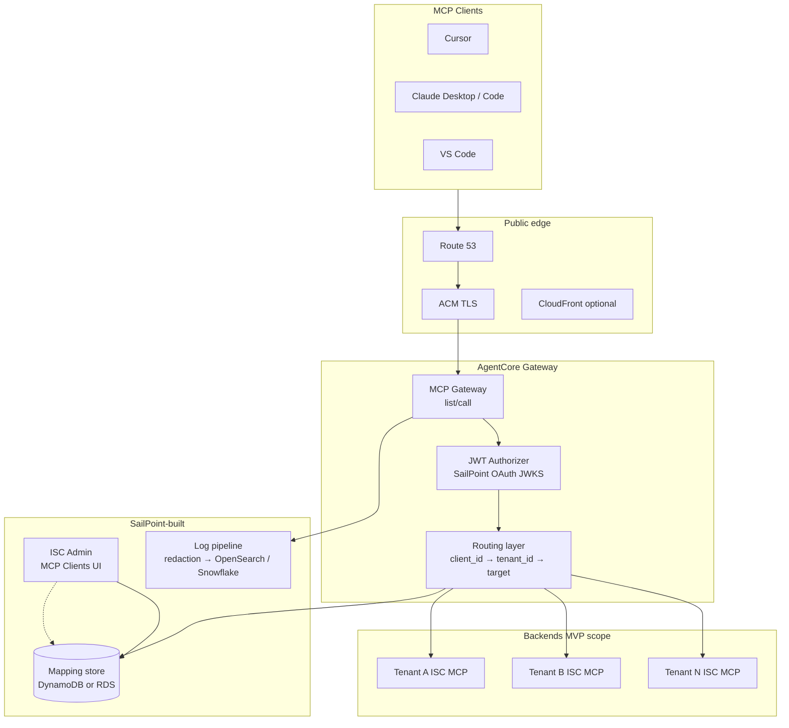

# MCP Gateway — MVP Specification

**Status:** Draft — pending PM/OAuth/Security sign-off  
**Version:** 0.2  
**Last updated:** 2026-05-16  
**Owner:** Dattu Marneni (EM)  
**Initiative:** [INIT-2704](https://sailpoint.atlassian.net/browse/INIT-2704)  
**Jira project:** [DPDE](https://sailpoint.atlassian.net/browse/DPDE) (component: **DP-SAF**)  
**Related docs:** [`mcp-gateway.md`](mcp-gateway.md) · [`mcp-gateway-execution-plan.md`](mcp-gateway-execution-plan.md)

---

## 1. Executive summary

The MCP Gateway MVP delivers a **single, tenant-agnostic MCP endpoint** for SailPoint Identity Security Cloud (ISC). AI clients (Cursor, Claude Desktop, Claude Code, VS Code) connect to one public URL with OAuth; the gateway validates identity and routes each MCP request to the correct **per-tenant ISC MCP backend** without exposing tenant in the client configuration.

**Foundation:** AWS Bedrock **AgentCore Gateway** for the managed gateway plane (protocol, auth scaffolding, scale). SailPoint builds the glue: custom domain, SailPoint OAuth integration, `client_id → tenant_id` mapping, admin registration UX, telemetry, and policy.

**MVP exit:** All **P0** functional requirements (FR1–FR12) and non-functional requirements (NFRs) satisfied in **one primary commercial region**, ready for **closed beta** (5–10 tenants). General availability (GA) and AWS Marketplace listing follow in a subsequent phase.

**Jira:** 16 epics in **DPDE** under initiative [INIT-2704](https://sailpoint.atlassian.net/browse/INIT-2704) (labels `INIT-2704`, `mcp-gateway`, component **DP-SAF**). See [§4.1 Jira epic index](#41-jira-epic-index).

---

## 2. Problem and success criteria

### 2.1 Problem

- Today, MCP clients must use **tenant-specific URLs** (e.g. `https://{tenant}.api.cloud.sailpoint.com/.../mcp`), which blocks a universal “install in Cursor” experience and complicates marketplace distribution.
- Security and platform teams lack a **single chokepoint** for auth, audit, and routing across MCP tool use.
- Competitors (e.g. Saviynt, Wiz) have shipped marketplace MCP listings; SailPoint needs parity on **one URL + OAuth**.

### 2.2 MVP success (measurable)

| ID | Criterion |
| --- | --- |
| SC-1 | **3+ developers** complete first successful `tools/list` in **&lt; 10 minutes** from a published quickstart (no live support). |
| SC-2 | **Zero cross-tenant** routing in security conformance tests (100% of routes derived from validated token + mapping store only). |
| SC-3 | **Closed beta:** 5–10 tenants on universal URL for **≥ 1 week** without a P1 incident attributable to the gateway. |
| SC-4 | **Backward compatibility:** existing tenant-direct MCP URLs show **zero regressions** on the automated compatibility suite. |
| SC-5 | **Observability:** every failed request traceable via `request_id` in logs within **5 minutes**; P0 dashboards and alarms operational. |

---

## 3. MVP goal and non-goals

### 3.1 In scope (MVP / P0)

- Universal gateway URL with TLS and documented client configuration (FR1).
- OAuth 2.0 Authorization Code + **PKCE**; JWT validation on every request (FR2, FR5).
- MCP `tools/list` and `tools/call` through gateway to **ISC tenant MCP backends only** (FR3, FR4).
- Static **client registration** and `client_id → tenant_id` mapping (FR7, FR8).
- Existing tenant URLs unchanged (FR6).
- Structured errors, health endpoint, request/mapping telemetry (FR9–FR12).
- P0 NFRs: latency overhead, scale smoke, uptime/error rate, TLS/JWT, usability, cost tagging.

### 3.2 Explicit non-goals (Phase II / post-GA)

| Item | Rationale |
| --- | --- |
| Dynamic Client Registration (RFC 7591) | Deferred; requires rate-limiting and abuse controls first. |
| Developer self-service portal (`developer.sailpoint.com/mcp`) | MVP uses ISC Admin (internal-admin minimum). |
| Email-based tenant discovery (`login.sailpoint.com` flow) | PRD 2 model; MVP uses static `client_id → tenant_id` map. |
| FedRAMP / UAE1 regions | Separate region rollout; confirm AgentCore availability first. |
| Multi-backend multiplexing (workflows, AIS, NERM as separate targets) | MVP: ISC tenant MCP only. |
| Tool namespacing across domains, semantic search, gateway federation | AgentCore capabilities; productize after GA. |
| AWS Marketplace listing | **Beta exit or GA** deliverable, not blocking closed beta. |
| Sunset of tenant-direct URLs | No deprecation in MVP; traffic monitoring only. |

### 3.3 Stretch / descope options (PM agreement required)

| If behind schedule | Descope | Impact |
| --- | --- | --- |
| WS-C slip | FR7: **CLI/API-only** client registration; defer ISC Admin UI to Phase 3 | Admins use API/CLI; slower onboarding |
| WS-G slip | Ship MVP at higher p95 latency; tune in patch | Document exception to NFR-002 |
| WS-H slip | Docs for **Cursor + Claude Desktop only** at launch | Other clients “best effort” |

---

## 4. PRD reconciliation — decisions required

Two PRDs exist; **MVP cannot start build** until the rows marked **Required** are approved.

| # | Topic | PRD 1 (Q1-2) | PRD 2 (Tenant-agnostic) | **MVP recommendation** | Status |
| --- | --- | --- | --- | --- | --- |
| D1 | Public hostname | `mcp.sailpoint.com` | `mcp.identitynow.com` | **`mcp.sailpoint.com`** (+ env prefixes: `mcp-dev`, `mcp-stage`) | **Required** |
| D2 | OAuth model | Auth Code, static clients | OAuth 2.1 + PKCE + DCR | **Auth Code + PKCE + static registration**; DCR → Phase II | **Required** |
| D3 | Tenant resolution | `client_id → tenant_id` table | Email discovery at authorize | **Static mapping at client create**; email discovery → GA | **Required** |
| D4 | Gateway capability | Thin JWT router | Broader platform | **Level 1–2:** JWT validate + route; no full multiplexing | **Required** |
| D5 | Managed foundation | (varies) | (varies) | **AgentCore Gateway** + SailPoint glue | **Required** |
| D6 | Backends in scope | ISC MCP | ISC + broader | **ISC tenant MCP only** for MVP | **Required** |
| D7 | Admin UX | ISC Admin MCP Clients | Dev portal | **ISC Admin, internal-admin minimum** | **Required** |
| D8 | Audit sink | Snowflake | Snowflake + alerts | **Snowflake + Grafana + alarms** | Confirm owner |
| D9 | Cognito bridge | — | — | **Prefer direct SailPoint OAuth as `customJWTAuthorizer`**; Cognito only if spike fails | Spike in PoC |
| D10 | Target model | — | — | **One AgentCore target per tenant** *or* one target + routing Lambda — **decide in PoC** | Spike in PoC |

**Sign-off meeting (week 1):** Ye Zhu (PM), Rahul Mishra (PM / OAuth), Dave Owens (Masala EM), Ben Coble (UI), Security delegate, SRE delegate.

---

### 4.1 Jira epic index

All epics are type **Epic**, project **DPDE**, component **DP-SAF**, labels **`INIT-2704`** and **`mcp-gateway`**. Parent initiative: [INIT-2704](https://sailpoint.atlassian.net/browse/INIT-2704).

| Key | Scope | MVP spec |
| --- | --- | --- |
| [DPDE-1767](https://sailpoint.atlassian.net/browse/DPDE-1767) | Understanding and kickoff (Phase 0 program) | §11 Phase 0 |
| [DPDE-1768](https://sailpoint.atlassian.net/browse/DPDE-1768) | Universal endpoint & client configuration | **FR1** |
| [DPDE-1769](https://sailpoint.atlassian.net/browse/DPDE-1769) | OAuth / JWT authorizer | **FR2** |
| [DPDE-1770](https://sailpoint.atlassian.net/browse/DPDE-1770) | `tools/list` & `tools/call` | **FR3** |
| [DPDE-1771](https://sailpoint.atlassian.net/browse/DPDE-1771) | Tenant routing & targets | **FR4** |
| [DPDE-1772](https://sailpoint.atlassian.net/browse/DPDE-1772) | Token expiration & auth failure UX | **FR5** |
| [DPDE-1773](https://sailpoint.atlassian.net/browse/DPDE-1773) | Backward compatibility & migration | **FR6** |
| [DPDE-1775](https://sailpoint.atlassian.net/browse/DPDE-1775) | Admin Portal MCP client registration | **FR7** |
| [DPDE-1776](https://sailpoint.atlassian.net/browse/DPDE-1776) | `client_id` → `tenant_id` mapping store | **FR8** |
| [DPDE-1774](https://sailpoint.atlassian.net/browse/DPDE-1774) | Snowflake mapping exposure | **FR9** |
| [DPDE-1777](https://sailpoint.atlassian.net/browse/DPDE-1777) | Usage dashboards & alarms | **FR10** |
| [DPDE-1778](https://sailpoint.atlassian.net/browse/DPDE-1778) | Structured errors & health | **FR11** |
| [DPDE-1779](https://sailpoint.atlassian.net/browse/DPDE-1779) | Structured request logging | **FR12** |
| [DPDE-1780](https://sailpoint.atlassian.net/browse/DPDE-1780) | NFR validation, security & cost | **§8 NFRs** |
| [DPDE-1781](https://sailpoint.atlassian.net/browse/DPDE-1781) | Foundation: Phase 0 design & Phase 1 PoC | §11 Phase 0–1 |
| [DPDE-1782](https://sailpoint.atlassian.net/browse/DPDE-1782) | Documentation, DX & GA launch | WS-H / §11 Phase 4 |

**Duplicates / hygiene**

- [AI-1415](https://sailpoint.atlassian.net/browse/AI-1415) — **Closed**; wrong project duplicate of FR1. Canonical FR1: **DPDE-1768**.
- **DPDE-1767** — Program kickoff; trim duplicate FR1 acceptance text from its description if still present (FR1 lives on **DPDE-1768**).

**Related work (coordinate, not INIT epic set):** APIMGMT-1990, SAASSIGMA-6213, SAASSRE-6461, APIMGMT-1699, AI-881.

---

## 5. User personas and journeys

### 5.1 Personas

| Persona | Goal |
| --- | --- |
| **ISC Admin** | Register MCP OAuth clients, bind tenant, revoke compromised clients. |
| **Developer** | Configure Cursor/Claude with gateway URL + `client_id`; run identity tools via MCP. |
| **SRE / On-call** | Diagnose failures via `request_id`, dashboards, runbooks. |
| **Security / Compliance** | Audit tool calls; verify no cross-tenant access. |

### 5.2 Journey A — Happy path (developer)

1. Admin creates MCP client in ISC Admin → receives `client_id`, redirect URIs, scopes.
2. Developer opens MCP client → enters `https://mcp.sailpoint.com/` (or env URL) + `client_id`.
3. OAuth PKCE flow completes → bearer token issued with `tenant_id` / scopes.
4. Client calls `tools/list` → gateway validates JWT, resolves tenant target, returns tool catalog.
5. Client calls `tools/call` → gateway proxies to tenant ISC MCP backend → result returned.

### 5.3 Journey B — Token expired

1. Client sends request with expired JWT.
2. Gateway returns **401** with `{ "error": "token_expired", "message": "...", "request_id": "..." }` and actionable hint (re-authenticate).
3. Developer re-runs OAuth; subsequent calls succeed.

### 5.4 Journey C — Revoked or unknown client

1. Request uses revoked or unregistered `client_id` / invalid token.
2. Gateway returns **403** (or **401** per OAuth semantics) with consistent envelope; no backend invocation.
3. Admin action (revoke) effective within **mapping cache TTL (≤ 60s)**.

---

## 6. Architecture (MVP)

### 6.1 Logical diagram



### 6.2 Request path (hot path)

1. `POST https://mcp.sailpoint.com/` with `Authorization: Bearer <jwt>` and MCP JSON-RPC body.
2. Authorizer validates signature, `exp`, `iss`, `aud`, allowed `client_id`, required scopes.
3. Routing resolves `tenant_id` from JWT claim and/or `client_id` lookup in mapping store (cache TTL ≤ 60s).
4. Gateway forwards to **exactly one** tenant ISC MCP endpoint; response returned unchanged unless error normalization applies.
5. Structured log emitted: `request_id`, `client_id`, `tenant_id`, `method`, `status_code`, `latency_ms`, `error_type` (no bearer token, no PII).

### 6.3 Security invariants (MVP)

- **S1:** Routing target MUST be derived only from validated JWT claims + mapping store — never from URL path, query, or client-supplied tenant headers.
- **S2:** No bearer tokens or refresh tokens in logs or Snowflake.
- **S3:** Per-tenant backend credentials isolated (AgentCore outbound auth per target).
- **S4:** Threat model (STRIDE) on routing + admin APIs completed before production routing code merges.

### 6.4 Environments

| Environment | URL pattern | Purpose |
| --- | --- | --- |
| dev | `mcp-dev.sailpoint.com` (TBD) | Engineering integration |
| stage | `mcp-stage.sailpoint.com` (TBD) | Pre-prod, compat tests |
| prod | `mcp.sailpoint.com` | Closed beta → GA |

All environments: IaC-managed (Terraform or CDK); no console-only production changes.

---

## 7. Functional requirements

Legend: **MVP** = P0 for closed beta · **Stretch** = may slip with PM sign-off

### FR1 — Universal endpoint and client configuration

**MVP** · Jira: [DPDE-1768](https://sailpoint.atlassian.net/browse/DPDE-1768)

**Description:** Canonical universal MCP gateway base URL (and `/latest` if required), public DNS/TLS, validated configuration for Cursor, Claude Desktop, Claude Code, and VS Code. Developers need **only** gateway URL + `client_id` (no tenant in URL).

**Given / When / Then**

| ID | Given | When | Then |
| --- | --- | --- | --- |
| GWT-1 | Registered OAuth `client_id` and supported MCP client | Developer configures documented universal endpoint | Client completes transport setup without `tenant_id` in URL or hostname |
| GWT-2 | Two supported MCP clients | Same `client_id` and endpoint used | Same class of outcomes for OAuth + first `tools/list` (success or documented errors) |
| GWT-3 | Fresh developer machine | Developer follows published quickstart | First successful `tools/list` within NFR-011 time budget after OAuth |

**Checklist AC**

- [ ] **AC-1** Universal URL (+ `/latest` if required) live in non-prod and prod with valid TLS
- [ ] **AC-2** Documented configs for Cursor, Claude Desktop, Claude Code, VS Code match observed behavior
- [ ] **AC-3** No `tenant_id` in URL/host for universal path (docs + smoke tests)
- [ ] **AC-4** Cross-client smoke checklist executed and attached to release evidence

---

### FR2 — OAuth and JWT authentication

**MVP** · Jira: [DPDE-1769](https://sailpoint.atlassian.net/browse/DPDE-1769)

**Description:** Gateway validates OAuth-issued JWTs on every MCP request using SailPoint OAuth (JWKS). Supports Authorization Code + PKCE for interactive MCP clients.

**Given / When / Then**

| ID | Given | When | Then |
| --- | --- | --- | --- |
| GWT-1 | Valid non-expired JWT with required scopes | Any MCP method invoked | Request reaches routing layer |
| GWT-2 | Missing or malformed `Authorization` header | MCP request sent | **401** with structured envelope; backend not called |
| GWT-3 | JWT with invalid signature or wrong `iss`/`aud` | MCP request sent | **401**; event logged as auth failure |
| GWT-4 | MCP client using PKCE (Cursor, Claude via `mcp-remote`) | OAuth flow initiated | Token issued with scopes needed for `tools/list` |

**Checklist AC**

- [ ] **AC-1** 100% of production MCP traffic passes JWT validation (NFR-010)
- [ ] **AC-2** JWKS caching documented; fallback behavior on IdP outage per security review
- [ ] **AC-3** Scope taxonomy documented (e.g. `sp:mcp:all`, read vs write tools) with OAuth team
- [ ] **AC-4** Security test: no unauthenticated request reaches any tenant backend

---

### FR3 — MCP tools/list and tools/call

**MVP** · Jira: [DPDE-1770](https://sailpoint.atlassian.net/browse/DPDE-1770)

**Description:** Gateway exposes MCP protocol methods; `tools/list` uses AgentCore cache-first listing where configured; `tools/call` proxies to tenant backend in real time.

**Given / When / Then**

| ID | Given | When | Then |
| --- | --- | --- | --- |
| GWT-1 | Authenticated session to tenant with ISC MCP enabled | Client calls `tools/list` | Non-empty tool catalog matching tenant backend (modulo sync lag) |
| GWT-2 | Valid tool name from prior `tools/list` | Client calls `tools/call` with arguments | Result or documented tool error from backend; gateway adds `request_id` on failures |
| GWT-3 | Backend unavailable | `tools/call` invoked | **502/503** with envelope; no partial tenant leakage |

**Checklist AC**

- [ ] **AC-1** `tools/list` and `tools/call` E2E from at least two MCP clients in stage
- [ ] **AC-2** Tool sync cadence documented (cache freshness SLA)
- [ ] **AC-3** Contract tests for JSON-RPC shape on success and error paths

---

### FR4 — Tenant routing

**MVP** · Jira: [DPDE-1771](https://sailpoint.atlassian.net/browse/DPDE-1771)

**Description:** After auth, every request routes to the ISC MCP backend for the tenant bound to the caller's identity — via JWT `tenant_id` and/or `client_id` mapping.

**Given / When / Then**

| ID | Given | When | Then |
| --- | --- | --- | --- |
| GWT-1 | Token for tenant A | Any MCP request | Traffic only to tenant A backend |
| GWT-2 | Token for tenant B | Same gateway URL as tenant A | Traffic only to tenant B backend |
| GWT-3 | Attacker supplies `X-Tenant: other` header | Request with token for tenant A | Routing ignores header; still tenant A |
| GWT-4 | Attacker tampers `tenant_id` claim without valid signature | Request sent | **401**; no backend call |

**Checklist AC**

- [ ] **AC-1** Routing p50 overhead &lt; 10ms, p95 &lt; 50ms (component of NFR-001–003)
- [ ] **AC-2** Fuzz tests: no cross-tenant routing in 10k randomized cases
- [ ] **AC-3** Routing decision logged with `request_id`, `tenant_id`, target id

---

### FR5 — Token expiration handling

**MVP** · Jira: [DPDE-1772](https://sailpoint.atlassian.net/browse/DPDE-1772)

**Description:** Clear, programmatic handling when access tokens expire.

**Given / When / Then**

| ID | Given | When | Then |
| --- | --- | --- | --- |
| GWT-1 | Expired access token | MCP request | **401**, `error: token_expired`, hint to re-authenticate, `request_id` |
| GWT-2 | Expired token | Developer follows hint | Re-auth succeeds; `tools/list` works |

**Checklist AC**

- [ ] **AC-1** Contract test asserts 401 envelope shape
- [ ] **AC-2** `request_id` correlates to log line within 1 lookup

---

### FR6 — Backward compatibility

**MVP** · Jira: [DPDE-1773](https://sailpoint.atlassian.net/browse/DPDE-1773)

**Description:** Existing tenant-specific MCP URLs remain supported; gateway is additive.

**Given / When / Then**

| ID | Given | When | Then |
| --- | --- | --- | --- |
| GWT-1 | Client configured with legacy tenant URL | `tools/list` / `tools/call` | Behavior unchanged vs pre-gateway baseline |
| GWT-2 | Gateway deployed to prod | Legacy URL regression suite run | Zero failures |

**Checklist AC**

- [ ] **AC-1** Compat suite in CI on every gateway deploy
- [ ] **AC-2** Migration guide published (gateway URL path)
- [ ] **AC-3** Per-tenant traffic metric: direct vs gateway (dashboard)

---

### FR7 — Admin: MCP client registration

**MVP** (minimum: **internal-admin** ISC UI; stretch: CLI-only) · Jira: [DPDE-1775](https://sailpoint.atlassian.net/browse/DPDE-1775)

**Description:** Admins create, label, view, and revoke MCP OAuth clients.

**Given / When / Then**

| ID | Given | When | Then |
| --- | --- | --- | --- |
| GWT-1 | ISC admin with permission | Creates MCP client with name, scopes, redirect URIs | `client_id` displayed; mapping to admin's tenant persisted |
| GWT-2 | Active client | Admin revokes client | New requests with that client fail within cache TTL |
| GWT-3 | Admin lists clients | Filter/search used | Only clients for authorized tenant(s) visible |

**Checklist AC**

- [ ] **AC-1** E2E: admin create → developer `tools/list` in &lt; 1 hour (excluding OAuth consent wait)
- [ ] **AC-2** All admin actions audited
- [ ] **AC-3** Revoke effective ≤ 60s

---

### FR8 — client_id → tenant_id mapping store

**MVP** · Jira: [DPDE-1776](https://sailpoint.atlassian.net/browse/DPDE-1776)

**Description:** Durable store and APIs for mapping; consumed by routing and admin UI.

**Given / When / Then**

| ID | Given | When | Then |
| --- | --- | --- | --- |
| GWT-1 | New client created in admin | Mapping written | Routing resolves correct tenant within cache TTL |
| GWT-2 | Mapping updated | Next request after TTL | Uses new tenant binding |
| GWT-3 | Unauthorized API caller | CRUD attempted | **403**; no data leak |

**Checklist AC**

- [ ] **AC-1** Store choice (DynamoDB vs RDS) documented in HLD
- [ ] **AC-2** CRUD APIs behind admin auth; contract tests
- [ ] **AC-3** Cache hit rate ≥ 95% at steady state (WS-G)

---

### FR9 — Snowflake: client mapping data

**MVP** · Jira: [DPDE-1774](https://sailpoint.atlassian.net/browse/DPDE-1774)

**Description:** Mapping store replicated to Snowflake for analytics and support queries.

**Checklist AC**

- [ ] **AC-1** CDC or batch pipeline; data within **15 minutes** of change
- [ ] **AC-2** Schema documented; no secrets in Snowflake tables
- [ ] **AC-3** Sample support queries validated with Data Platform

---

### FR10 — Usage dashboards and alarms

**MVP** · Jira: [DPDE-1777](https://sailpoint.atlassian.net/browse/DPDE-1777)

**Description:** Operational visibility: rate, latency, errors, per-tenant volume, auth failures.

**Checklist AC**

- [ ] **AC-1** Grafana (or agreed tool) dashboards: 1h / 6h / 24h / 7d filters
- [ ] **AC-2** Alarms: error rate &gt; 1% (5 min), p95 &gt; 500ms (5 min), 5xx spike, auth failure spike
- [ ] **AC-3** Page on-call within 5 minutes of breach (routing confirmed)

---

### FR11 — Structured error responses and health

**MVP** · Jira: [DPDE-1778](https://sailpoint.atlassian.net/browse/DPDE-1778)

**Description:** Consistent error envelope; `GET /health` for probes.

**Envelope (all 4xx/5xx):**

```json
{
  "error": "<machine_code>",
  "message": "<human_readable>",
  "request_id": "<uuid>"
}
```

**Status codes (minimum):** 400 malformed · 401 auth · 403 unregistered/revoked · 502 bad backend · 503 unavailable

**Checklist AC**

- [ ] **AC-1** `GET /health` → 200 `{ "status", "version", "timestamp" }`
- [ ] **AC-2** Contract tests for every status code above
- [ ] **AC-3** No stack traces in client responses; 5xx details only in logs

---

### FR12 — Structured request logging

**MVP** · Jira: [DPDE-1779](https://sailpoint.atlassian.net/browse/DPDE-1779)

**Description:** JSON logs per request; ship to OpenSearch (ops) and Snowflake (analytics); PII/token redaction.

**Log fields (minimum):** `request_id`, `client_id`, `tenant_id`, `mcp_method`, `status_code`, `latency_ms`, `timestamp`, `error_type`, `error_message`

**Checklist AC**

- [ ] **AC-1** 100% of failed requests searchable by `request_id` within 5 minutes
- [ ] **AC-2** Security sign-off on redaction checklist
- [ ] **AC-3** Retention periods documented

---

## 8. Non-functional requirements (P0)

| ID | Requirement | Target | Verification |
| --- | --- | --- | --- |
| NFR-001 | Gateway routing overhead p50 | &lt; 10 ms | Load test + APM |
| NFR-002 | Gateway routing overhead p95 | &lt; 300 ms (total path budget) | Load test |
| NFR-003 | Gateway routing overhead p99 | &lt; 500 ms | Load test |
| NFR-004 | Concurrent sessions | 100 concurrent without degradation | k6/Locust |
| NFR-005 | Monthly volume | 1M requests/month sustained test | 24h burndown |
| NFR-006 | Registered clients | 1,000 clients (mapping store) | Capacity test |
| NFR-007 | Availability | Multi-AZ; target **99.9%** MVP (GA may raise) | Failover drill |
| NFR-008 | Error rate | &lt; 0.1% excluding client errors | 14-day beta window |
| NFR-009 | TLS | TLS 1.2+ only; valid public certs | Scan + config review |
| NFR-010 | JWT validation | 100% authenticated traffic validated | Security tests |
| NFR-011 | Time to first `tools/list` | &lt; 10 min from quickstart (3 devs) | Timed user test |
| NFR-012 | Documentation quality | DevRel + editorial pass | Review sign-off |
| NFR-013 | Error hints | Every 4xx/5xx includes next-step hint | Contract audit |
| NFR-014 | Cost visibility | Per-env cost tags; monthly report | FinOps |
| NFR-015 | Cost budget | **Reframe with PM in Phase 0** — PRD placeholder likely unrealistic at scale | Cost model |
| SEC-1 | Cross-tenant leakage | **Zero** tolerance | Fuzz + pen test before beta |
| SEC-2 | Log PII | No tokens/PII in logs | Security review |

**Documented exceptions:** Any NFR not met at beta exit requires written PM + SRE approval with remediation date.

---

## 9. Interfaces and contracts

### 9.1 JWT claims (minimum)

| Claim | Required | Use |
| --- | --- | --- |
| `iss` | Yes | SailPoint OAuth issuer |
| `aud` | Yes | Gateway audience |
| `exp` | Yes | Expiry |
| `client_id` or `azp` | Yes | Mapping lookup |
| `tenant_id` (or equivalent) | Yes* | Routing (*or derived solely from mapping if PM confirms) |
| `scope` | Yes | Tool authorization |

Exact claim names **locked with OAuth team** in PoC.

### 9.2 Admin API (mapping store)

- `POST /v1/mcp-clients` — create (internal)
- `GET /v1/mcp-clients` — list (tenant-scoped)
- `DELETE /v1/mcp-clients/{id}` — revoke
- OpenAPI published in repo; admin UI is primary consumer.

### 9.3 Backend (ISC tenant MCP)

- Gateway preserves MCP JSON-RPC body; adds/propagates `request_id` for tracing.
- Outbound auth per AgentCore target (service token or OBO — **locked in PoC**).
- ISC team provides: base URL template, required headers, MCP version.

---

## 10. Dependencies and RACI

| Area | Responsible | Accountable | Consulted | Informed |
| --- | --- | --- | --- | --- |
| MVP delivery | Gateway EM | Director / VP Eng | PM, Security | Leadership |
| OAuth / JWT | OAuth platform (Rahul Mishra) | OAuth lead | Gateway team | PM |
| ISC Admin UI | Ben Coble's team | UI lead | Gateway EM | PM |
| ISC tenant MCP | Masala / tenant MCP | Dave Owens | Gateway | Beta tenants |
| Snowflake / logs | Data Platform | DP lead | Security | SRE |
| AWS / AgentCore | Gateway backend + SRE | Tech lead | AWS SA | FinOps |
| Docs / DevRel | Tech writing | PM | Gateway | Customers (beta) |

---

## 11. Milestones and phases

| Phase | Duration | Goal | MVP spec gate |
| --- | --- | --- | --- |
| **0 — Spec & design** | 3 weeks | This doc + HLD signed; PRD decisions D1–D7 | **Exit: all Required decisions approved** |
| **1 — PoC** | 6 weeks | One tenant E2E; AgentCore + domain + OAuth spike | Validates D9, D10 |
| **2 — MVP build** | 8–10 weeks | FR1–FR12, P0 NFRs | Workstreams WS-A–H |
| **3 — Closed beta** | 4 weeks | 5–10 tenants; go/no-go week 2 | SC-3 |
| **4 — GA** | 4 weeks | Production + marketplace (if in GA scope) | SC-1–SC-5 sustained |

Detailed sequencing: [`mcp-gateway-execution-plan.md`](mcp-gateway-execution-plan.md) § Phase 2.

---

## 12. Workstreams (implementation map)

Epics are created in Jira; see [§4.1 Jira epic index](#41-jira-epic-index) for keys and links.

| WS | FR/NFR | Primary epic(s) |
| --- | --- | --- |
| WS-A Routing & targets | FR3, FR4, FR8 | [DPDE-1770](https://sailpoint.atlassian.net/browse/DPDE-1770), [DPDE-1771](https://sailpoint.atlassian.net/browse/DPDE-1771), [DPDE-1776](https://sailpoint.atlassian.net/browse/DPDE-1776) |
| WS-B Auth | FR2, FR5, NFR-009/010 | [DPDE-1769](https://sailpoint.atlassian.net/browse/DPDE-1769), [DPDE-1772](https://sailpoint.atlassian.net/browse/DPDE-1772) |
| WS-C Admin UI | FR7 | [DPDE-1775](https://sailpoint.atlassian.net/browse/DPDE-1775) |
| WS-D Telemetry | FR9, FR10, FR12 | [DPDE-1774](https://sailpoint.atlassian.net/browse/DPDE-1774), [DPDE-1777](https://sailpoint.atlassian.net/browse/DPDE-1777), [DPDE-1779](https://sailpoint.atlassian.net/browse/DPDE-1779) |
| WS-E Errors & health | FR11 | [DPDE-1778](https://sailpoint.atlassian.net/browse/DPDE-1778) |
| WS-F Backward compat | FR6 | [DPDE-1773](https://sailpoint.atlassian.net/browse/DPDE-1773) |
| WS-G Performance | NFR-001–008 | [DPDE-1780](https://sailpoint.atlassian.net/browse/DPDE-1780) |
| WS-H Documentation | FR1, NFR-011/012 | [DPDE-1768](https://sailpoint.atlassian.net/browse/DPDE-1768), [DPDE-1782](https://sailpoint.atlassian.net/browse/DPDE-1782) |
| Program / PoC | Phase 0–1 | [DPDE-1767](https://sailpoint.atlassian.net/browse/DPDE-1767), [DPDE-1781](https://sailpoint.atlassian.net/browse/DPDE-1781) |

---

## 13. Risks and mitigations

| Risk | Likelihood | Impact | Mitigation |
| --- | --- | --- | --- |
| PRD decisions slip | High | High | Week-1 sponsored reconciliation; escalate at 5 days |
| AgentCore FedRAMP unavailable | Medium | High | Phase II region plan; abstract gateway interface |
| Cross-tenant routing bug | Low | Critical | STRIDE week 2; fuzz tests; security sign-off before beta |
| OAuth JWKS incompatible with AgentCore | Medium | High | 3-day PoC spike; Cognito bridge fallback |
| p95 latency budget exhausted by AgentCore | Medium | Medium | Early perf baseline; provisioned concurrency |
| Admin UI bandwidth | High | Medium | CLI/API fallback for FR7 |
| Cost NFR-015 unrealistic | High | Low | Reframe in Phase 0 with PM |

---

## 14. MVP exit criteria (closed beta ready)

- [ ] All **MVP** FR checklist AC complete (FR7 at internal-admin minimum unless descoped).
- [ ] P0 NFRs met or **documented exception** approved.
- [ ] SRE operational readiness review (ORR) passed.
- [ ] Runbook + on-call rotation defined.
- [ ] Security review complete (routing + admin + logging).
- [ ] At least **one internal team** on non-prod tenant ≥ 1 week, no P1 gateway incidents.
- [ ] PRD decisions D1–D7 recorded in this doc (Status = Approved).

---

## 15. Open questions

1. Final production hostname: `mcp.sailpoint.com` vs `mcp.identitynow.com`?
2. Is `tenant_id` always in JWT, or only via `client_id` mapping?
3. One AgentCore target per tenant vs routing Lambda — quota and latency tradeoff?
4. AgentCore Gateway availability in FedRAMP regions (timeline)?
5. Masala team: partner, embed, or separate charter?
6. Marketplace listing: beta exit vs GA?

---

## 16. References

### Internal

- [INIT-2704](https://sailpoint.atlassian.net/browse/INIT-2704) — Initiative
- [§4.1 Jira epic index](#41-jira-epic-index) — DPDE-1767 … DPDE-1782 (FR1 = [DPDE-1768](https://sailpoint.atlassian.net/browse/DPDE-1768))
- [MCP Q1-2 PRD](https://sailpoint.atlassian.net/wiki/spaces/~7120200fd8a6740fdb4ca9bd0f88f478f134a5/pages/4634738812/MCP+Q1-2+PRD+SailPoint+MCP+Server+Single+URL+and+Oauth+Support)
- [MCP PRD — Tenant-agnostic endpoint](https://sailpoint.atlassian.net/wiki/spaces/~7120200fd8a6740fdb4ca9bd0f88f478f134a5/pages/) *(link via Confluence `NIDUAgE`)*
- [HLD SailPoint MCP Server](https://sailpoint.atlassian.net/wiki/spaces/~557058a92a897c42824a4792963165ed4eea38/pages/3670769784/HLD+SailPoint+MCP+Server)
- [AWS Agent Core Gateway Integration](https://sailpoint.atlassian.net/wiki/spaces/~978782161/pages/4347527504/AWS+Agent+Core+Gateway+Integration)
- [`mcp-gateway.md`](mcp-gateway.md) · [`mcp-gateway-execution-plan.md`](mcp-gateway-execution-plan.md)

### External

- [Model Context Protocol](https://modelcontextprotocol.io)
- [AWS Bedrock AgentCore Gateway](https://aws.amazon.com/bedrock/agentcore/)
- [AWS — Unite MCP servers through AgentCore Gateway](https://aws.amazon.com/blogs/machine-learning/transform-your-mcp-architecture-unite-mcp-servers-through-agentcore-gateway/)

---

## Document history

| Version | Date | Author | Changes |
| --- | --- | --- | --- |
| 0.1 | 2026-05-16 | Dattu Marneni | Initial MVP spec draft |
| 0.2 | 2026-05-16 | Dattu Marneni | Jira epic index (DPDE-1767–1782); FR1 → DPDE-1768; per-FR Jira links |
