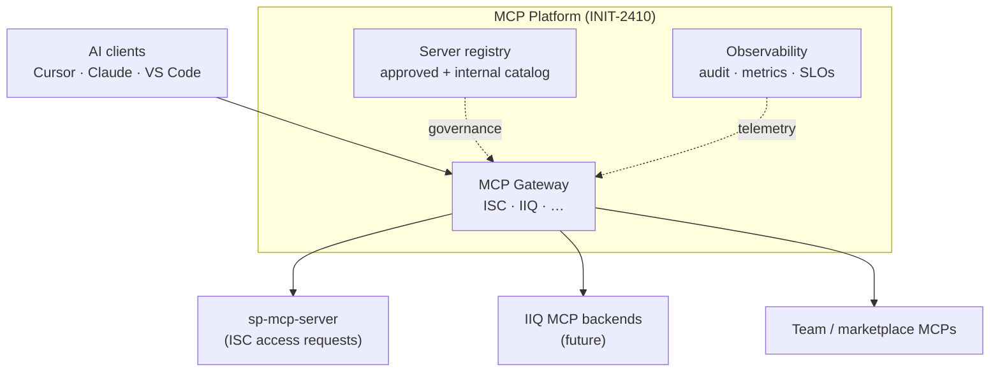

# MCP Platform

Working home in **VibeEM** for SailPoint’s **MCP Platform** initiative — the umbrella program that makes MCP the standard integration fabric for AI agents across SailPoint products, internal teams, and customers.

**Strategic initiative:** [INIT-2410 — MCP Platform](https://sailpoint.atlassian.net/browse/INIT-2410) (PM: Ye Zhu · Assignee: Maryam Agahi)  
**Platform strategy (Confluence):** [Draft SailPoint MCP Platform Strategy](https://sailpoint.atlassian.net/wiki/spaces/~7120200fd8a6740fdb4ca9bd0f88f478f134a5/pages/4614226238/Draft+SailPoint+MCP+Platform+Strategy)

**Cursor skills:** [`.cursor/skills/mcp-platform/`](../../.cursor/skills/mcp-platform/)

---

## What the platform covers

The MCP Platform is broader than any single gateway deployment. It spans **discovery, governance, observability, and unified access** to MCP servers across SailPoint.

| Pillar | Purpose | VibeEM docs | Status |
| --- | --- | --- | --- |
| **MCP Gateway** | Single URL, OAuth, tenant/product routing to downstream MCP servers (ISC, IIQ, …) | [`gateway/`](gateway/) | **Active delivery** — [INIT-2704](https://sailpoint.atlassian.net/browse/INIT-2704) |
| **MCP Server registry** | Catalog of approved/internal/custom MCP servers; ownership, lifecycle, policy | [`mcp-server-registry.md`](mcp-server-registry.md) | Planned (INIT-2410) |
| **Observability** | Tool-call audit, metrics, dashboards, compliance trail across MCP traffic | [`mcp-observability.md`](mcp-observability.md) | Planned (INIT-2410) |
| **OAuth / client auth** | OAuth 2.1, DCR, PKCE for external MCP clients | [INIT-2090](https://sailpoint.atlassian.net/browse/INIT-2090) | In progress (dependency) |

---

## Sub-topics in this repo

### MCP Gateway (tactical delivery)

Universal MCP endpoint, AgentCore Gateway, tenant routing, rollout with global URL work.

| Document | Description |
| --- | --- |
| [Concept primer](gateway/mcp-gateway.md) | What an MCP gateway is; SailPoint context |
| [MVP spec](gateway/mcp-gateway-mvp-spec.md) | FR/NFR, acceptance criteria, Jira epic index |
| [Execution plan](gateway/mcp-gateway-execution-plan.md) | EM plan, initiative landscape, 4-week MVP |
| [Delivery kit](gateway/mcp-gateway-delivery-kit.md) | Week-1, RACI, stories, risks, gates |
| [Rollout & migration sync](gateway/mcp-gateway-rollout-migration-sync.md) | May 2026 global URL vs AgentCore GW |

**Jira:** [INIT-2704](https://sailpoint.atlassian.net/browse/INIT-2704) · DPDE epics [DPDE-1767](https://sailpoint.atlassian.net/browse/DPDE-1767)–[DPDE-1782](https://sailpoint.atlassian.net/browse/DPDE-1782)

### MCP Server registry

See [`mcp-server-registry.md`](mcp-server-registry.md).

### Observability

See [`mcp-observability.md`](mcp-observability.md).

---

## How initiatives relate

| Initiative | Scope | Relationship to platform |
| --- | --- | --- |
| [INIT-2410](https://sailpoint.atlassian.net/browse/INIT-2410) | Full MCP Platform (strategic) | **Umbrella** — registry, observability, marketplace, org-wide governance |
| [INIT-2704](https://sailpoint.atlassian.net/browse/INIT-2704) | MCP Gateway for SailPoint | **Platform sub-topic** — concrete slice (gateway + auth + routing); do not expand to “entire platform” |
| [INIT-2090](https://sailpoint.atlassian.net/browse/INIT-2090) | OAuth 2.1 for MCP | **Platform dependency** — blocks external client auth; coordinate with gateway FR2 |
| [AI-881](https://sailpoint.atlassian.net/browse/AI-881) | Customer-facing MCP Gateway | On hold; links to INIT-2410 marketplace narrative |

**Scope guardrail:** INIT-2704 delivers the **gateway front door** (ISC first). INIT-2410 owns **registry, observability at platform scale, IIQ and multi-product routing, and marketplace** when re-baselined.

---

## Product scope (gateway)

| Product | MCP backend | Gateway role |
| --- | --- | --- |
| **ISC** | [sp-mcp-server](https://github.com/sailpoint-core/sp-mcp-server) (`/access-requests/mcp`) | **MVP** — route OAuth clients to tenant upstream |
| **IIQ** | TBD | **Future** — same gateway plane; product-specific targets and auth |
| **Internal / team MCPs** | Various (see [Approved MCP Servers](https://sailpoint.atlassian.net/wiki/spaces/SDLC/pages/4951474326)) | **Future** — registry + gateway aggregation |

---

## Related SailPoint docs

- [Approved MCP Servers](https://sailpoint.atlassian.net/wiki/spaces/SDLC/pages/4951474326)
- [MCP Server Request Process](https://sailpoint.atlassian.net/wiki/spaces/SDLC/pages/4175036476)
- [AI Assistants + MCP servers: Onboarding guide](https://sailpoint.atlassian.net/wiki/spaces/SDLC/pages/4914413686/AI+Assistants+MCP+servers+Onboarding+guide)
- [MCP / Agentic Security Policies](https://sailpoint.atlassian.net/wiki/spaces/SEC/pages/4820926587/MCP+Agentic+Security+Policies)
- [Enterprise MCP Server Infrastructure Research](https://sailpoint.atlassian.net/wiki/spaces/~7120200fd8a6740fdb4ca9bd0f88f478f134a5/pages/4631528649/Enterprise+MCP+Server+Infrastructure+Research)

---

## Changelog

| Date | Change |
| --- | --- |
| 2026-05-25 | Created MCP Platform hub; moved gateway docs under `gateway/` |
